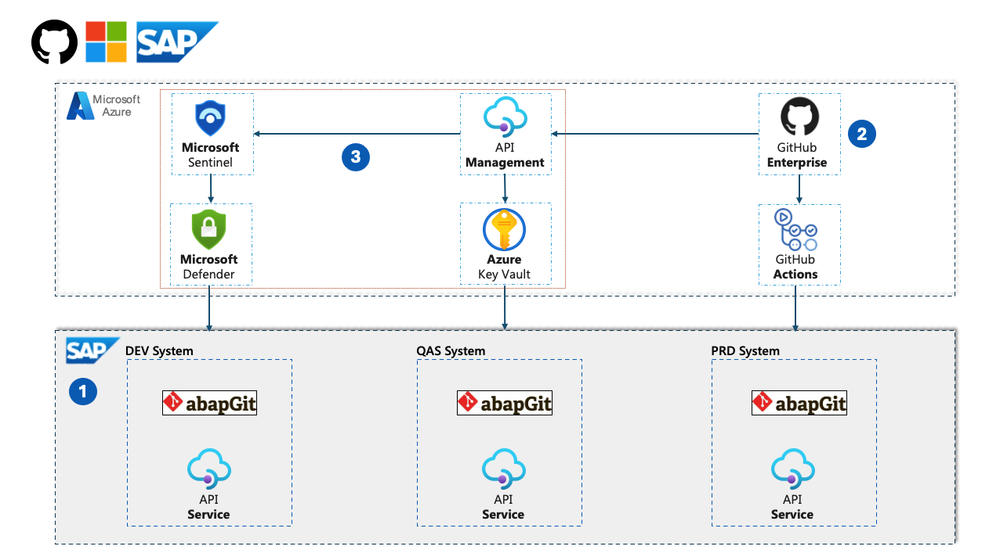

# Automated SAP-GitHub Integration: A Modern Development Approach for ABAP Systems

A comprehensive technical playbook for integrating GitHub Enterprise with SAP S/4 HANA and ECC 6.0 environments, enabling teams to establish a fully automated development pipeline with zero manual synchronization steps, enhanced by Microsoft's comprehensive security solutions.

## Overview

This playbook provides detailed, implementation-ready guidance for modernizing SAP ABAP development through integration with GitHub Enterprise. By combining the robust enterprise capabilities of SAP systems with modern DevOps practices from GitHub, organizations can achieve faster development cycles, higher code quality, and enhanced security.

## Architecture

The integration architecture connects three primary ecosystems:
1. **SAP Development Environment** - S/4 HANA or ECC 6.0 systems in a typical DEV → QAS → PRD landscape
2. **GitHub Enterprise Environment** - Code repositories, CI/CD pipelines, security scanning
3. **Microsoft Azure Security Services** - API Management, Sentinel, and Defender for comprehensive security

## Key Features

- **Fully Automated Development Pipeline** with zero manual synchronization steps
- **Bidirectional Synchronization** between SAP and GitHub
- **Modern DevOps Practices** for ABAP development
- **Enhanced Security** through GitHub Advanced Security, Microsoft Sentinel, and Defender
- **Comprehensive Documentation** for implementation and operations

## Core Components

The integration includes the following key components:

- **GitHub Enterprise** for version control, collaboration, and workflow automation
- **GitHub Actions** for CI/CD workflows
- **GitHub Advanced Security** for code scanning and vulnerability detection
- **GitHub Copilot** for AI-assisted development
- **Microsoft API Management** as the secure middleware layer
- **Microsoft Sentinel** for security monitoring and threat detection
- **Microsoft Defender for Cloud** for enhanced security protection
- **abapGit** for SAP version control integration

## Getting Started

To get started with the SAP-GitHub integration, follow these steps:

1. Review the [Architecture Overview](docs/architecture/overview.md) to understand the components and interactions
2. Check the [Prerequisites](docs/getting-started/prerequisites.md) to ensure your environment is ready
3. Follow the [Installation Guide](docs/getting-started/installation.md) for step-by-step implementation instructions
4. Explore the [Quick Start Guide](docs/getting-started/quick-start.md) for initial usage instructions

## Documentation

Comprehensive documentation is available in the [docs](./docs/) directory:

- [Getting Started Guides](./docs/getting-started/)
- [Architecture Documentation](./docs/architecture/)
- [Implementation Guides](./docs/implementation/)
- [Tutorials](./docs/tutorials/)
- [Troubleshooting](./docs/troubleshooting/)
- [Reference Documentation](./docs/reference/)

## Examples

Working code examples are available in the [examples](./examples/) directory:

- [GitHub Actions Workflows](./examples/github-actions/)
- [abapGit Configurations](./examples/abapgit-config/)
- [API Management Policies](./examples/apim-configs/)
- [Security Configurations](./examples/security/)

## Benefits

The SAP-GitHub integration provides significant benefits:

- **40-60% reduction** in development cycle time
- **30-50% decrease** in production defects
- **70-90% reduction** in manual tasks related to transport management
- **25-35% improvement** in developer productivity
- **60-80% reduction** in security vulnerabilities

For detailed metrics and case studies, see the [Benefits](./docs/benefits/) section.

## Contributing

Contributions to this playbook are welcome! Please see [CONTRIBUTING.md](./CONTRIBUTING.md) for details.

## License

This project is licensed under the MIT License - see the [LICENSE](./LICENSE) file for details.

## Security

For security concerns or vulnerability reporting, please see [SECURITY.md](./SECURITY.md).

---

**Document Metadata:**
- Last Updated: 2023-09-01
- Version: 1.0.0
- Status: Published