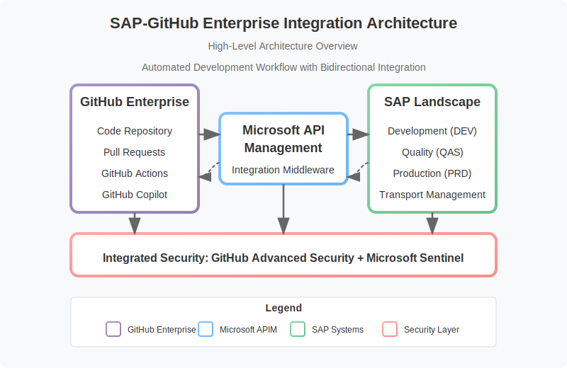

# 🔗 SAP-GitHub Integration Playbook

<div align="center" class="svg-container">
  <!-- Using both object and img as fallback for maximum compatibility -->
  <object type="image/svg+xml" data="assets/images/architecture/high-level-architecture.svg" style="width: 700px; max-width: 100%;" aria-label="SAP-GitHub Integration Architecture">
    
  </object>
  
  *Strategic integration between SAP systems and GitHub for modern enterprise development*
</div>

## 📋 Table of Contents

- [Introduction](#introduction)
- [Key Features](#key-features)
- [Repository Structure](#repository-structure)
- [Getting Started](#getting-started)
- [Documentation](#documentation)
- [Examples](#examples)
- [Contributing](#contributing)
- [License](#license)

## Introduction

The SAP-GitHub Integration Playbook provides comprehensive guidance for implementing a modern, secure, and efficient integration between SAP systems and GitHub. This integration enables organizations to leverage GitHub's collaborative development features while maintaining the governance and stability required for SAP systems.

This playbook is designed for SAP architects, developers, and operations teams looking to modernize their development practices by adopting industry-standard DevOps approaches while respecting the unique requirements of SAP environments.

## Key Features

- **Bidirectional Code Synchronization**: Seamless code flow between SAP systems and GitHub
- **Automated Workflows**: CI/CD pipelines for SAP development
- **Transport Management Integration**: Automated creation and management of SAP transports
- **Enhanced Security**: Comprehensive security controls and monitoring
- **Context-Aware Development**: Preservation of development context across systems
- **AI-Assisted Development**: Custom GitHub Copilot integration for SAP development
- **Comprehensive Monitoring**: End-to-end visibility of the development pipeline

## Repository Structure

This repository is organized as follows:

```
sap-github-integration-playbook/
├── docs/                      # Comprehensive documentation
│   ├── getting-started/       # Getting started guides
│   ├── documentation/         # Detailed technical documentation  
│   ├── examples/              # Implementation examples
│   └── resources/             # Additional resources and guides
├── assets/                    # Images, templates, and resources
├── examples/                  # Sample code and configurations
└── README.md                  # This file
```

## Getting Started

To get started with the SAP-GitHub integration:

1. **Prerequisites**: Review the [prerequisites](docs/getting-started/prerequisites.md) to ensure your environment is ready
2. **Architecture Overview**: Understand the [integration architecture](docs/documentation/architecture/overview.md)
3. **Implementation Plan**: Follow the [implementation plan](docs/getting-started/implementation-plan.md)
4. **Configuration Guide**: Set up the integration with the [configuration guide](docs/getting-started/configuration.md)

## Documentation

Complete documentation is available in the [docs](docs/) directory:

- [Getting Started Guides](docs/getting-started/README.md) - Quick start and onboarding
- [Architecture Documentation](docs/documentation/architecture/README.md) - System architecture and design
- [Developer Guides](docs/documentation/developer/README.md) - Developer-focused documentation
- [Operations Guides](docs/documentation/operations/README.md) - Day-2 operations and maintenance
- [Security Documentation](docs/documentation/security/README.md) - Security considerations and implementation
- [Reference Documentation](docs/documentation/reference/README.md) - API references and detailed specifications

## Examples

The [examples](examples/) directory contains practical examples and sample implementations:

- [ABAP Integration](examples/abap-integration/) - Integration with ABAP systems
- [GitHub Actions](examples/github-actions/) - Custom GitHub Actions for SAP
- [API Management](examples/api-management/) - API configurations and examples
- [Security Configurations](examples/security-config/) - Security implementation examples
- [End-to-End Scenarios](examples/end-to-end/) - Complete implementation scenarios

---

## ⚡ Contributing

We welcome contributions to this project! Please see our [Contributing Guide](CONTRIBUTING.md) for more information.

## ⚡ License

This project is licensed under the MIT License - see the [LICENSE](LICENSE) file for details.

---

🔄 Last updated: April 2025 | Contribute to this document through [Pull Requests](https://github.com/your-org/sap-github-integration-playbook/pulls)
