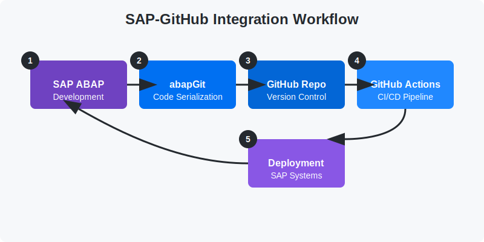

# SAP-GitHub Integration Playbook

A comprehensive guide for implementing version control, collaborative development, and continuous integration for SAP development objects using GitHub.

## Overview

The SAP-GitHub Integration Playbook provides detailed, step-by-step instructions for establishing a seamless integration between SAP systems and GitHub. This integration enables SAP development teams to leverage modern software development practices such as version control, collaborative development, code reviews, and continuous integration.

## Documentation

The complete documentation is organized into sequential sections that guide you through the full implementation process:

1. **[Overview](./docs/1-overview/index.md)** - Technical introduction to the integration architecture
2. **[Prerequisites](./docs/2-prerequisites/index.md)** - Requirements for implementing the integration
3. **[Setup Guide](./docs/3-setup-guide/index.md)** - Core installation and configuration tutorials
4. **[Workflow Tutorials](./docs/4-workflow-tutorials/index.md)** - Development workflow implementation
5. **[Advanced Scenarios](./docs/5-advanced-scenarios/index.md)** - Additional capabilities and best practices
   - Including [Developer Productivity Tools](./docs/5-advanced-scenarios/developer-productivity.md) with GitHub Copilot for ABAP
6. **[Troubleshooting](./docs/6-troubleshooting/index.md)** - Solutions for common issues

See the [Documentation Index](./docs/new_index.md) for a complete overview of all available documentation.

## Key Features

This playbook helps you implement:

- Version control for SAP development objects
- Collaborative development using branches and pull requests
- Continuous integration with automated testing
- Code quality improvement through reviews
- Security best practices for SAP-GitHub integration
- AI-assisted ABAP development with GitHub Copilot

## Implementation Approach

The playbook follows a sequential, tutorial-based approach with:

- Continuous step numbering across tutorials (Steps 1-224)
- Clear prerequisites for each tutorial
- Detailed verification steps to ensure successful implementation
- Common issues and solutions
- Next steps to guide you through the implementation journey

## Developer Productivity

As of March 2025, this integration takes advantage of GitHub Copilot support for ABAP, which provides:

- Intelligent code completion for ABAP development in Eclipse
- In-IDE chat support for ABAP-specific guidance
- Accelerated development with AI-assisted coding
- Enhanced problem-solving capabilities for SAP developers

## Getting Started

To begin your SAP-GitHub integration implementation:

1. Review the [Technical Overview](./docs/1-overview/technical-overview.md) to understand the architecture
2. Verify your systems meet the [System Requirements](./docs/2-prerequisites/system-requirements.md)
3. Start with [Tutorial 1: Installing abapGit in SAP System](./docs/3-setup-guide/installing-abapgit.md)
4. Follow each tutorial in sequence, completing the verification steps

## 👥 Credits
This SAP-GitHub Integration Playbook was developed by @paulanunes85.
