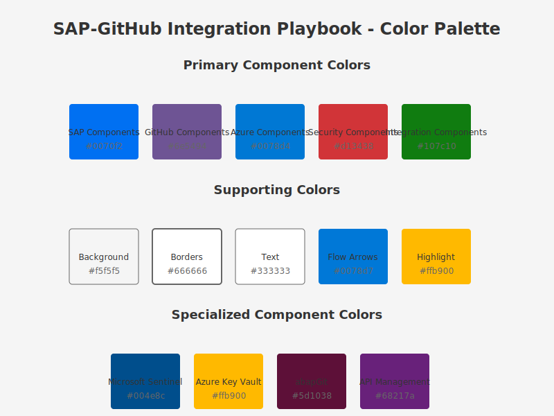

# 🖼️ Assets Directory

<div align="center">
  
  
  
  *Visual assets for the SAP-GitHub Integration Playbook*
</div>

## 📋 Overview

This directory contains all visual and supporting assets for the SAP-GitHub Integration Playbook. It is organized into several key subdirectories to make finding and managing assets easier.

## 📁 Directory Structure

- **🎨 css/** - Stylesheet files for the playbook's web presentation
- **📊 images/** - All visual elements, diagrams, and graphics
  - **🏛️ architecture/** - System architecture diagrams
  - **🧩 components/** - Component-level diagrams
  - **🚀 deployment/** - Deployment scenario diagrams
  - **🔄 devsecops/** - DevSecOps and workflow diagrams
  - **📈 flows/** - Process and data flow diagrams
  - **🔍 icons/** - Standardized icons
  - **📋 resources/** - Visual resources like color palettes
- **📜 js/** - JavaScript files for interactive features

## 🎨 Design Guidelines

All visual assets in this repository adhere to the following guidelines:

1. **Format**: All diagrams and visual representations should be in SVG format
2. **Color Palette**: Follow the standard color palette defined in `images/resources/color-palette.svg`
3. **Typography**: Use Segoe UI, Helvetica, Arial, sans-serif for all text elements
4. **Consistency**: Maintain visual consistency across all diagrams and images
5. **Accessibility**: Ensure sufficient color contrast and provide alt text in documentation

## 🔄 Updating Assets

When adding or updating assets:

1. Place them in the appropriate subdirectory
2. Use descriptive, kebab-case filenames (e.g., `sap-github-workflow.svg`)
3. Include a short README.md in each subdirectory explaining its contents
4. Update any documentation that references modified assets

## 🔗 Referencing Images in Documentation

To reference images in markdown files, use the following syntax:

```markdown

```

For centered images with captions, use:

```markdown
<div align="center">
  
  
  
  *Caption text here*
</div>
```

For Jekyll-specific image inclusion with more options, use:

```markdown

```

## 🔗 Related Documentation

- [Image Design Guidelines](../docs/1-architecture/standards/image-design-guidelines.md)
- [Documentation Guidelines](../DOCUMENTATION_GUIDELINES.md)

---

<details>
<summary><strong>📊 Document Metadata</strong></summary>

- **Last Updated:** 2025-04-07
- **Author:** Documentation Team
- **Version:** 1.0.0
- **Status:** Published
</details>