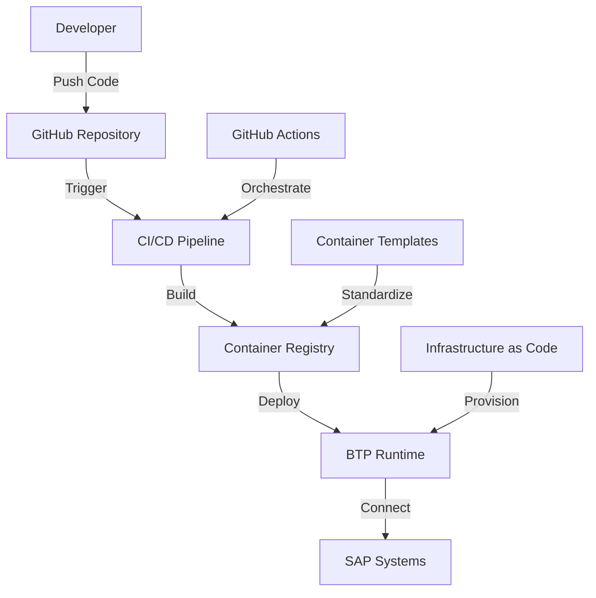
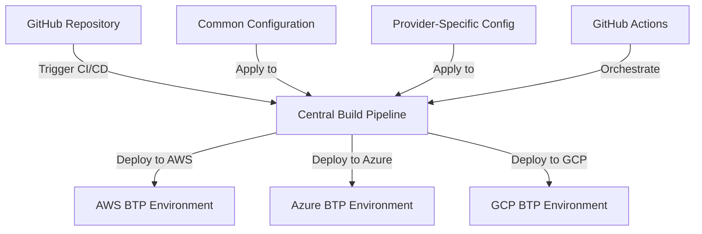
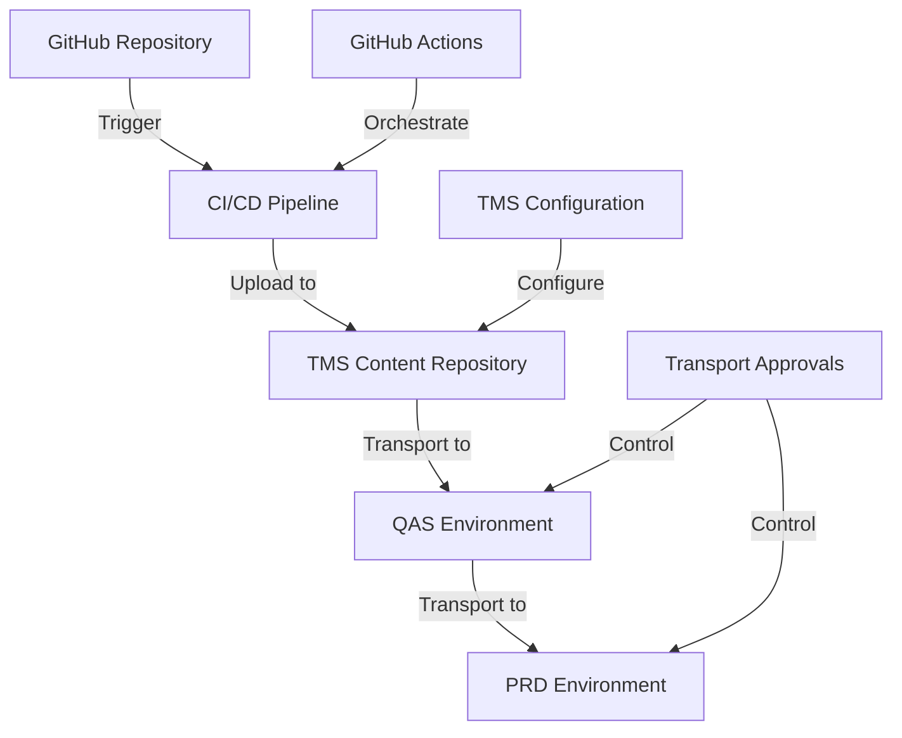
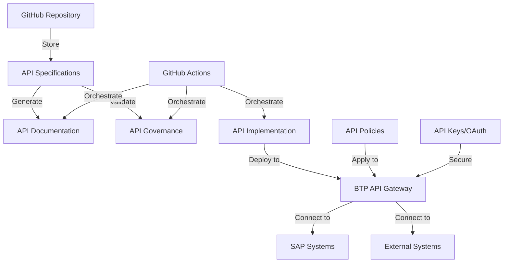
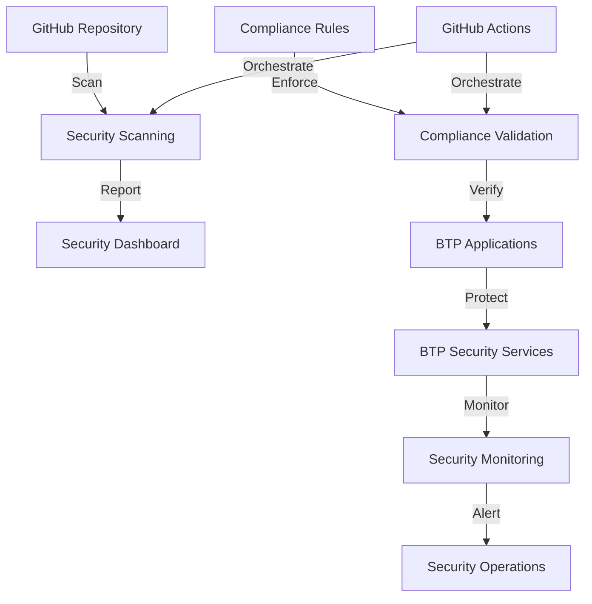

# 📄 SAP Business Technology Platform (BTP) Architecture Integration

## 📋 Table of Contents

- [📋 Overview](#overview)
- [Architecture Components](#architecture-components)
- [BTP-Specific Integration Requirements](#btp-specific-integration-requirements)
- [🔧 Implementation Recommendations](#implementation-recommendations)
- [Related Documentation](#related-documentation)
- [References](#references)


This document outlines the specialized architecture for integrating SAP Business Technology Platform (BTP) with GitHub Enterprise, addressing the unique requirements of cloud-based SAP development environments.

## 📋 Overview

SAP Business Technology Platform (BTP) represents SAP's cloud platform offering, providing a comprehensive suite of integrated tools, services, and capabilities for building, extending, and integrating cloud applications. Integrating GitHub with BTP requires specialized approaches that address cloud-native development, multi-cloud deployments, transport management, API-based integration, and security compliance.

## Architecture Components

The BTP integration architecture consists of the following key components:

1. **SAP BTP Environment** - Cloud-based platform for SAP application development and extensions
2. **GitHub Enterprise** - Source code repository and collaboration platform
3. **Cloud Transport Management** - SAP's cloud-based transport management service
4. **API Management** - API gateway and lifecycle management
5. **Identity and Access Management** - Authentication and authorization services
6. **CI/CD Pipeline Services** - Cloud-based continuous integration and deployment services
7. **Security and Compliance Services** - Services ensuring security and regulatory compliance

## BTP-Specific Integration Requirements

### Cloud-Native Integration Approaches

BTP applications require cloud-native integration approaches that differ from traditional on-premises SAP systems.

#### Container-Based Integration Architecture

The recommended approach leverages containerization for consistent development and deployment:



#### Cloud-Native Development Workflow

1. **Local Development Environment**
   - Container-based local development environments
   - Cloud SDK for local API emulation
   - BTP service binding emulation

2. **Integration Testing**
   - Service virtualization for dependent services
   - Mock services for SAP backend systems
   - Cloud-based test environments

3. **Deployment Automation**
   - Infrastructure as Code (IaC) for environment provisioning
   - Blue-green deployment for zero-downtime updates
   - Canary releases for controlled rollouts

4. **Observability Integration**
   - Centralized logging integration
   - Distributed tracing across services
   - Metric collection and visualization

#### GitHub Actions for Cloud-Native BTP Development

Example GitHub Actions workflow for cloud-native BTP application:

```yaml
name: BTP Cloud-Native Application CI/CD
on:
  push:
    branches: [ main, develop ]
  pull_request:
    branches: [ main ]
    
jobs:
  build-and-test:
    runs-on: ubuntu-latest
    steps:
      - name: Checkout code
        uses: actions/checkout@v3
        
      - name: Setup Node.js
        uses: actions/setup-node@v3
        with:
          node-version: '18'
          
      - name: Install dependencies
        run: |
          npm ci
          
      - name: Run tests
        run: |
          npm test
          
      - name: Build application
        run: |
          npm run build
          
      - name: Build and push container
        uses: docker/build-push-action@v4
        with:
          context: .
          push: true
          tags: ${{ env.REGISTRY }}/${{ env.IMAGE_NAME }}:${{ github.sha }}
          
  deploy-to-btp:
    needs: build-and-test
    if: github.event_name == 'push' && github.ref == 'refs/heads/main'
    runs-on: ubuntu-latest
    steps:
      - name: Install Cloud Foundry CLI
        uses: cloudfoundry-community/setup-cf-cli@v1
        
      - name: Login to Cloud Foundry
        run: |
          cf login -a ${{ secrets.CF_API }} \
                  -u ${{ secrets.CF_USERNAME }} \
                  -p ${{ secrets.CF_PASSWORD }} \
                  -o ${{ secrets.CF_ORG }} \
                  -s ${{ secrets.CF_SPACE }}
                  
      - name: Deploy to BTP
        run: |
          cf push -f manifest.yml --strategy rolling
```

### Multi-Cloud Deployment Strategies

SAP BTP supports deployment across multiple cloud providers, requiring specialized integration approaches for consistent development and deployment across heterogeneous environments.

#### Supported Cloud Providers

BTP currently supports the following cloud infrastructure providers:

1. **Amazon Web Services (AWS)**
2. **Microsoft Azure**
3. **Google Cloud Platform (GCP)**
4. **Alibaba Cloud**

#### Multi-Cloud Architecture Patterns

The integration architecture supports several multi-cloud patterns:

1. **Portable Application Design**
   - Cloud-agnostic application architecture
   - Abstraction layers for cloud-specific services
   - Standardized deployment descriptors

2. **Consistent CI/CD Across Clouds**
   - Cloud-agnostic pipeline definition
   - Provider-specific deployment stages
   - Unified quality gates across providers

3. **Hybrid Deployment Models**
   - Distribution of components across clouds
   - Inter-cloud communication patterns
   - Resilience across cloud outages

4. **Cloud Provider Selection Strategy**
   - Rule-based provider selection
   - Cost optimization across providers
   - Compliance-driven deployment rules

#### Multi-Cloud Deployment Architecture



#### Multi-Cloud Deployment Configuration

Example multi-cloud deployment configuration:

```yaml
# multi-cloud-config.yaml
defaultProvider: azure
applicationName: sap-inventory-service
version: 1.2.0

providers:
  - name: azure
    region: westeurope
    services:
      - type: managed-hana
        size: 64GB
      - type: app-runtime
        instances: 2
        size: medium
    compliance:
      - GDPR
      - ISO27001
      
  - name: aws
    region: eu-central-1
    services:
      - type: managed-hana
        size: 64GB
      - type: app-runtime
        instances: 2
        size: medium
    compliance:
      - GDPR
      - ISO27001
      - PCI-DSS
      
  - name: gcp
    region: europe-west4
    services:
      - type: managed-hana
        size: 64GB
      - type: app-runtime
        instances: 2
        size: medium
    compliance:
      - GDPR
      - ISO27001

routingRules:
  - data: customer-data
    region: EU
    provider: azure
  - data: payment-data
    compliance: PCI-DSS
    provider: aws
  - data: analytics
    provider: gcp
```

#### GitHub Actions for Multi-Cloud Deployment

Example GitHub Actions workflow for multi-cloud deployment:

```yaml
name: Multi-Cloud BTP Deployment
on:
  push:
    branches: [ main ]
    paths:
      - 'src/**'
      - 'deployment/**'
      
jobs:
  build:
    runs-on: ubuntu-latest
    steps:
      - name: Build application artifacts
        # Build steps here
        
  deploy-azure:
    needs: build
    runs-on: ubuntu-latest
    steps:
      - name: Deploy to Azure BTP
        uses: sap-actions/btp-cf-deploy@v2
        with:
          api: ${{ secrets.AZURE_CF_API }}
          username: ${{ secrets.AZURE_CF_USERNAME }}
          password: ${{ secrets.AZURE_CF_PASSWORD }}
          org: ${{ secrets.AZURE_CF_ORG }}
          space: ${{ secrets.AZURE_CF_SPACE }}
          manifest: deployment/azure/manifest.yml
          
  deploy-aws:
    needs: build
    runs-on: ubuntu-latest
    steps:
      - name: Deploy to AWS BTP
        uses: sap-actions/btp-cf-deploy@v2
        with:
          api: ${{ secrets.AWS_CF_API }}
          username: ${{ secrets.AWS_CF_USERNAME }}
          password: ${{ secrets.AWS_CF_PASSWORD }}
          org: ${{ secrets.AWS_CF_ORG }}
          space: ${{ secrets.AWS_CF_SPACE }}
          manifest: deployment/aws/manifest.yml
          
  verify-deployment:
    needs: [deploy-azure, deploy-aws]
    runs-on: ubuntu-latest
    steps:
      - name: Verify multi-cloud deployment
        # Verification steps here
```

### Transport Management with Cloud Transport Management Service

SAP BTP's Cloud Transport Management service (TMS) provides a cloud-native approach to transport management that must be integrated with GitHub workflows.

#### Cloud TMS Architecture



#### TMS Integration Components

1. **Content Repository Integration**
   - File-based MTA archive storage
   - Version-controlled transport content
   - Metadata synchronization

2. **Transport Node Configuration**
   - Environment-specific transport nodes
   - Transport route definition
   - Approval workflow configuration

3. **Transport Operation Service**
   - Transport execution API
   - Transport status monitoring
   - Transport logging and auditing

4. **GitHub Integration Components**
   - GitHub Actions for transport triggering
   - Pull request integration with transport creation
   - Status synchronization between GitHub and TMS

#### TMS Integration Workflow

The Cloud Transport Management integration follows this workflow:

1. **Development Phase**
   - Code changes in GitHub repository
   - CI validation with automated tests
   - Build of deployable artifacts (MTA archive)

2. **Transport Creation**
   - Creation of transport in TMS
   - Upload of MTA archive to content repository
   - Association with GitHub pull request

3. **Approval Process**
   - Transport approval workflow in TMS
   - Status synchronization with GitHub
   - Documentation of approval decisions

4. **Transport Execution**
   - Automated or manual transport trigger
   - Deployment to target environment
   - Status and result reporting

5. **Transport Monitoring**
   - Tracking of transport status
   - Error handling and notification
   - Auditing of transport activities

#### GitHub Actions for TMS Integration

Example GitHub Actions workflow for TMS integration:

```yaml
name: BTP Transport Management Integration
on:
  pull_request:
    types: [closed]
    branches:
      - main
      
jobs:
  create-transport:
    if: github.event.pull_request.merged == true
    runs-on: ubuntu-latest
    steps:
      - name: Checkout code
        uses: actions/checkout@v3
        
      - name: Build MTA
        run: |
          npm ci
          mbt build -p=cf
          
      - name: Create Transport Request
        uses: sap-actions/create-transport@v1
        with:
          tms-endpoint: ${{ secrets.TMS_ENDPOINT }}
          username: ${{ secrets.TMS_USERNAME }}
          password: ${{ secrets.TMS_PASSWORD }}
          description: "Deploy changes from PR #${{ github.event.pull_request.number }}"
          nodeName: "DEV"
          
      - name: Upload to TMS
        uses: sap-actions/upload-to-tms@v1
        with:
          tms-endpoint: ${{ secrets.TMS_ENDPOINT }}
          username: ${{ secrets.TMS_USERNAME }}
          password: ${{ secrets.TMS_PASSWORD }}
          transportId: ${{ steps.create-transport.outputs.transportId }}
          mtaPath: ./mta_archives/myapp_1.0.0.mtar
          
      - name: Trigger Transport to QAS
        uses: sap-actions/trigger-transport@v1
        with:
          tms-endpoint: ${{ secrets.TMS_ENDPOINT }}
          username: ${{ secrets.TMS_USERNAME }}
          password: ${{ secrets.TMS_PASSWORD }}
          transportId: ${{ steps.create-transport.outputs.transportId }}
          nodeName: "QAS"
```

### API-Based Integration Patterns

BTP applications typically implement API-based integration patterns for connecting with other systems and services.

#### API Management Architecture



#### API Integration Components

1. **API Design and Documentation**
   - OpenAPI specification management
   - API documentation generation
   - API change management

2. **API Gateway Configuration**
   - Policy definition and management
   - Security configuration
   - Rate limiting and quota management

3. **API Implementation**
   - Backend service implementation
   - Integration service development
   - Mock service implementation

4. **API Governance**
   - API quality gates
   - Standards compliance validation
   - Security assessment

#### API Lifecycle Integration

The API lifecycle integration with GitHub includes:

1. **Design Phase**
   - OpenAPI specification creation in GitHub
   - Documentation generation
   - Collaborative review process

2. **Implementation Phase**
   - Code generation from specification
   - Unit and integration testing
   - Mock API implementation

3. **Deployment Phase**
   - Gateway configuration deployment
   - Policy application
   - Security configuration

4. **Management Phase**
   - Version management
   - Consumption monitoring
   - Performance analysis

#### GitHub Actions for API Lifecycle Management

Example GitHub Actions workflow for API lifecycle management:

```yaml
name: API Lifecycle Management
on:
  push:
    paths:
      - 'apis/**/*.yaml'
      - 'apis/**/*.json'
      
jobs:
  validate-api:
    runs-on: ubuntu-latest
    steps:
      - name: Checkout code
        uses: actions/checkout@v3
        
      - name: Validate OpenAPI specification
        uses: openapi-actions/validate@v1
        with:
          file-path: ./apis/service-api.yaml
          
      - name: Check for breaking changes
        uses: openapi-actions/compare@v1
        with:
          old-spec: ${{ github.event.before }}:./apis/service-api.yaml
          new-spec: ${{ github.event.after }}:./apis/service-api.yaml
          fail-on-breaking-changes: true
          
  generate-documentation:
    needs: validate-api
    runs-on: ubuntu-latest
    steps:
      - name: Generate API documentation
        uses: openapi-actions/generate-docs@v1
        with:
          spec-file: ./apis/service-api.yaml
          output-dir: ./docs/apis
          
  deploy-to-api-management:
    needs: validate-api
    if: github.ref == 'refs/heads/main'
    runs-on: ubuntu-latest
    steps:
      - name: Deploy API to API Management
        uses: sap-actions/deploy-to-apim@v1
        with:
          apim-endpoint: ${{ secrets.APIM_ENDPOINT }}
          username: ${{ secrets.APIM_USERNAME }}
          password: ${{ secrets.APIM_PASSWORD }}
          api-spec: ./apis/service-api.yaml
          api-name: service-api
```

### Security and Compliance in Cloud Environments

BTP deployments must address specific security and compliance requirements for cloud environments.

#### Security Architecture



#### Security Components

1. **Identity and Access Management**
   - Role-based access control
   - Single sign-on integration
   - Principal propagation
   - Automated provisioning and deprovisioning

2. **Data Protection**
   - Data encryption at rest and in transit
   - Data anonymization
   - Personal data handling
   - Data residency controls

3. **Application Security**
   - Secure development practices
   - Vulnerability scanning
   - Dependency analysis
   - Penetration testing

4. **Operational Security**
   - Security monitoring
   - Incident response
   - Audit logging
   - Security analytics

#### Compliance Framework

The BTP integration supports compliance with various frameworks:

| Compliance Framework | Implementation Approach | GitHub Integration |
|---------------------|-------------------------|-------------------|
| GDPR | Data protection impact assessment, data subject rights management | Automated GDPR checks in CI/CD |
| ISO 27001 | Information security management system | Security control validation in pipelines |
| SOC 2 | Trust service criteria assessment | Continuous compliance monitoring |
| PCI DSS | Cardholder data security | Specialized scanning for payment card data |
| HIPAA | Protected health information handling | PHI detection in code and data |

#### Security and Compliance Integration Workflow

The integration of security and compliance into BTP development includes:

1. **Development Phase**
   - Security requirements definition
   - Secure coding practices
   - Static application security testing
   - Secret detection

2. **Build Phase**
   - Dependency vulnerability scanning
   - License compliance checking
   - Container scanning
   - Security policy validation

3. **Deployment Phase**
   - Infrastructure as Code security checks
   - Configuration validation
   - Compliance rule enforcement
   - Security group management

4. **Runtime Phase**
   - Dynamic application security testing
   - Runtime vulnerability assessment
   - Compliance monitoring
   - Security event management

#### GitHub Actions for Security and Compliance

Example GitHub Actions workflow for security and compliance:

```yaml
name: BTP Security and Compliance
on:
  push:
    branches: [ main, develop ]
  pull_request:
    branches: [ main ]
    
jobs:
  security-scan:
    runs-on: ubuntu-latest
    steps:
      - name: Checkout code
        uses: actions/checkout@v3
        
      - name: Static code analysis
        uses: github/codeql-action/analyze@v2
        with:
          languages: javascript, typescript
          
      - name: Secret detection
        uses: gitleaks/gitleaks-action@v2
        
      - name: Dependency scan
        uses: snyk/actions/node@master
        with:
          args: --severity-threshold=high
          
  compliance-check:
    runs-on: ubuntu-latest
    steps:
      - name: Checkout code
        uses: actions/checkout@v3
        
      - name: GDPR compliance check
        uses: compliance-actions/gdpr@v1
        
      - name: License compliance
        uses: compliance-actions/license-check@v1
        with:
          allowed-licenses: MIT, Apache-2.0, SAP-1.0
          
  security-deployment-check:
    runs-on: ubuntu-latest
    needs: [security-scan, compliance-check]
    steps:
      - name: Checkout code
        uses: actions/checkout@v3
        
      - name: Analyze deployment artifacts
        uses: security-actions/deployment-scan@v1
        with:
          deployment-files: ./deployment/**/*
          
      - name: Generate security report
        uses: security-actions/report@v1
        with:
          output-file: security-report.pdf
```

## 🔧 Implementation Recommendations

Based on real-world implementations, the following recommendations apply to BTP-specific GitHub integration:

1. **Cloud-Native Development Model**
   - Adopt container-based development approach
   - Implement infrastructure as code for all environments
   - Design for multi-cloud portability

2. **Integrated Transport Management**
   - Seamlessly integrate GitHub workflows with Cloud TMS
   - Implement automated transport creation and execution
   - Maintain synchronized status across systems

3. **API-First Development**
   - Implement API specifications before development
   - Leverage API Management for governance and security
   - Build comprehensive API testing into CI/CD pipelines

4. **Security Automation**
   - Integrate security testing throughout the pipeline
   - Implement policy as code for compliance requirements
   - Automate security monitoring and alerting

## Related Documentation

- [SAP Components Overview](./sap-components.md)
- [Integration Architecture](./integration-architecture.md)
- [API Extension Framework](./api-extension-framework.md)
- [System Architecture](./system-architecture.md)

## References

1. SAP. (2025). "SAP Business Technology Platform Implementation Guide." SAP Help Portal.
2. Forrester Research. (2025). "Cloud-Native Development in Enterprise Environments."
3. IDC. (2025). "Multi-Cloud Strategy for Enterprise Applications."
4. Gartner. (2025). "Magic Quadrant for Enterprise Integration Platform as a Service."
5. Cloud Security Alliance. (2025). "Cloud Controls Matrix v4.0."
---

<details>
<summary><strong>📊 Document Metadata</strong></summary>

- **Last Updated:** 2025-04-07
- **Version:** 1.0.0
- **Status:** Published
</details>
