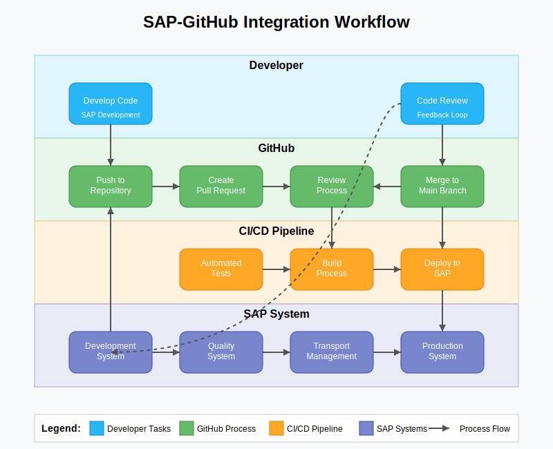

# 🔧 Implementation Guide

  
  
  
  *Step-by-step guidance for SAP-GitHub integration implementation*

## 📋 Table of Contents

- [📋 Overview](#-overview)
- [🚀 Getting Started](#-getting-started)
- [🏛️ Architecture Implementation](#️-architecture-implementation)
- [⚙️ Configuration](#️-configuration)
- [🔒 Security Setup](#-security-setup)
- [🔄 Workflows](#-workflows)
- [📊 Monitoring](#-monitoring)
- [🔗 Related Documents](#-related-documents)

## 📋 Overview

This Implementation Guide provides detailed instructions for setting up, configuring, and deploying the SAP-GitHub integration. It covers all necessary steps from initial preparation through deployment and verification, ensuring a successful implementation.

## 🚀 Getting Started

Before beginning implementation, review these essential resources:

- [Prerequisites](./getting-started/prerequisites.md) - Required systems and preparation
- [Implementation Checklist](./getting-started/implementation-checklist.md) - Complete pre-implementation checklist
- [Quick Start Guide](./getting-started/quick-start.md) - Accelerated implementation path
- [Installation](./getting-started/installation.md) - Detailed installation instructions

## 🏛️ Architecture Implementation

Implement the core integration architecture:

- [API Management Setup](./apim-setup/index.md) - Configure API gateway and policies
- [SAP System Setup](./sap-setup/index.md) - Configure SAP systems for integration
- [GitHub Setup](./github-setup/index.md) - Configure GitHub organization and repositories
- [abapGit Setup](./abapgit-setup.md) - Install and configure abapGit

## ⚙️ Configuration

Configure system components:

| Component | Configuration Guide | Verification |
|:----------|:-------------------|:------------|
| SAP Systems | [SAP Setup](./sap-setup/index.md) | [System Assessment](./sap-setup/system-assessment.md) |
| GitHub | [GitHub Organization](./github-setup/organization-setup.md) | [Security Enablement](./github-setup/security-enablement.md) |
| API Gateway | [APIM Deployment](./apim-setup/apim-deployment.md) | [Monitoring](./apim-setup/monitoring.md) |
| Security | [Authentication](./security-setup/index.md) | [Compliance Setup](./security-setup/compliance-setup.md) |

## 🔒 Security Setup

Implement comprehensive security measures:

1. [Authentication Setup](./github-setup/authentication.md)
2. [Enterprise Authentication](./github-setup/enterprise-authentication.md)
3. [Repository Security](./github-setup/repository-security.md)
4. [Secret Management](./github-setup/secret-management.md)
5. [Security Monitoring](./security-setup/security-monitoring.md)

> **⚠️ Warning:** Never commit secrets or credentials to repositories. Always use secure secret management solutions.

## 🔄 Workflows

Set up automated workflows:

- [CI/CD Setup](./workflows/ci-cd-setup.md)
- [Transport Automation](./workflows/transport-automation.md)
- [Code Sync](./workflows/code-sync.md)
- [PR Automation](./workflows/pr-automation.md)

## 📊 Monitoring

Establish monitoring and alerting:

- [Monitoring Overview](./monitoring/overview.md)
- [Performance Monitoring](./monitoring/performance.md)

## 🔗 Related Documents

- [Architecture Documentation](../1-architecture/README.md)
- [Developer Guide](../3-developer-guide/README.md)
- [Operations Guide](../4-operations-guide/README.md)

---

<strong>📊 Document Metadata</strong>

- **Last Updated:** 2025-04-07
- **Author:** SAP-GitHub Integration Team
- **Version:** 1.0.0
- **Status:** Published

