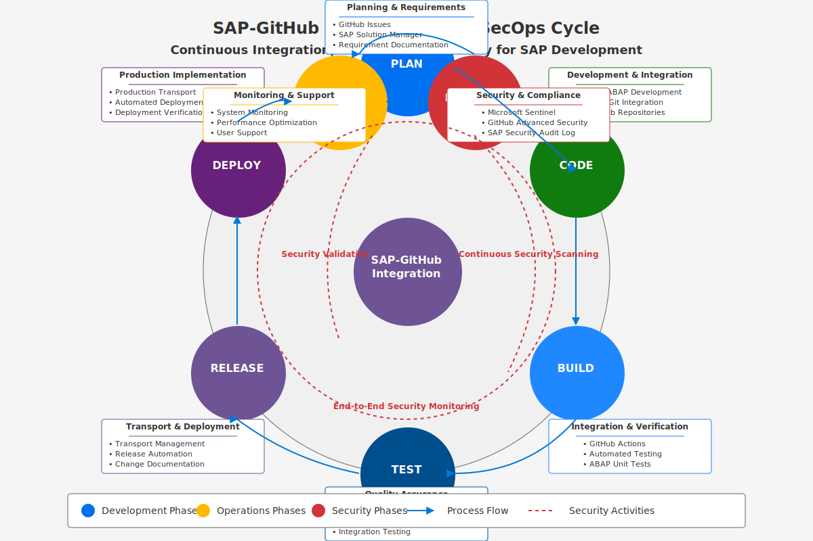

# 📄 DevSecOps and CI/CD Lifecycle for SAP-GitHub Integration

**Section:** [Implementation Guide](../README.md) | **Previous:** [Setup Guide](../getting-started/index.md) | **Next:** [Workflows](../workflows/index.md)

## 📋 Table of Contents

- [Overview](#overview)
- [DevSecOps Cycle](#devsecops-cycle)
- [CI/CD Components](#cicd-components)
- [Integration Points](#integration-points)
- [Security Integration](#security-integration)
- [Implementation Steps](#implementation-steps)
- [Best Practices](#best-practices)
- [Next Steps](#next-steps)

## 📋 Overview

This document describes the Continuous Integration, Continuous Delivery, and Continuous Security (DevSecOps) lifecycle for the SAP-GitHub integration. It provides a comprehensive view of how development, operations, and security practices are integrated into a unified workflow.

## DevSecOps Cycle

The SAP-GitHub integration follows a comprehensive DevSecOps approach that embeds security at every stage of the software development lifecycle.

  

  
  *\1*

The diagram above illustrates the continuous cycle of our DevSecOps approach with the following key phases:

### 1. Plan

- **Activities**: Requirements gathering, backlog management, security requirements
- **Tools**: SAP Solution Manager, GitHub Issues
- **Security Focus**: Threat modeling, security requirements, compliance planning

### 2. Code

- **Activities**: Development, version control, code reviews
- **Tools**: SAP ABAP Development Tools, abapGit, GitHub repositories
- **Security Focus**: Secure coding practices, pre-commit hooks, code standards

### 3. Build

- **Activities**: Continuous integration, artifact creation
- **Tools**: GitHub Actions, SAP Transport System
- **Security Focus**: Dependency checking, license compliance

### 4. Test

- **Activities**: Automated testing, quality checks, validation
- **Tools**: ABAP Unit Tests, GitHub Actions
- **Security Focus**: Security scanning, vulnerability assessment, SAST

### 5. Release

- **Activities**: Continuous delivery, approvals, change management
- **Tools**: GitHub Actions, SAP Change Management
- **Security Focus**: Security gate validation, compliance checks

### 6. Deploy

- **Activities**: Deployment automation, transport management
- **Tools**: SAP Transport System, API Management
- **Security Focus**: Secure configuration verification, deployment verification

### 7. Operate

- **Activities**: System monitoring, incident management, maintenance
- **Tools**: SAP Solution Manager, Azure Monitor
- **Security Focus**: Runtime protection, anomaly detection

### 8. Monitor

- **Activities**: Feedback collection, performance analysis, continuous improvement
- **Tools**: Microsoft Sentinel, SAP Focused Run
- **Security Focus**: Security monitoring, threat detection, incident response

## CI/CD Components

The CI/CD workflow consists of the following key components:

### GitHub Components

- **GitHub Repositories**: Store ABAP code in serialized format (XML)
- **GitHub Actions**: Automated workflows for building, testing, and deploying
- **GitHub Advanced Security**: SAST, dependency scanning, and secret detection
- **Pull Requests**: Code review and approval workflows

### SAP Components

- **ABAP Development System**: Development environment for ABAP code
- **abapGit**: Git client for ABAP objects, handling serialization
- **Transport Management System**: Manages transport requests for changes
- **ABAP Unit Tests**: Unit testing framework for ABAP code

### Integration Components

- **API Management**: Secure gateway between SAP and GitHub
- **Transport Automation**: Automated creation and release of transports
- **Security Scanning**: Custom security checks for ABAP code
- **Monitoring**: End-to-end monitoring of the CI/CD pipeline

## Integration Points

The following integration points are critical for the DevSecOps lifecycle:

1. **SAP to GitHub Code Synchronization**:
   - abapGit serializes ABAP objects to XML
   - Code is pushed to GitHub repositories
   - Version control and history maintained

2. **GitHub to SAP Deployment**:
   - Changes merged into main branch
   - GitHub Actions workflows triggered
   - Transport requests created and processed
   - Changes deployed to target SAP system

3. **Security Monitoring and Alerting**:
   - Security events from all systems logged
   - Microsoft Sentinel processes security telemetry
   - Security alerts generated and routed
   - Remediation workflows triggered

## 🛡️ Security Integration

Security is integrated throughout the DevSecOps lifecycle:

### Security Governance

- Security policies and standards defined
- Compliance requirements documented
- Security roles and responsibilities assigned

### Secure Development

- Secure coding standards enforced
- Pre-commit hooks for security checks
- Code scanning integrated into development

### Security Testing

- Automated security scanning in CI/CD
- Vulnerability management process
- Penetration testing for critical components

### Secure Deployment

- Infrastructure as code security validation
- Secure configuration verification
- Deployment verification and validation

### Security Monitoring

- Runtime security monitoring
- Log collection and correlation
- Security analytics and reporting

### Security Operations

- Incident response procedures
- Threat hunting capabilities
- Security remediation workflows

### Threat Intelligence

- Threat intelligence integration
- Emerging threat monitoring
- Proactive security measures

## 🔧 Implementation Steps

Follow these steps to implement the DevSecOps lifecycle:

### 1. Plan and Prepare

1. Define security and compliance requirements
2. Establish DevSecOps roles and responsibilities
3. Document the target workflow and architecture
4. Define success metrics and KPIs

### 2. Implement Foundation Components

1. Set up GitHub repositories and organizations
2. Install and configure abapGit in SAP systems
3. Deploy API Management and authentication
4. Configure security monitoring foundation

### 3. Establish CI/CD Pipeline

1. Create GitHub Actions workflows
2. Configure build and test automation
3. Implement security scanning
4. Set up deployment automation

### 4. Integrate Security Controls

1. Implement security gates in workflows
2. Configure security scanning tools
3. Establish security monitoring
4. Create security dashboards

### 5. Validate and Test

1. Conduct end-to-end testing
2. Perform security validation
3. Verify monitoring and alerting
4. Document lessons learned

## Best Practices

- **Shift Left Security**: Embed security early in the development process
- **Continuous Feedback**: Establish feedback loops across all phases
- **Automate Everything**: Minimize manual steps in all processes
- **Visibility and Transparency**: Make processes and metrics visible to all stakeholders
- **Collaboration**: Break down silos between development, operations, and security
- **Continuous Improvement**: Regularly review and refine processes

## ➡️ Next Steps

After understanding the DevSecOps lifecycle:

1. Proceed to [Workflow Implementation](../workflows/index.md) to set up specific workflows
2. Configure [Security Controls](../security-setup/index.md) for your environment
3. Establish [Monitoring and Alerting](../monitoring/index.md) for your DevSecOps pipeline

---

**Document Metadata:**
- Last Updated: 2025-04-04
- Contributors: DevSecOps Team
- Version: 1.0.0
- Status: Published

---

<strong>📊 Document Metadata</strong>

- **Last Updated:** 2025-04-07
- **Version:** 1.0.0
- **Status:** Published

