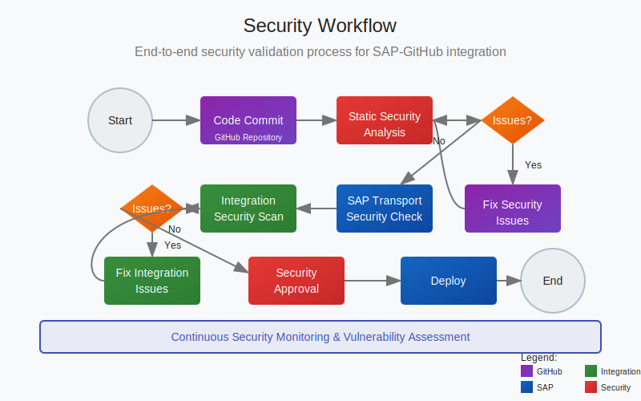

# 🛡️ Security Setup Guide

  
  
  
  *Comprehensive security implementation for SAP-GitHub integration*

## 📋 Table of Contents

- [📋 Overview](#-overview)
- [🔒 Microsoft Sentinel Configuration](#-microsoft-sentinel-configuration)
- [📊 Analytics Rules Configuration](#-analytics-rules-configuration)
- [🛡️ Microsoft Defender for Cloud](#️-microsoft-defender-for-cloud)
- [📈 Workbooks and Dashboards](#-workbooks-and-dashboards)
- [🤖 SOAR Automation](#-soar-automation)
- [🔐 GitHub Advanced Security](#-github-advanced-security)
- [🔌 Network Security](#-network-security)
- [✅ Implementation Checklist](#-implementation-checklist)
- [📝 Compliance and Governance](#-compliance-and-governance)
- [➡️ Next Steps](#️-next-steps)

## 📋 Overview

Security is a cornerstone of this integration, providing comprehensive protection, monitoring, and threat detection across all components. This guide covers all aspects of security setup and configuration for the SAP-GitHub integration.

## 🔒 Microsoft Sentinel Configuration

Implement robust security monitoring with Microsoft Sentinel:

- [Sentinel Workspace Setup](./sentinel-workspace.md) - Configure Log Analytics workspace for Sentinel
- [Data Collection](./data-collection.md) - Set up data collection from all components
- [SAP Connector Setup](./sap-connector.md) - Configure Sentinel connector for SAP
- [GitHub Connector Setup](./github-connector.md) - Configure Sentinel connector for GitHub
- [Azure Connector Setup](./azure-connector.md) - Configure Sentinel connector for Azure services

## 📊 Analytics Rules Configuration

Configure detection rules for identifying security threats:

| Rule Type | Purpose | Configuration |
|:----------|:--------|:--------------|
| Standard Rules | Base detection | [Standard Rules](./standard-rules.md) |
| SAP-Specific Rules | SAP security | [Custom SAP Rules](./custom-sap-rules.md) |
| Transport Rules | Transport security | [Transport Rules](./transport-rules.md) |
| Auth Rules | Authentication security | [Auth Rules](./auth-rules.md) |

## 🛡️ Microsoft Defender for Cloud

Implement comprehensive protection with Microsoft Defender:

- [Defender for Cloud Setup](./security-governance.md#defender-configuration) - Deploy Microsoft Defender for Cloud
- [API Protection](./security-governance.md#api-protection) - Configure protection for APIs
- [Server Protection](./security-governance.md#server-protection) - Set up protection for SAP servers
- [DevOps Security](./security-governance.md#devops-security) - Configure security for GitHub integration
- [Regulatory Compliance](./compliance-setup.md) - Set up compliance standards

> **💡 Tip:** Configure Defender for Cloud to automatically remediate common security issues.

## 📈 Workbooks and Dashboards

Implement comprehensive security monitoring dashboards:

- [SAP Security Workbook](./sap-workbook.md) - SAP security monitoring workbook
- [GitHub Activity Workbook](./github-workbook.md) - GitHub activity workbook
- [Integration Dashboard](./integration-dashboard.md) - Comprehensive monitoring dashboard
- [Executive Reporting](./executive-dashboard.md) - Executive-level security reporting

## 🤖 SOAR Automation

Automate security responses with Security Orchestration, Automation, and Response:

1. [Incident Response](./incident-response.md) - Incident response automation
2. [Remediation Actions](./remediation.md) - Automated remediation
3. [Notification Configuration](./notifications.md) - Security notifications

## 🔐 GitHub Advanced Security

Leverage GitHub's security features:

- [Advanced Security Setup](./security-governance.md#advanced-security) - GitHub Advanced Security features
- [Secret Management](./security-governance.md#secret-management) - Security for secrets and credentials
- [Dependency Management](./security-governance.md#dependency-management) - Manage and secure dependencies
- [ABAP Security Practices](./standard-rules.md#abap-security) - ABAP-specific security practices

## 🔌 Network Security

Implement comprehensive network security:

- [Network Security Configuration](./security-governance.md#network-security) - Network security implementation
- [Secure Connectivity](./security-governance.md#secure-connectivity) - Secure connection between components
- [Security Boundaries](./security-governance.md#security-boundaries) - Security boundaries
- [Data Protection](./security-governance.md#data-protection) - Data protection in transit and at rest

## ✅ Implementation Checklist

Use this checklist to ensure complete security setup:

- [ ] Microsoft Sentinel workspace configured
- [ ] Data connectors established for all components
- [ ] Analytics rules deployed and tested
- [ ] Microsoft Defender for Cloud enabled
- [ ] Security workbooks and dashboards created
- [ ] SOAR playbooks implemented
- [ ] GitHub Advanced Security configured
- [ ] Network security hardened
- [ ] Compliance standards verified

## 📝 Compliance and Governance

Implement governance frameworks:

- [Regulatory Compliance](./regulatory-compliance.md) - Address regulatory requirements
- [Security Governance](./security-governance.md) - Security governance framework
- [Audit Configuration](./audit-setup.md) - Comprehensive auditing
- [Risk Assessment](./risk-assessment.md) - Security risk assessment

## ➡️ Next Steps

After completing security setup, proceed to [Workflows Setup](../workflows/index.md) to configure end-to-end CI/CD workflows.

---

<strong>📊 Document Metadata</strong>

- **Last Updated:** 2025-04-07
- **Author:** SAP-GitHub Integration Team
- **Version:** 1.0.0
- **Status:** Published

