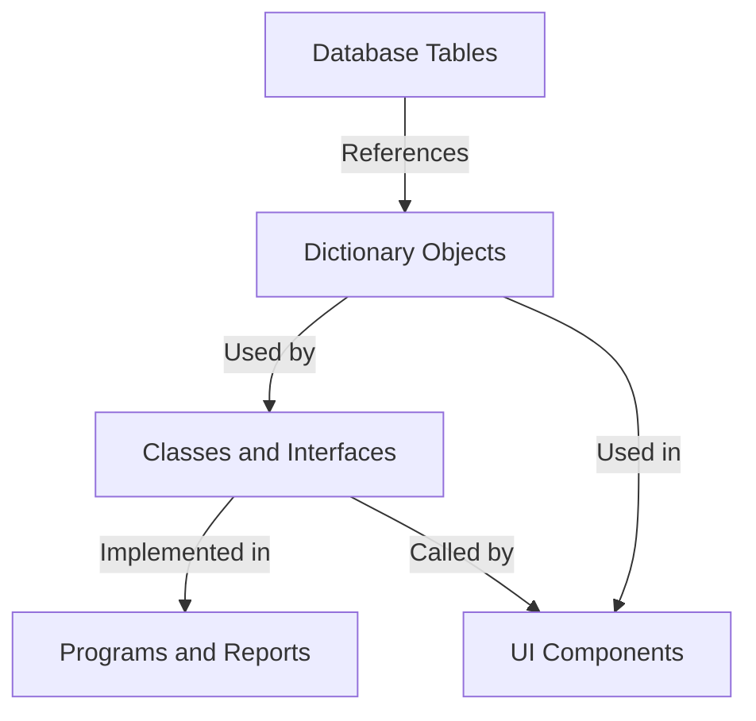

# 📄 Transport Sequencing and Dependencies

## 📋 Table of Contents

- [📋 Overview](#overview)
- [✅ Prerequisites](#prerequisites)
- [Transport Dependency Challenges](#transport-dependency-challenges)
- [Step-by-Step Implementation](#step-by-step-implementation)
- [Handling Common Scenarios](#handling-common-scenarios)
- [Validation](#validation)
- [Troubleshooting](#troubleshooting)
- [➡
️ ️ Next Steps](#next-steps)


## 📋 Overview

This tutorial guides you through managing complex transport dependencies in the SAP-GitHub integration. You'll learn how to properly sequence transports, handle dependencies between different development objects, and ensure smooth promotion across your SAP landscape.

## ✅ Prerequisites

Before starting this tutorial, ensure you have:

- Completed the [Automated Transport Creation](./automated-creation.md) tutorial
- Administrator access to your SAP transport management system
- GitHub repository with appropriate workflows configured
- Understanding of SAP transport concepts and dependencies

## Transport Dependency Challenges

SAP transport management involves complex dependencies that must be carefully managed:

- **Object Dependencies**: ABAP objects often depend on other objects (tables, classes, interfaces)
- **Transport Sequencing**: Transports must be imported in the correct order
- **Cross-System Dependencies**: Changes may span multiple SAP systems
- **Development Branches**: Multiple feature branches may affect the same objects

## Step-by-Step Implementation

### 1. Map Object Dependencies

First, establish a clear understanding of your object dependencies:

1. Create an object dependency diagram for your project:



2. Document these dependencies in your repository's README.md or a dedicated `DEPENDENCIES.md` file.

### 2. Configure Transport Dependency Tracking

Set up a system to track transport dependencies:

```yaml
# .github/transport-dependencies.yml
transport_dependencies:
  - id: TR1234
    description: "Base Data Model"
    prerequisite_for: ["TR1235", "TR1236"]
    
  - id: TR1235
    description: "Business Logic Layer"
    prerequisite_for: ["TR1237"]
    depends_on: ["TR1234"]
    
  - id: TR1236
    description: "UI Components"
    depends_on: ["TR1234"]
```

### 3. Implement a Transport Sequencing Workflow

Create a GitHub Actions workflow to manage transport sequencing:

```yaml
# .github/workflows/transport-sequence.yml
name: Transport Sequencing

on:
  workflow_dispatch:
    inputs:
      target_system:
        description: 'Target SAP System'
        required: true
        default: 'QAS'

jobs:
  analyze_dependencies:
    runs-on: ubuntu-latest
    steps:
      - uses: actions/checkout@v3
      
      - name: Parse Transport Dependencies
        id: parse_deps
        run: |
          # Script to parse transport-dependencies.yml
          python .github/scripts/parse_transport_dependencies.py \
            --target ${{ github.event.inputs.target_system }}
            
      - name: Generate Transport Sequence
        id: sequence
        run: |
          # Generate optimal transport sequence
          python .github/scripts/generate_transport_sequence.py \
            --dependencies "${{ steps.parse_deps.outputs.dependencies }}"
            
  execute_transport_sequence:
    needs: analyze_dependencies
    runs-on: ubuntu-latest
    steps:
      - name: Import Transports in Sequence
        run: |
          # Script to import transports in the correct sequence
          python .github/scripts/import_transports.py \
            --sequence "${{ needs.analyze_dependencies.outputs.sequence }}" \
            --system ${{ github.event.inputs.target_system }}
```

### 4. Create the Supporting Python Scripts

Create the necessary Python scripts for the workflow:

**parse_transport_dependencies.py**:
```python
#!/usr/bin/env python3
import yaml
import json
import argparse
import sys

def parse_dependencies(target_system):
    # Load dependency configuration
    with open('.github/transport-dependencies.yml', 'r') as file:
        config = yaml.safe_load(file)
    
    # Filter dependencies relevant for the target system
    # (In a real implementation, you would have system-specific logic)
    dependencies = config.get('transport_dependencies', [])
    
    # Output dependencies as JSON for the next step
    print(f"::set-output name=dependencies::{json.dumps(dependencies)}")

if __name__ == "__main__":
    parser = argparse.ArgumentParser()
    parser.add_argument('--target', required=True, help='Target SAP system')
    args = parser.parse_args()
    
    parse_dependencies(args.target)
```

**generate_transport_sequence.py**:
```python
#!/usr/bin/env python3
import json
import argparse
import sys
from collections import defaultdict, deque

def topological_sort(dependencies):
    # Build the graph
    graph = defaultdict(list)
    in_degree = defaultdict(int)
    
    # Initialize the graph with all nodes
    all_transports = set()
    for dep in dependencies:
        transport_id = dep['id']
        all_transports.add(transport_id)
        
        # Add prerequisite relationships
        for prereq_id in dep.get('depends_on', []):
            graph[prereq_id].append(transport_id)
            in_degree[transport_id] += 1
            all_transports.add(prereq_id)
    
    # Initialize nodes with no dependencies
    queue = deque()
    for transport_id in all_transports:
        if in_degree[transport_id] == 0:
            queue.append(transport_id)
    
    # Perform topological sort
    result = []
    while queue:
        current = queue.popleft()
        result.append(current)
        
        for neighbor in graph[current]:
            in_degree[neighbor] -= 1
            if in_degree[neighbor] == 0:
                queue.append(neighbor)
    
    # Check for cycles
    if len(result) != len(all_transports):
        print("Error: Cycle detected in transport dependencies", file=sys.stderr)
        sys.exit(1)
        
    return result

def generate_sequence(dependencies_json):
    dependencies = json.loads(dependencies_json)
    sequence = topological_sort(dependencies)
    
    # Output the sequence for the next step
    print(f"::set-output name=sequence::{json.dumps(sequence)}")

if __name__ == "__main__":
    parser = argparse.ArgumentParser()
    parser.add_argument('--dependencies', required=True, help='Transport dependencies as JSON')
    args = parser.parse_args()
    
    generate_sequence(args.dependencies)
```

### 5. Integrate with SAP Transport Management

Create the script to execute the transport sequence in SAP:

```python
#!/usr/bin/env python3
import json
import argparse
import sys
import requests
import time

def import_transports(sequence_json, target_system):
    sequence = json.loads(sequence_json)
    
    # API endpoint for SAP transport import
    api_url = f"https://sap-api.example.com/transport/import"
    
    print(f"Importing {len(sequence)} transports to {target_system}:")
    
    for idx, transport_id in enumerate(sequence, 1):
        print(f"[{idx}/{len(sequence)}] Importing transport {transport_id}...")
        
        # Call the SAP API to import the transport
        response = requests.post(api_url, json={
            "transport_id": transport_id,
            "target_system": target_system,
            "options": {
                "import_all_objects": True,
                "overwrite_originals": True,
                "ignore_non_critical_errors": True
            }
        })
        
        if response.status_code != 200:
            print(f"Error importing transport {transport_id}: {response.text}", file=sys.stderr)
            sys.exit(1)
            
        # Get the import status
        status_data = response.json()
        import_id = status_data.get("import_id")
        
        # Wait for import to complete
        print(f"Waiting for import to complete...")
        while True:
            status_response = requests.get(f"{api_url}/{import_id}/status")
            if status_response.status_code != 200:
                print(f"Error checking status: {status_response.text}", file=sys.stderr)
                break
                
            status = status_response.json().get("status")
            if status == "completed":
                print(f"Transport {transport_id} imported successfully.")
                break
            elif status == "failed":
                print(f"Transport {transport_id} import failed: {status_response.json().get('error')}", file=sys.stderr)
                sys.exit(1)
                
            time.sleep(10)  # Wait 10 seconds before checking again
    
    print(f"All transports imported successfully to {target_system}")

if __name__ == "__main__":
    parser = argparse.ArgumentParser()
    parser.add_argument('--sequence', required=True, help='Transport sequence as JSON')
    parser.add_argument('--system', required=True, help='Target SAP system')
    args = parser.parse_args()
    
    import_transports(args.sequence, args.system)
```

### 6. Test the Workflow

To test the transport sequencing workflow:

1. Commit the workflow and supporting scripts to your repository
2. Create sample transport dependency configuration
3. Manually trigger the workflow to test transport sequencing
4. Monitor the SAP system for proper import order

## Handling Common Scenarios

### Scenario 1: Circular Dependencies

If circular dependencies are detected:

1. The workflow will fail with a clear error message
2. Review your transport-dependencies.yml file
3. Refactor your development objects to eliminate circular dependencies
4. If circular dependencies cannot be avoided, consider creating a combined transport

### Scenario 2: Failed Transports

If a transport in the sequence fails:

1. The workflow will stop and report the failure
2. Diagnose and fix the issue in the SAP system
3. Retry the workflow, optionally with a modified sequence that skips already imported transports

### Scenario 3: Emergency Changes

For urgent hotfixes that need to bypass normal sequencing:

1. Create a special "emergency" workflow that can override normal sequencing
2. Document the emergency change carefully
3. Schedule a follow-up to properly integrate the change into your dependency structure

## Validation

To validate your transport sequencing implementation:

1. Check the SAP import logs for correct transport order
2. Verify all objects are activated properly
3. Test the functionality that depends on objects across multiple transports
4. Verify that the workflow correctly handles dependency changes

## Troubleshooting

| Issue | Solution |
|-------|----------|
| Circular dependency detected | Review your object dependencies and refactor to eliminate the cycle. |
| Transport import fails | Check SAP logs for specific errors. Common issues include missing prerequisites or object locks. |
| Workflow doesn't detect all dependencies | Ensure all dependencies are properly documented in the transport-dependencies.yml file. |
| Import sequence is incorrect | Verify the topological sorting logic in the generate_transport_sequence.py script. |

## ➡️ Next Steps

After implementing transport sequencing, consider these advanced topics:

- [Implementing Controlled Transport Release](./controlled-release.md) for managing transports to production
- Setting up automatic dependency detection tools
- Integrating transport sequencing with your release management process
- Implementing detailed transport analytics and reporting

---

**Document Metadata:**
- Last Updated: 2023-09-01
- Contributors: Transport Management Team
- Version: 1.0.0
- Status: Published
---

<details>
<summary><strong>📊 Document Metadata</strong></summary>

- **Last Updated:** 2025-04-07
- **Version:** 1.0.0
- **Status:** Published
</details>
