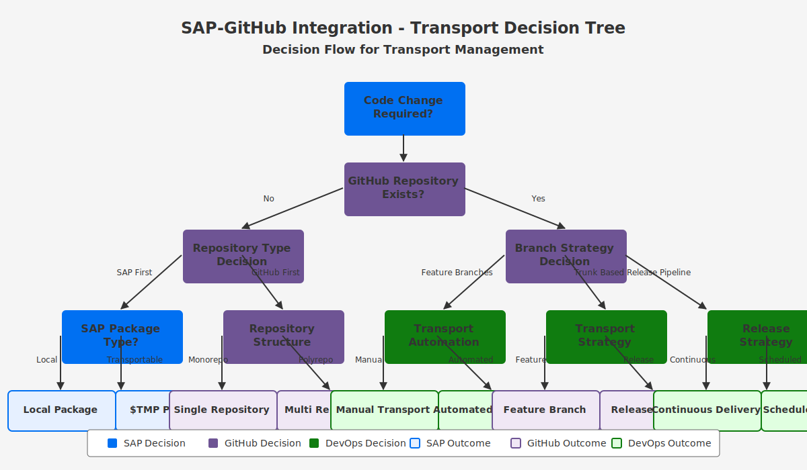

# 🔄 Workflow Configuration

  
  
  
  *Workflow configuration for SAP-GitHub integration*

## 📋 Table of Contents

- [📋 Overview](#-overview)
- [🏗️ Workflow Fundamentals](#️-workflow-fundamentals)
- [🔄 CI/CD Workflows](#-cicd-workflows)
- [📦 Transport Automation](#-transport-automation)
- [🔌 Integration Workflows](#-integration-workflows)
- [⚡ Example Workflows](#-example-workflows)
- [🛠️ Troubleshooting](#️-troubleshooting)
- [🔗 Related Documents](#-related-documents)

## 📋 Overview

This section provides detailed guidance on setting up and configuring workflows for automating the integration between SAP systems and GitHub. These workflows cover continuous integration, testing, deployment, and transport management.

## 🏗️ Workflow Fundamentals

Understand GitHub Actions basics:

- [Workflow Fundamentals](./workflow-fundamentals.md)
- [YAML Syntax](./yaml-syntax.md)
- [Workflow Permissions](./workflow-permissions.md)
- [Repository Setup](./repository-setup.md)

## 🔄 CI/CD Workflows

Set up continuous integration and delivery:

- [CI/CD Setup](./ci-cd-setup.md)
- [CICD Workflow](./cicd-workflow.md)
- [Static Analysis](./static-analysis.md)
- [Automated Testing](./automated-testing.md)
- [Integration Testing](./integration-testing.md)

> **💡 Tip:** Use matrix strategies for testing across multiple environments and configurations.

## 📦 Transport Automation

Automate SAP transport processes:

| Transport Process | Workflow | Documentation |
|:------------------|:---------|:--------------|
| Creation | [Transport Creation](./transport-creation.md) | Create transports via API |
| Assignment | [Transport Assignment](./transport-assignment.md) | Assign objects to transports |
| Release | [Transport Release](./transport-release.md) | Release transports |
| Sequencing | [Transport Sequencing](./transport-sequencing.md) | Manage transport sequence |

## 🔌 Integration Workflows

Specialized integration workflows:

- [Code Sync](./code-sync.md)
- [SAP API Integration](./sap-api-integration.md)
- [APIM Integration](./apim-integration.md)
- [Key Vault](./key-vault.md)
- [Sentinel Integration](./sentinel-integration.md)

## ⚡ Example Workflows

Learn from example implementations:

- [Simple Package](./examples/simple-package.md)
- [Complex App](./examples/complex-app.md)
- [Hotfix](./examples/hotfix.md)
- [Multi-System](./examples/multi-system.md)

## 🛠️ Troubleshooting

Solve common workflow challenges:

- [Troubleshooting](./troubleshooting.md)
- [Workflow Visualization](./workflow-visualization.md)
- [Logging Config](./logging-config.md)
- [Notifications](./notifications.md)

## 🔗 Related Documents

- [GitHub Setup](../github-setup/index.md)
- [SAP Setup](../sap-setup/index.md)
- [abapGit Setup](../abapgit-setup.md)

---

<strong>📊 Document Metadata</strong>

- **Last Updated:** 2025-04-07
- **Author:** SAP-GitHub Integration Team
- **Version:** 1.0.0
- **Status:** Published

