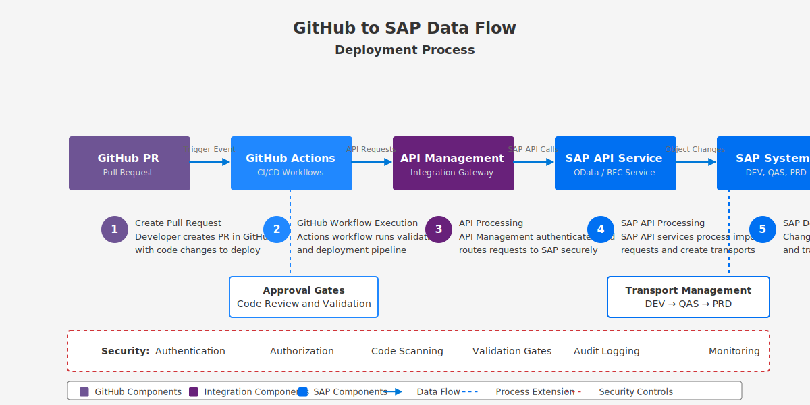

# 👨‍💻 Developer Guide

  
  
  
  *Guidelines for developers working with the SAP-GitHub integration*

## 📋 Table of Contents

- [📋 Overview](#-overview)
- [🔧 Development Environment Setup](#-development-environment-setup)
- [📚 API References](#-api-references)
- [🔄 Development Workflows](#-development-workflows)
- [⚙️ GitHub Features](#️-github-features)
- [🧪 Testing Guidelines](#-testing-guidelines)
- [🧠 GitHub Copilot Integration](#-github-copilot-integration)
- [🔗 Related Documents](#-related-documents)

## 📋 Overview

This Developer Guide provides comprehensive documentation for developers working with the SAP-GitHub integration. It covers setting up development environments, API references, development workflows, and best practices to ensure efficient and effective development practices.

## 🔧 Development Environment Setup

Prepare your development environment with:

- [Development Environment Setup](./dev-environment-setup.md)
- [Context-Aware Development](./context-aware-development.md)

## 📚 API References

Reference documentation for APIs:

- [API Management Configuration](./api-management/configuration.md)
- [GitHub API Integration](./github/actions-workflow-setup.md)

## 🔄 Development Workflows

Standard development workflows:

| Workflow | Description | Documentation |
|:---------|:------------|:--------------|
| Feature Development | Creating new features | [Feature Branches](../2-implementation-guide/tutorials/development/feature-branches.md) |
| Code Reviews | Review process | [Code Reviews](../2-implementation-guide/tutorials/development/code-reviews.md) |
| Pull Requests | PR workflow | [Pull Requests](../2-implementation-guide/tutorials/development/pull-requests.md) |
| CI/CD Integration | Continuous integration | [GitHub Actions](../2-implementation-guide/github-setup/workflow-guide.md) |

## ⚙️ GitHub Features

Leverage GitHub features:

- [Advanced GitHub Features](./advanced-github-features.md)
- [GitHub Actions Workflow Setup](./github/actions-workflow-setup.md)

> **💡 Tip:** Use branch protection rules to enforce code quality standards through required status checks.

## 🧪 Testing Guidelines

Follow testing best practices:

1. Write unit tests for all code changes
2. Implement integration tests for interfaces
3. Use mocks for SAP system dependencies
4. Follow test-driven development where possible

## 🧠 GitHub Copilot Integration

Enhance productivity with AI pair programming:

- [GitHub Copilot Integration](./github-copilot-integration.md)
- [Copilot for ABAP](./copilot-for-abap.md)

## 🔗 Related Documents

- [Architecture Documentation](../1-architecture/README.md)
- [Implementation Guide](../2-implementation-guide/README.md)
- [Operations Guide](../4-operations-guide/README.md)
- [API Reference](../5-reference/api-reference/index.md)

---

<strong>📊 Document Metadata</strong>

- **Last Updated:** 2025-04-07
- **Author:** SAP-GitHub Integration Team
- **Version:** 1.0.0
- **Status:** Published

