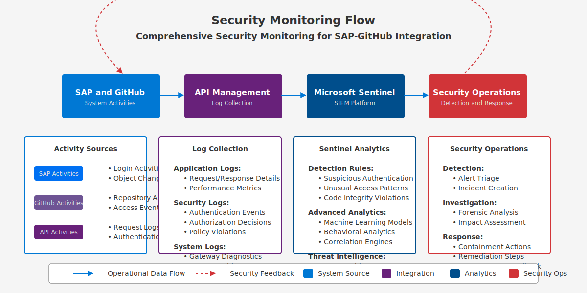

# 🛠️ Operations Guide

  
  
  
  *Maintaining and operating the SAP-GitHub integration*

## 📋 Table of Contents

- [📋 Overview](#-overview)
- [📊 Monitoring](#-monitoring)
- [💾 Backup & Recovery](#-backup--recovery)
- [🔧 Maintenance](#-maintenance)
- [⚡ Performance Tuning](#-performance-tuning)
- [🛡️ Security Operations](#️-security-operations)
- [🚨 Troubleshooting](#-troubleshooting)
- [🔗 Related Documents](#-related-documents)

## 📋 Overview

This Operations Guide provides comprehensive instructions for maintaining, monitoring, and troubleshooting the SAP-GitHub integration in production environments. It covers routine operations, performance optimization, disaster recovery, and security measures to ensure continuous availability and performance.

## 📊 Monitoring

Implement comprehensive monitoring:

- [Monitoring Overview](./monitoring.md) - Monitoring strategy and tools
- [Metrics Dashboard](./metrics-dashboard.md) - Key performance indicators
- [Alert Setup](./maintenance/alert-setup.md) - Configuring alerts and notifications

## 💾 Backup & Recovery

Ensure business continuity:

| Component | Backup Method | Recovery Procedure |
|:----------|:--------------|:-------------------|
| GitHub Repositories | [Repository Backup](./maintenance/repository-backup.md) | [Disaster Recovery](./disaster-recovery.md) |
| API Configurations | [Config Backup](./maintenance/config-backup.md) | [Business Continuity](./maintenance/business-continuity.md) |
| SAP Transport Routes | [Transport Backup](./maintenance/backup-strategy.md) | [System Recovery](./backup-recovery.md) |

See the [Backup Recovery](./backup-recovery.md) and [Disaster Recovery](./disaster-recovery.md) guides for complete information.

## 🔧 Maintenance

Regular maintenance procedures:

- [Daily Operations](./maintenance/daily-operations.md)
- [Weekly Maintenance](./maintenance/weekly-maintenance.md)
- [Monthly Maintenance](./maintenance/monthly-maintenance.md)
- [Quarterly Reviews](./maintenance/quarterly-reviews.md)

> **ℹ️ Note:** Follow the maintenance checklists in the [Maintenance Guide](./maintenance-guide.md) for comprehensive upkeep.

## ⚡ Performance Tuning

Optimize performance:

1. [API Performance](./maintenance/api-performance.md)
2. [GitHub Performance](./maintenance/github-performance.md)
3. [SAP Performance](./maintenance/sap-performance.md)
4. [Workflow Optimization](./maintenance/workflow-optimization.md)

## 🛡️ Security Operations

Maintain security controls:

- [Security Monitoring](./security/context-aware-security.md)
- [Security Updates](./maintenance/security-updates.md)
- [Security Incidents](./maintenance/security-incidents.md)
- [AI Governance Framework](./security/ai-governance-framework.md)

## 🚨 Troubleshooting

Address common issues:

- [Troubleshooting General](./maintenance/troubleshooting-general.md)
- [Troubleshooting Auth](./maintenance/troubleshooting-auth.md)
- [Troubleshooting Integration](./maintenance/troubleshooting-integration.md)
- [Troubleshooting Performance](./maintenance/troubleshooting-performance.md)
- [Troubleshooting Workflows](./maintenance/troubleshooting-workflows.md)

## 🔗 Related Documents

- [Architecture Documentation](../1-architecture/README.md)
- [Implementation Guide](../2-implementation-guide/README.md)
- [Developer Guide](../3-developer-guide/README.md)
- [Security Reference](../5-reference/security-reference/index.md)

---

<strong>📊 Document Metadata</strong>

- **Last Updated:** 2025-04-07
- **Author:** SAP-GitHub Integration Team
- **Version:** 1.0.0
- **Status:** Published

