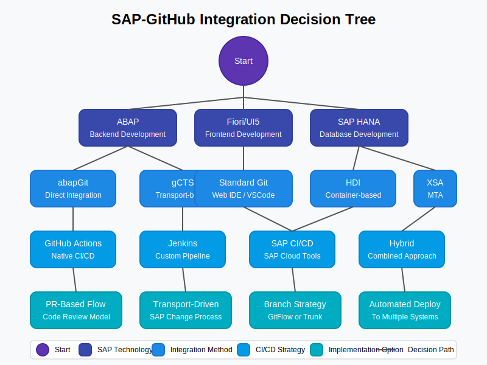

# 📑 Appendices

  
  
  
  *Supplementary materials, templates, and resources*

## 📋 Table of Contents

- [📋 Overview](#-overview)
- [📝 Templates](#-templates)
- [🔍 Troubleshooting](#-troubleshooting)
- [🎓 Training Resources](#-training-resources)
- [📋 Checklists](#-checklists)
- [📊 ROI Templates](#-roi-templates)
- [📚 Case Studies](#-case-studies)
- [❓ FAQ](#-faq)
- [🔗 Related Documents](#-related-documents)

## 📋 Overview

The Appendices section provides supplementary documentation, templates, and resources to support the implementation and operation of the SAP-GitHub integration. These materials complement the main documentation sections with practical tools and additional information.

## 📝 Templates

Ready-to-use templates:

| Template Type | Description | Link |
|:--------------|:------------|:-----|
| Document Template | Standard document format | [Document Template](./templates/document-template.md) |
| Checklist Template | Implementation checklist format | [Checklist Template](./templates/checklist-template.md) |
| API Templates | ABAP API templates | [ABAP API Template](./templates/api/abap-api-template.abap) |
| GitHub Templates | Issue and workflow templates | [Issue Templates](./templates/github/issue-templates) |
| Security Templates | Sentinel rule templates | [Sentinel Template](./templates/security/sentinel-rule-template.yaml) |

## 🔍 Troubleshooting

Resolve common issues:

- [Troubleshooting Guide](./support/troubleshooting-guide.md)
- [Common Problems Index](./troubleshooting/index.md)

> **💡 Tip:** Always check the logs first when troubleshooting integration issues.

## 🎓 Training Resources

Educational materials:

1. [Developer Training](./training/index.md)
2. [Administrator Training](./training/index.md)
3. [Security Training](./training/index.md)

## 📋 Checklists

Implementation checklists:

- [Implementation Checklist](./implementation-checklist.md)
- [Security Checklist](./best-practices/security-best-practices.md)
- [API Development Checklist](./best-practices/api-development.md)

## 📊 ROI Templates

Business value assessment:

- [ROI Calculator Template](./roi-templates.md)
- [ROI Calculator Spreadsheet Instructions](./templates/roi/roi-calculator-spreadsheet-instructions.md)
- [Sample ROI Calculation](./templates/roi/sample-roi-calculation.md)

## 📚 Case Studies

Real-world examples:

- [Case Studies Index](./case-studies/index.md)

## ❓ FAQ

Frequently asked questions:

- [General FAQ](./faq.md)
- [Technical FAQ](./faq.md)
- [Security FAQ](./faq.md)

## 🔗 Related Documents

- [Architecture Documentation](../1-architecture/README.md)
- [Implementation Guide](../2-implementation-guide/README.md)
- [Developer Guide](../3-developer-guide/README.md)
- [Operations Guide](../4-operations-guide/README.md)
- [Reference Documentation](../5-reference/README.md)

---

<strong>📊 Document Metadata</strong>

- **Last Updated:** 2025-04-07
- **Author:** SAP-GitHub Integration Team
- **Version:** 1.0.0
- **Status:** Published

