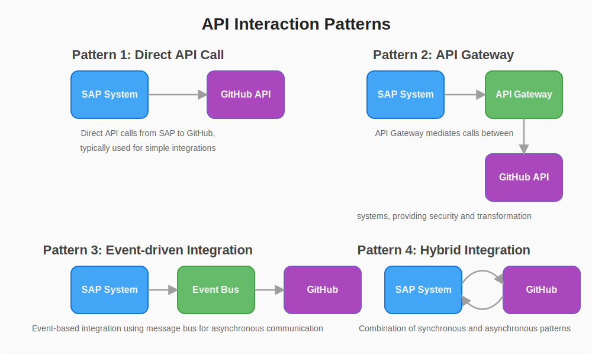
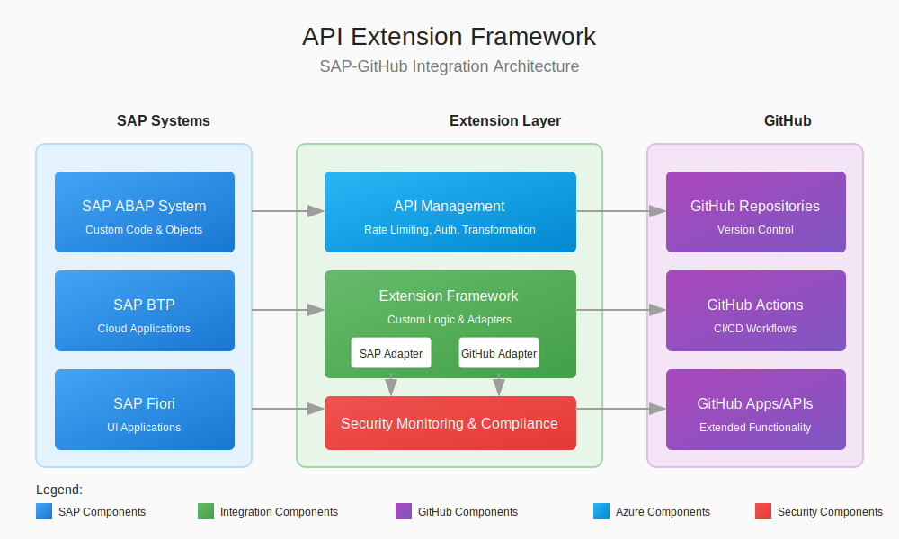

# 📄 API and Extension Framework

## 📋 Table of Contents

- [📋 Overview](#overview)
- [API Architecture](#api-architecture)
- [Extension Points](#extension-points)
- [API Management](#api-management)
- [Extension Development](#extension-development)
- [Reference Architecture](#reference-architecture)
- [🔧 Implementation Strategy](#implementation-strategy)
- [Use Cases](#use-cases)
- [Best Practices](#best-practices)
- [Related Documentation](#related-documentation)

This document outlines the API and extension framework for SAP-GitHub integration, providing a comprehensive approach for extending and customizing the integration capabilities while maintaining a stable and supportable architecture.

## 📋 Overview

The API and Extension Framework provides:

- Standardized interfaces for integration between SAP and GitHub
- Well-defined extension points for customization
- Governance mechanisms for API lifecycle management
- Security controls for API access and utilization

This framework enables organizations to extend the core integration while maintaining compatibility with future updates and ensuring security and performance standards.

## API Architecture

### Core API Layers

The API architecture consists of the following layers:

1. **SAP Backend APIs**
   - ABAP-based OData services
   - SAP Gateway services
   - RFC-enabled function modules
   - BAPIs and standard interfaces

2. **Integration Middleware APIs**
   - API Management proxies
   - API gateways
   - Event brokers
   - Message transformers

3. **GitHub APIs**
   - REST API
   - GraphQL API
   - Webhooks
   - GitHub Apps endpoints

4. **Custom Integration APIs**
   - Custom services for business logic
   - Orchestration services
   - Workflow interfaces
   - Security and monitoring APIs

### API Interaction Patterns

  

  
  *API Interaction Patterns between SAP and GitHub Systems*

The following interaction patterns are supported:

1. **Synchronous Request/Response**
   - Direct API calls with immediate response
   - Suitable for real-time operations
   - Transaction-based integration
   - User-initiated workflows

2. **Asynchronous Event-Based**
   - Webhook-triggered processes
   - Message queue integration
   - Event-driven architecture
   - Background processing

3. **Batch Processing**
   - Scheduled data synchronization
   - Bulk operations
   - ETL processes
   - Mass updates

4. **Streaming**
   - Real-time data flows
   - Continuous integration events
   - Activity monitoring
   - Live status updates

## Extension Points

### Standard Extension Points

1. **SAP System Extension Points**
   - Business Add-Ins (BAdIs)
   - User exits
   - Enhancement spots
   - Custom fields and logic

2. **GitHub Extension Points**
   - GitHub Actions
   - GitHub Apps
   - Custom webhooks
   - Probot applications

3. **Integration Layer Extensions**
   - API policies
   - Custom mediators
   - Message transformers
   - Pre/post processors

4. **UI Extension Points**
   - Custom Fiori applications
   - GitHub UI extensions
   - Custom dashboards
   - Embedded analytics

### Extension Framework Components

  

  
  *API Extension Framework Architecture*

#### 1. Extension Registry

Central registry that:
- Catalogs all available extension points
- Tracks implemented extensions
- Manages extension metadata
- Enforces compatibility constraints

#### 2. Extension Deployment

Deployment mechanisms that:
- Package extensions for deployment
- Validate extension prerequisites
- Manage extension lifecycle
- Support versioning and rollback

#### 3. Extension Security

Security controls that:
- Authorize access to extension points
- Validate extension code
- Monitor extension behavior
- Enforce security policies

## API Management

### API Governance

1. **API Design Standards**
   - Consistent naming conventions
   - Standardized parameter naming
   - Common response formats
   - Error handling patterns

2. **API Lifecycle Management**
   - Version management
   - Deprecation process
   - Breaking change policies
   - Transition support

3. **API Documentation**
   - OpenAPI/Swagger documentation
   - Interactive API consoles
   - Code samples and SDKs
   - Technical developer guides

### API Security

1. **Authentication Mechanisms**
   - OAuth 2.0 implementation
   - API keys and tokens
   - Service account authentication
   - SAML and OpenID Connect integration

2. **Authorization Controls**
   - Scope-based access control
   - Role-based permissions
   - Resource-level restrictions
   - Context-aware authorization

3. **API Protection**
   - Rate limiting
   - Quota management
   - Threat protection
   - Content validation

### API Monitoring

1. **Performance Metrics**
   - Response time tracking
   - Throughput measurement
   - Error rate monitoring
   - Quota utilization

2. **Usage Analytics**
   - API consumption patterns
   - Consumer identification
   - Business impact analysis
   - Trend analysis

3. **Operational Monitoring**
   - Health checks
   - Availability monitoring
   - SLA compliance tracking
   - Alerting and notification

## Extension Development

### Extension Types

1. **Process Extensions**
   - Workflow customizations
   - Approval process extensions
   - Status management extensions
   - Notification extensions

2. **Data Extensions**
   - Custom fields and attributes
   - Data transformation extensions
   - Validation rule extensions
   - Data enrichment extensions

3. **UI Extensions**
   - Custom views and screens
   - Report extensions
   - Dashboard extensions
   - Mobile app extensions

4. **Integration Extensions**
   - Third-party system connectors
   - Additional API support
   - Message format adapters
   - Protocol adapters

### Development Guidelines

1. **Extension Design Principles**
   - Loosely coupled design
   - Configuration over code
   - Backward compatibility
   - Defensive implementation

2. **Testing Requirements**
   - Unit testing standards
   - Integration test requirements
   - Performance test guidelines
   - Security test guidelines

3. **Documentation Standards**
   - Technical documentation
   - User documentation
   - Configuration guides
   - Troubleshooting guides

### Development Tools

1. **SAP Extension Development**
   - ABAP Development Tools
   - SAP Business Application Studio
   - SAP Extension Factory
   - SAPUI5 Extension tools

2. **GitHub Extension Development**
   - GitHub Actions development tools
   - GitHub App development
   - Probot framework
   - GitHub API libraries

3. **Integration Development**
   - API development tools
   - Middleware configuration tools
   - Message mapping tools
   - Testing and mocking tools

## Reference Architecture

### API Gateway Architecture

  

  
  *API Gateway and Extension Framework Architecture*

The API Gateway serves as the central point for:
- API traffic management
- Security enforcement
- Transformation and mediation
- Monitoring and analytics

Key components include:
- Gateway server
- Policy enforcement points
- Developer portal
- Analytics dashboard

### Extension Framework Architecture

  

  
  *Extension Framework with Integration Components*

The Extension Framework provides:
- Extension registry
- Extension deployment mechanisms
- Security controls
- Lifecycle management

## 🔧 Implementation Strategy

### API Implementation Approach

1. **API First Design**
   - Define API contracts first
   - Use OpenAPI/Swagger for documentation
   - Mock APIs for early testing
   - Validate APIs with consumers

2. **Versioning Strategy**
   - Semantic versioning (MAJOR.MINOR.PATCH)
   - Version in URL path (/v1/, /v2/)
   - Backward compatibility requirements
   - Deprecation announcements

3. **Security Implementation**
   - API security by design
   - Defense in depth approach
   - Least privilege principle
   - Regular security review

### Extension Implementation Approach

1. **Extension Classification**
   - Core extensions (officially supported)
   - Partner extensions (verified)
   - Custom extensions (organization-specific)
   - Sandbox extensions (experimental)

2. **Extension Development Process**
   - Requirements analysis
   - Extension design review
   - Development and testing
   - Certification if applicable
   - Deployment and monitoring

3. **Extension Governance**
   - Extension review board
   - Compatibility certification
   - Security validation
   - Performance impact analysis

## Use Cases

### API Use Cases

1. **Transport Management Integration**
   - Transport request creation via API
   - Transport status updates
   - Transport content retrieval
   - Transport execution

2. **Code Synchronization APIs**
   - Bidirectional code transfer
   - Version comparison
   - Conflict management
   - Metadata synchronization

3. **User and Role Management**
   - User synchronization
   - Role mapping
   - Permission management
   - Access control

4. **Workflow Integration**
   - Approval process integration
   - Status notifications
   - Task assignments
   - Process monitoring

### Extension Use Cases

1. **Custom Validation Rules**
   - Industry-specific code validation
   - Company standards enforcement
   - Regulatory compliance checks
   - Security scanning extensions

2. **Specialized Deployment Processes**
   - Industry-specific deployment steps
   - Compliance validation
   - Automated documentation
   - Custom approvals

3. **Business Process Integration**
   - Change management integration
   - Project management integration
   - Requirement traceability
   - Budget and resource tracking

4. **Custom Dashboards and Reporting**
   - Development KPI dashboards
   - Compliance reporting
   - Productivity analytics
   - Quality metrics visualization

## Best Practices

### API Design Best Practices

1. **API Design Principles**
   - RESTful resource orientation
   - Consistent naming conventions
   - Standardized error handling
   - Comprehensive documentation

2. **Performance Considerations**
   - Appropriate caching strategies
   - Pagination for large result sets
   - Asynchronous processing for long operations
   - Efficient data formats

3. **Security Guidelines**
   - Always use HTTPS
   - Implement proper authentication
   - Apply principle of least privilege
   - Input validation and output encoding

### Extension Development Best Practices

1. **Stability and Compatibility**
   - Defensive programming techniques
   - Graceful degradation
   - Feature detection over version checking
   - Thorough testing across versions

2. **Performance Impact**
   - Minimize performance overhead
   - Appropriate caching
   - Resource utilization awareness
   - Load testing requirements

3. **Maintainability**
   - Clear documentation
   - Modular design
   - Configuration options
   - Logging and monitoring

## Related Documentation

- [SAP Components Overview](./sap-components.md) - General overview of SAP components
- [Integration Architecture](./integration-architecture.md) - General integration patterns
- [Security Architecture](./security-architecture.md) - Security implementation details

---

