# 📄 Disaster Recovery and Business Continuity

## 📋 Table of Contents

- [📋 Overview](#overview)
- [Recovery Architecture Components](#recovery-architecture-components)
- [Recovery Time and Point Objectives](#recovery-time-and-point-objectives)
- [Backup Procedures](#backup-procedures)
- [Disaster Recovery Procedures](#disaster-recovery-procedures)
- [Failover Strategies](#failover-strategies)
- [Business Continuity Metrics](#business-continuity-metrics)
- [Incident Response Playbooks](#incident-response-playbooks)
- [Testing and Validation](#testing-and-validation)
- [🔧 Implementation Recommendations](#implementation-recommendations)
- [Related Documentation](#related-documentation)
- [References](#references)


This document outlines the disaster recovery (DR) and business continuity planning (BCP) architecture for SAP-GitHub integrations, providing comprehensive guidance for maintaining system availability and recoverability across all integration components.

## 📋 Overview

Disaster recovery and business continuity planning are critical for enterprise SAP-GitHub integrations, ensuring that development, deployment, and operational workflows can continue or quickly recover from disruptions. This document provides a framework for building resilient integration architectures, implementing backup strategies, and creating incident response procedures.

## Recovery Architecture Components

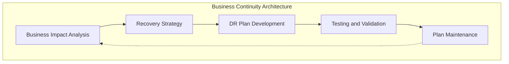

### Critical Integration Components

A comprehensive DR strategy must address all integration components, with particular attention to stateful and configuration components:

| Component Category | Examples | Criticality | Recovery Priority |
|-------------------|----------|-------------|-------------------|
| Source Code Repositories | Git repositories, wikis, release artifacts | High | 1 - Immediate |
| CI/CD Configuration | Pipeline definitions, environment configurations | High | 1 - Immediate |
| Integration Infrastructure | API gateways, message brokers, proxies | High | 1 - Immediate |
| Authentication Components | OAuth servers, certificate stores, SSO | High | 1 - Immediate |
| Self-hosted Runners | GitHub Actions runners, build servers | Medium | 2 - Next Business Day |
| Transport Management | Transport directories, configuration | High | 1 - Immediate |
| Monitoring Systems | Log aggregation, alerting, dashboards | Medium | 2 - Next Business Day |
| Documentation | Procedural documents, runbooks | Low | 3 - Within Week |

## Recovery Time and Point Objectives

### RTO and RPO Definitions

Recovery Time Objective (RTO) and Recovery Point Objective (RPO) form the foundation of the DR strategy:

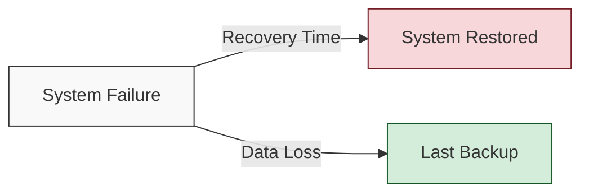

- **Recovery Time Objective (RTO)**: The maximum acceptable time to restore service after a disruption
- **Recovery Point Objective (RPO)**: The maximum acceptable data loss measured in time

### Enterprise SAP-GitHub Integration Targets

| Component | RTO | RPO | Justification |
|-----------|-----|-----|---------------|
| GitHub Enterprise Server | 1 hour | 15 minutes | Critical development infrastructure |
| GitHub Enterprise Database | 1 hour | 5 minutes | Repository data integrity |
| SAP Development Systems | 4 hours | 1 hour | Development environment availability |
| SAP QA/Test Systems | 8 hours | 4 hours | Non-critical for immediate operation |
| SAP Production Systems | 1 hour | 15 minutes | Business-critical operations |
| Integration Infrastructure | 2 hours | 30 minutes | Pipeline dependencies |
| CI/CD Configuration | 1 hour | 1 hour | Deployment capabilities |
| Transport Management | 2 hours | 1 hour | Release management dependencies |

### Critical Path Analysis

Identify the critical path for recovery to prioritize restoration efforts:

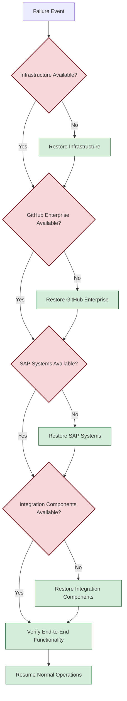

## Backup Procedures

### GitHub Enterprise Backup Strategy

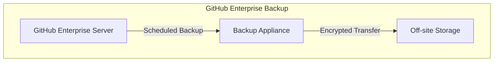

#### Backup Components and Frequency

| Component | Backup Frequency | Retention Period | Backup Method |
|-----------|-----------------|------------------|---------------|
| Git Repositories | Every 6 hours | 30 days | GitHub Backup Utilities |
| Issues and Pull Requests | Daily | 30 days | GitHub Backup Utilities |
| GitHub Actions Workflows | Daily | 30 days | File System Backup |
| GitHub Enterprise Config | After Changes | 90 days | Configuration as Code |
| GitHub Enterprise Database | Every 6 hours | 30 days | Database Backup |
| GitHub Enterprise Secrets | Weekly + After Changes | 90 days | Encrypted Backup |

#### Backup Implementation

Example backup implementation for GitHub Enterprise Server:

```bash
# Example GitHub Enterprise Backup Script
#!/bin/bash
# Run GitHub Enterprise Backup Utility

# Set variables
GHE_HOST="github.example.corp"
BACKUP_DIR="/mnt/backup/github"
TIMESTAMP=$(date +%Y%m%d_%H%M%S)
BACKUP_PATH="$BACKUP_DIR/$TIMESTAMP"

# Create backup directory
mkdir -p $BACKUP_PATH

# Run GitHub backup
ghe-backup -v $BACKUP_PATH

# Verify backup
if [ $? -eq 0 ]; then
  echo "Backup completed successfully to $BACKUP_PATH"
  # Create success marker
  touch "$BACKUP_PATH/backup_successful"
  
  # Cleanup old backups (keep last 30 days)
  find $BACKUP_DIR -type d -name "20*" -mtime +30 -exec rm -rf {} \;
else
  echo "Backup failed"
  # Send alert to monitoring system
  curl -X POST https://monitoring.example.com/api/alert \
    -d "{'service': 'github-backup', 'status': 'failed', 'severity': 'high'}"
fi

# Transfer to off-site storage
rsync -avz --delete $BACKUP_PATH offsite-storage:/backups/github/
```

### SAP Integration Components Backup

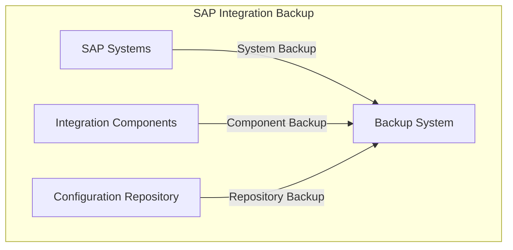

#### SAP Integration Component Backup Strategy

| Component | Backup Frequency | Retention Period | Backup Method |
|-----------|-----------------|------------------|---------------|
| Integration Server Configuration | Daily | 90 days | Configuration Export |
| API Gateway Configurations | Daily | 90 days | API Definition Export |
| Custom Integration Code | With each change | Indefinite | Git Repository |
| Integration Certificates | Weekly + After Changes | 1 year | Certificate Store Backup |
| Transport Configurations | Daily | 90 days | File System Backup |
| SAP Gateway Configuration | Weekly + After Changes | 90 days | Configuration Export |
| SAP ABAP Git Connectors | Weekly | 90 days | Configuration Backup |

## Disaster Recovery Procedures

### Recovery Scenarios

#### Scenario 1: GitHub Enterprise Server Failure

**Impact**: Developers unable to access repositories, submit/review code, or run CI/CD pipelines

**Recovery Procedure**:

1. **Assess Failure**
   - Identify failure cause (hardware, software, network)
   - Determine if failure is temporary or requires full recovery

2. **Activate DR Plan**
   - Notify affected stakeholders
   - Assemble recovery team
   - Prepare recovery environment

3. **Recover GitHub Enterprise**
   - Provision recovery server if needed
   - Restore from latest backup
   - Verify data integrity

4. **Validate Functionality**
   - Test repository access
   - Verify authentication/authorization
   - Test CI/CD pipeline execution

5. **Resume Operations**
   - Redirect traffic to recovered system
   - Notify users of restored service
   - Monitor system for stability

#### Scenario 2: SAP Integration Component Failure

**Impact**: CI/CD pipelines unable to deploy to SAP, broken integration between GitHub and SAP

**Recovery Procedure**:

1. **Identify Failed Components**
   - Diagnose specific integration component failure
   - Assess impact on dependent systems

2. **Isolate Failure**
   - Prevent cascading failures
   - Implement temporary workarounds if available

3. **Restore Components**
   - Redeploy integration components from source code
   - Restore configuration from backup
   - Reconfigure authentication if needed

4. **Validate Integration**
   - Test end-to-end integration flows
   - Verify data consistency
   - Confirm deployment capabilities

5. **Resume Operations**
   - Enable normal workflow processing
   - Clear any backlog of operations
   - Update monitoring systems

#### Scenario 3: Data Corruption

**Impact**: Repository history corruption, integration configuration damage, or transport system corruption

**Recovery Procedure**:

1. **Contain Corruption**
   - Identify affected components
   - Prevent further corruption spread
   - Lock affected systems if necessary

2. **Assess Damage**
   - Determine extent of corruption
   - Identify last known good state
   - Develop recovery strategy

3. **Data Restoration**
   - Restore from pre-corruption backup
   - Restore configuration from version control
   - Rebuild corrupted repositories if needed

4. **Data Validation**
   - Verify data integrity
   - Check for missing information
   - Validate configuration correctness

5. **Prevention Measures**
   - Identify corruption cause
   - Implement preventive measures
   - Enhance monitoring for early detection

### Recovery Runbooks

Example recovery runbook structure:

```yaml
# GitHub Enterprise Recovery Runbook
name: "GitHub Enterprise Server Recovery"
version: "1.2"
last_updated: "2025-02-15"
owners:
  - "Infrastructure Team"
  - "DevOps Team"

prerequisites:
  - "Access to GitHub Enterprise backup"
  - "Recovery environment ready"
  - "Network connectivity verified"
  - "DNS control access"

procedure:
  - step: "Assess failure"
    details: "Determine cause and extent of failure"
    responsible: "Infrastructure Team"
    
  - step: "Notify stakeholders"
    details: "Inform affected users via status page and email"
    responsible: "Communications Team"
    
  - step: "Prepare recovery environment"
    details: "Ensure recovery server meets specifications"
    responsible: "Infrastructure Team"
    
  - step: "Restore from backup"
    details: "Use ghe-restore utility with latest backup"
    responsible: "DevOps Team"
    command: "ghe-restore -v /path/to/latest-backup"
    
  - step: "Verify restoration"
    details: "Check repository integrity, user access, and system health"
    responsible: "DevOps Team"
    
  - step: "Update DNS"
    details: "Point DNS to recovered instance"
    responsible: "Network Team"
    
  - step: "Resume operations"
    details: "Monitor system performance and address any issues"
    responsible: "Operations Team"

verification:
  - "Repository access test"
  - "Authentication test"
  - "CI/CD pipeline execution test"
  - "Integration component connectivity test"

rollback:
  description: "If recovery fails or causes additional issues"
  procedure:
    - "Revert DNS changes"
    - "Inform users of extended outage"
    - "Escalate to senior technical staff"
    - "Consider alternative recovery options"
```

## Failover Strategies

### High Availability Architecture

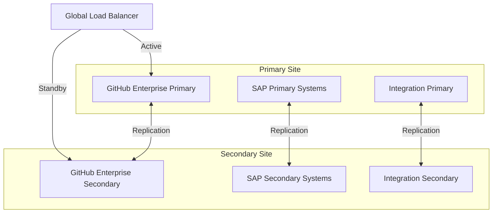

### Failover Types

#### Active-Passive Failover

For GitHub Enterprise and stateful integration components:

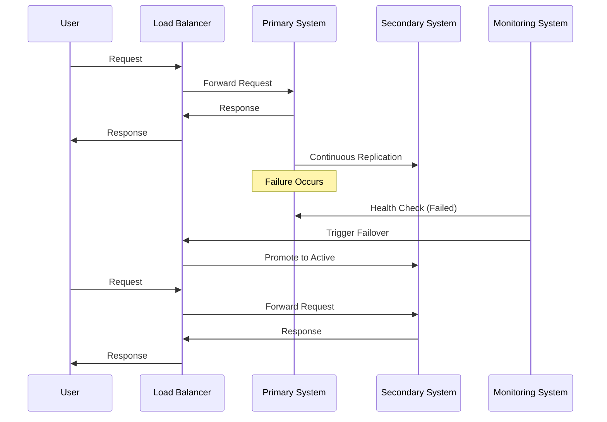

**Implementation Guidelines**:

- Maintain up-to-date replicas with near-real-time synchronization
- Implement automated health checks with configurable thresholds
- Design failover processes that minimize or eliminate manual intervention
- Test failover procedures regularly as part of DR testing

#### Active-Active Configuration

For stateless integration components and read operations:

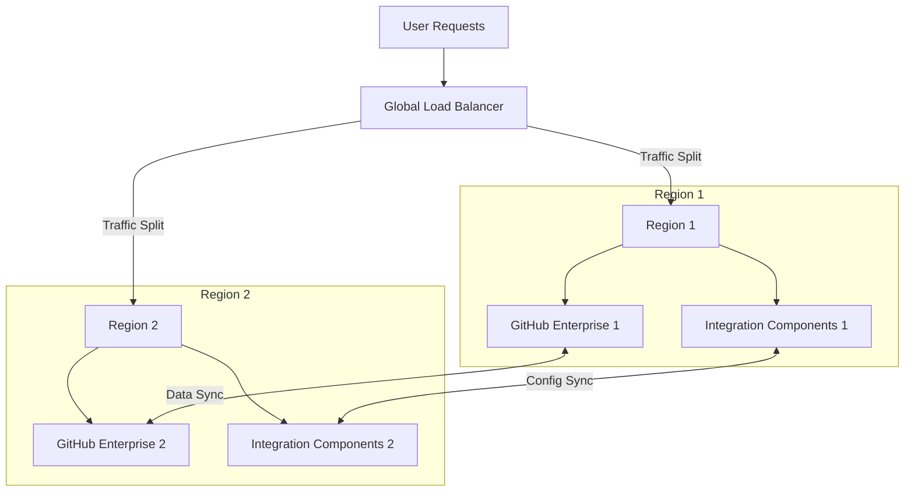

**Implementation Guidelines**:

- Use global load balancers with geo-routing capabilities
- Ensure data synchronization between active instances
- Implement consistent session handling
- Design for eventual consistency where applicable

## Business Continuity Metrics

### Recovery Efficiency Metrics

Track and improve recovery capabilities using key metrics:

| Metric | Description | Target | Measurement Method |
|--------|-------------|--------|-------------------|
| Mean Time to Recovery (MTTR) | Average time to restore service after failure | < 45 minutes | Incident timestamps |
| Recovery Point Accuracy | How close to the RPO the actual recovery achieved | > 95% | Data comparative analysis |
| First-Time Recovery Success | Percentage of recoveries that succeed on first attempt | > 90% | DR test results |
| Recovery Cost | Resources expended during recovery operations | Within budget | Finance tracking |
| Business Impact Duration | Time business operations were affected | < RTO | Business process monitoring |

### Continuous Improvement Process

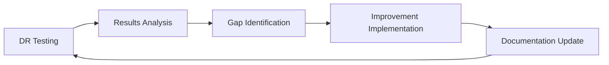

Implement a regular improvement cycle:

1. **Regular Testing**
   - Scheduled DR tests (quarterly minimum)
   - Scenario-based exercises
   - Surprise resilience tests

2. **Performance Analysis**
   - Compare actual vs target recovery metrics
   - Identify bottlenecks and failure points
   - Document lessons learned

3. **Process Enhancement**
   - Update recovery procedures
   - Improve automation
   - Enhance monitoring and alerting

## Incident Response Playbooks

### Incident Classification

Classify incidents to determine appropriate response:

| Severity Level | Description | Response Time | Escalation Path | Example |
|----------------|-------------|---------------|-----------------|---------|
| Critical (P1) | Complete loss of service, significant business impact | Immediate (24/7) | CTO, CIO | GitHub Enterprise complete outage |
| High (P2) | Partial service disruption, notable business impact | < 2 hours | IT Director, Head of DevOps | CI/CD pipeline failure affecting deployments |
| Medium (P3) | Limited functionality issues, minimal business impact | Next business day | Team Lead | Self-hosted runner capacity issues |
| Low (P4) | Minor issues, no business impact | Planned work | Team member | Documentation inconsistencies |

### Standard Incident Response Process

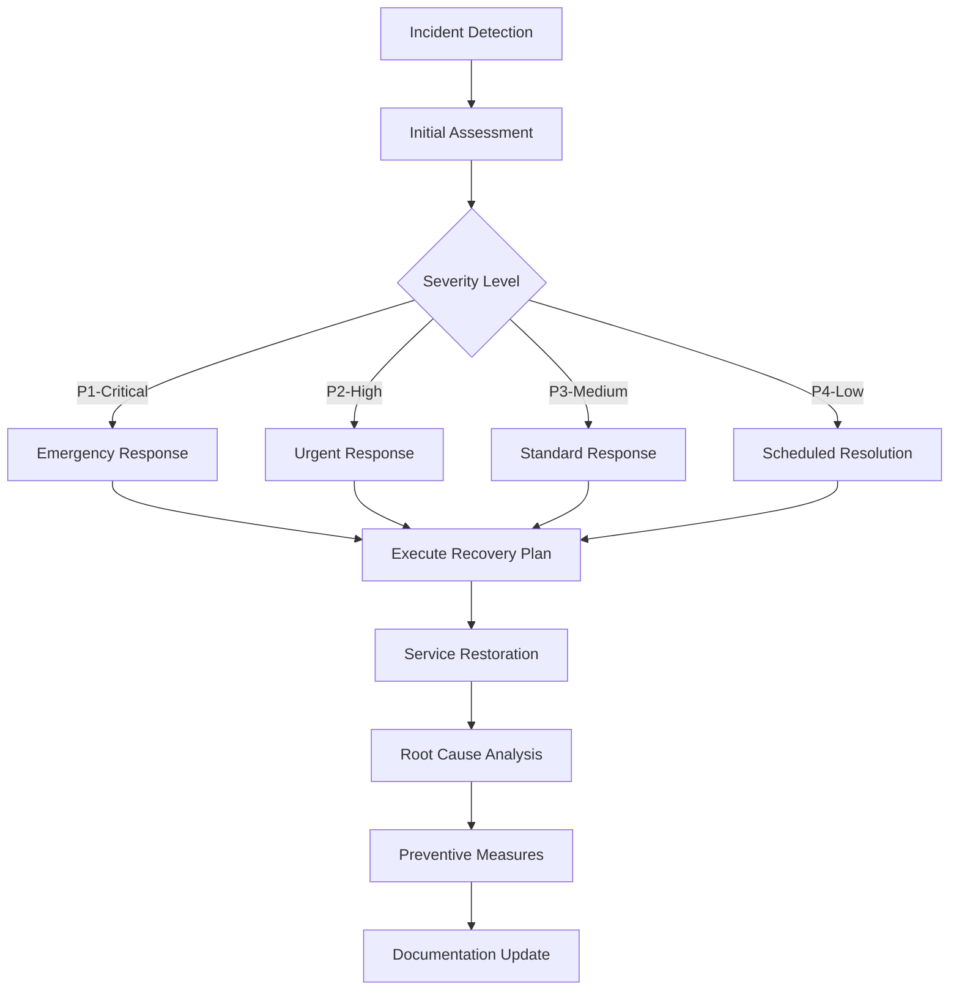

### Example Playbook: GitHub Enterprise Outage

```yaml
# GitHub Enterprise Outage Response Playbook
title: "GitHub Enterprise Outage Response"
severity: "P1-Critical"
response_team:
  - "DevOps Lead (Primary)"
  - "Infrastructure Engineer"
  - "Network Engineer"
  - "Security Engineer"
  - "Communications Lead"

detection:
  - "Monitoring alert from status check failure"
  - "User reports of GitHub Enterprise inaccessibility"
  - "CI/CD pipeline failure notifications"
  - "Integration error alerts"

initial_assessment:
  - "Verify outage through multiple channels"
  - "Determine if outage is complete or partial"
  - "Check for scheduled maintenance activities"
  - "Assess if outage is localized or global"

communication:
  initial:
    - "Post incident notification to status page"
    - "Send alert to development teams via preferred channel"
    - "Notify management via established escalation path"
  
  updates:
    frequency: "Every 30 minutes"
    channels:
      - "Status page"
      - "Email distribution list"
      - "Chat channel"

response_procedure:
  - step: "Determine cause of outage"
    actions:
      - "Check server status and resource utilization"
      - "Review recent changes or deployments"
      - "Examine network connectivity"
      - "Check authentication systems"
  
  - step: "Implement immediate mitigation"
    actions:
      - "Restart services if appropriate"
      - "Rollback recent changes if identified as cause"
      - "Implement traffic rerouting if network-related"
      - "Scale resources if capacity-related"
  
  - step: "Execute recovery plan"
    actions:
      - "If self-recovery not possible, initiate failover procedure"
      - "Follow GitHub Enterprise recovery runbook"
      - "Verify restoration of service functionality"

  - step: "Validate integrations"
    actions:
      - "Test SAP integration components"
      - "Verify CI/CD pipeline functionality"
      - "Ensure transport system connectivity"

resolution:
  - "Confirm service restoration with multiple teams"
  - "Update status page with resolved status"
  - "Send resolution notification to all stakeholders"
  - "Schedule post-incident review"

post_incident:
  - "Conduct formal root cause analysis"
  - "Document incident timeline and response actions"
  - "Identify preventive measures"
  - "Update recovery procedures based on lessons learned"
  - "Implement monitoring improvements for earlier detection"
```

## Testing and Validation

### DR Test Types

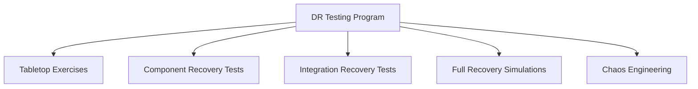

Implement a comprehensive testing approach:

1. **Tabletop Exercises**
   - Cross-functional team discussions
   - Scenario-based response planning
   - No actual system changes

2. **Component Recovery Tests**
   - Testing recovery of individual components
   - Scheduled backup restoration verification
   - Functionality validation

3. **Integration Recovery Tests**
   - Multi-component recovery testing
   - Integration functionality verification
   - Cross-system communication testing

4. **Full Recovery Simulations**
   - Complete DR scenario execution
   - Business process validation
   - RTO/RPO assessment

5. **Chaos Engineering**
   - Controlled failure injection
   - Resilience verification
   - Unexpected scenario handling

### Test Schedule and Documentation

| Test Type | Frequency | Participants | Documentation |
|-----------|-----------|--------------|---------------|
| Tabletop Exercises | Quarterly | DR Team, Business Stakeholders | Scenario Documentation, Findings Report |
| Component Recovery | Monthly | Technical Teams | Test Results, Recovery Time Measurements |
| Integration Recovery | Quarterly | Technical Teams, Integration Specialists | Interdependency Map, Recovery Sequence |
| Full Simulation | Annually | All Stakeholders | Complete DR Assessment, Gap Analysis |
| Chaos Engineering | Ongoing | Platform Engineering | Resilience Report, Improvement Recommendations |

## 🔧 Implementation Recommendations

Based on real-world implementations, the following recommendations apply to DR and BCP for SAP-GitHub integrations:

1. **Prioritize Configuration Management**
   - Store all configurations in version control
   - Implement infrastructure as code where possible
   - Automate configuration deployment

2. **Design for Resilience**
   - Build redundancy into critical components
   - Implement graceful degradation patterns
   - Design circuit breakers for integration points

3. **Invest in Monitoring**
   - Implement comprehensive health checks
   - Create custom integration monitoring
   - Establish clear alerting thresholds

4. **Practice Regular Recovery**
   - Schedule and execute recovery tests
   - Rotate DR responsibilities among team members
   - Continuously improve procedures based on learnings

## Related Documentation

- [Integration Architecture](./integration-architecture.md)
- [Environment Configurations](./environment-configurations.md)
- [Governance Model](./governance-model.md)
- [System Architecture](./system-architecture.md)

## References

1. GitHub. (2025). "GitHub Enterprise Backup and Disaster Recovery Guide."
2. SAP. (2025). "SAP Disaster Recovery Implementation Guide."
3. NIST. (2025). "Contingency Planning Guide for Information Technology Systems."
4. Gartner. (2025). "Best Practices in IT Disaster Recovery Planning."
5. ISO. (2025). "ISO 22301: Business Continuity Management Systems."
---


