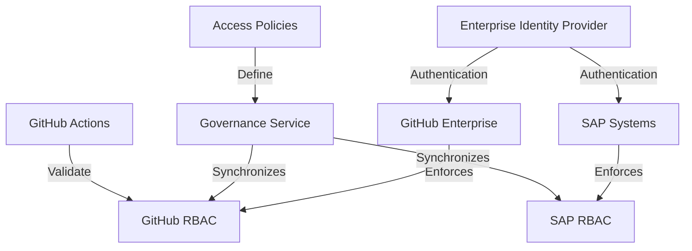
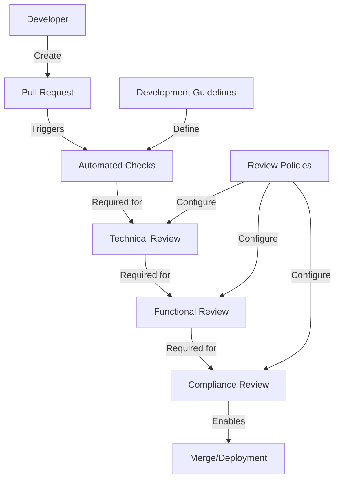
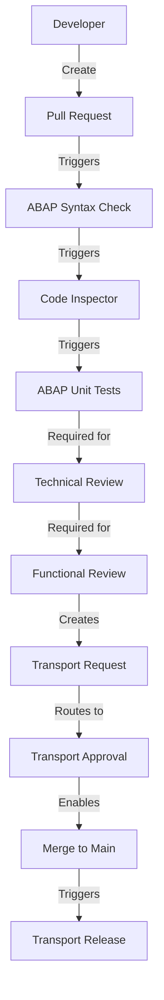
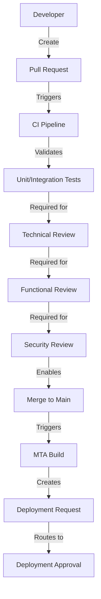
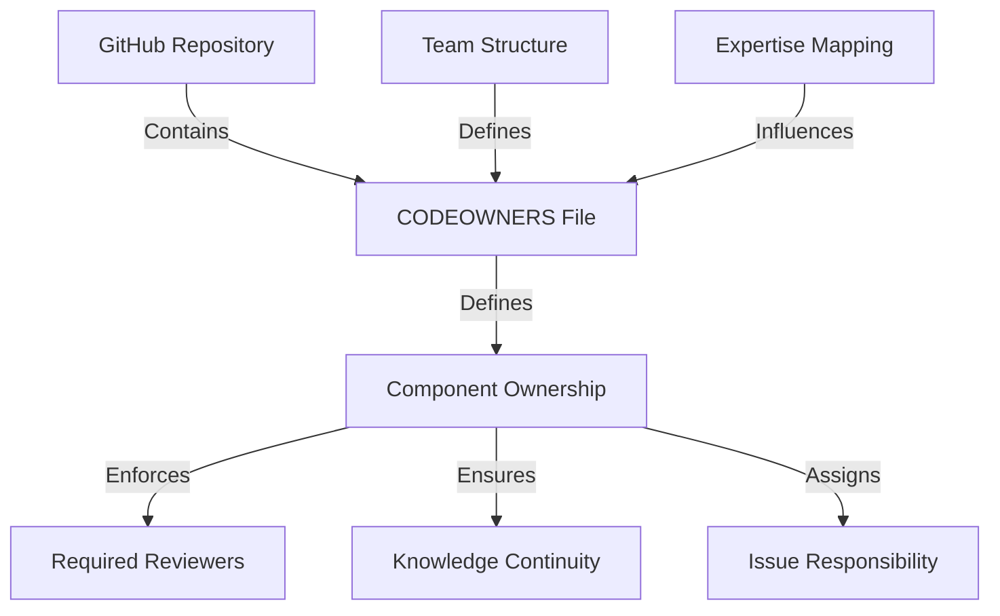
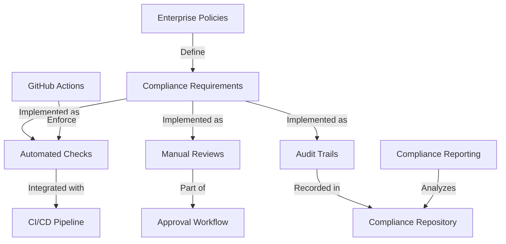
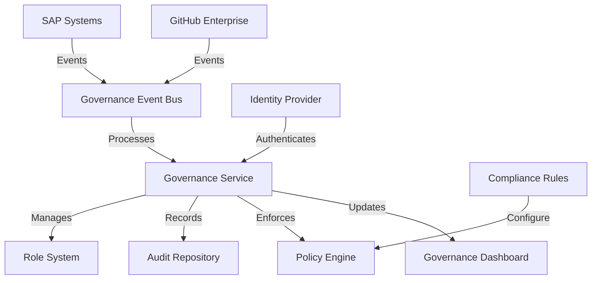

# 📄 Enterprise Governance Model

## 📋 Table of Contents

- [📋 Overview](#overview)
- [Governance Components](#governance-components)
- [Role-Based Access Control Patterns](#role-based-access-control-patterns)
- [Approval Workflow Framework](#approval-workflow-framework)
- [Code Ownership Model](#code-ownership-model)
- [Compliance Framework](#compliance-framework)
- [Governance Tooling](#governance-tooling)
- [Governance Metrics](#governance-metrics)
- [🔄 Process Efficiency](#process-efficiency)
- [Compliance Status](#compliance-status)
- [🛡
️ ️ Security Posture](#security-posture)
- [Code Quality](#code-quality)
- [🔧 Implementation Recommendations](#implementation-recommendations)
- [Related Documentation](#related-documentation)
- [References](#references)


This document outlines the enterprise governance model for SAP-GitHub integration, addressing role-based access control, approval workflows, code ownership, and compliance considerations across all SAP technologies.

## 📋 Overview

An effective governance model is essential for successful SAP-GitHub integration, ensuring proper controls while enabling developer productivity. This model spans organizational, process, and technical domains to create a balanced approach that works across different SAP technologies.

## Governance Components

The governance model consists of the following key components:

1. **Role-Based Access Control Framework** - Structured access management across GitHub and SAP systems
2. **Approval Workflow Framework** - Multi-level approval processes aligned with enterprise standards
3. **Code Ownership Model** - Clear ownership and responsibility definitions
4. **Compliance Framework** - Standards-based compliance controls and monitoring
5. **Governance Tooling** - Tools to implement and enforce governance policies
6. **Governance Metrics** - Measurements to evaluate governance effectiveness

## Role-Based Access Control Patterns

### Access Control Architecture



### Role Hierarchy

The role hierarchy follows a structured approach across all SAP technologies:

| Role Level | GitHub Roles | SAP Roles | Permissions |
|------------|-------------|-----------|------------|
| Organization Administrator | Organization Owner | SAP System Administrator | Full system administration, repository creation |
| Team Lead | Team Maintainer | Development Lead, Transport Admin | Repository creation, branch protection management |
| Senior Developer | Repository Maintainer | Developer with extended privileges | Merge approvals, protected branch management |
| Developer | Repository Write | Developer | Code contributions, pull request creation |
| Reviewer | Repository Triage | Code Reviewer | Pull request reviews, issue management |
| Observer | Repository Read | Read-only User | Read access to code and documentation |
| CI/CD Service | GitHub Actions, App | Technical User | Automated workflow execution |

### Technology-Specific Considerations

Each SAP technology requires specific RBAC considerations:

#### ABAP Systems

```yaml
# ABAP-specific RBAC configuration
abapRbacConfig:
  repositoryPermissions:
    - role: SeniorDeveloper
      permissions:
        - createTransport
        - releaseTransport
        - createPackage
    - role: Developer
      permissions:
        - modifyObjects
        - createObjects
        - assignToTransport
    - role: Reviewer
      permissions:
        - readObjects
        - checkObjects
        
  transportPermissions:
    - role: TeamLead
      permissions:
        - approveTransport
        - importTransport
    - role: CI/CDService
      permissions:
        - triggerTransport
        - checkTransportStatus
```

#### SAP BTP Applications

```yaml
# BTP-specific RBAC configuration
btpRbacConfig:
  cloudFoundryPermissions:
    - role: OrganizationAdministrator
      permissions:
        - manageOrganizations
        - manageSpaces
        - assignQuotas
    - role: TeamLead
      permissions:
        - createServices
        - manageRoles
        - manageSpaceMembers
    - role: Developer
      permissions:
        - pushApplications
        - bindServices
        - viewLogs
        
  apiManagementPermissions:
    - role: TeamLead
      permissions:
        - createAPIProducts
        - publishAPIs
    - role: Developer
      permissions:
        - createAPIs
        - testAPIs
        - modifyPolicies
```

#### Fiori/UI5 Applications

```yaml
# Fiori/UI5-specific RBAC configuration
fioriRbacConfig:
  appDevelopmentPermissions:
    - role: SeniorDeveloper
      permissions:
        - createApplications
        - configureRouting
        - manageLibraries
    - role: Developer
      permissions:
        - modifyViews
        - modifyControllers
        - runTests
        
  launchpadPermissions:
    - role: TeamLead
      permissions:
        - configureCatalogs
        - assignRoles
        - manageGroups
    - role: Developer
      permissions:
        - createTiles
        - testCatalogs
```

### GitHub Branch Protection Rules

Branch protection is critical to enforce governance across all SAP technologies:

```yaml
# Branch protection configuration
branchProtectionRules:
  - branch: main
    requiredReviews: 2
    requiredStatusChecks:
      - ci-build
      - code-quality
      - security-scan
    restrictPushAccess: true
    allowedToMerge:
      - TeamLead
      - SeniorDeveloper
      
  - branch: develop
    requiredReviews: 1
    requiredStatusChecks:
      - ci-build
      - code-quality
    restrictPushAccess: false
    allowedToMerge:
      - Developer
      - SeniorDeveloper
      
  - branch: 'release/*'
    requiredReviews: 2
    requiredStatusChecks:
      - ci-build
      - code-quality
      - security-scan
      - compliance-check
    restrictPushAccess: true
    allowedToMerge:
      - TeamLead
```

### GitHub Actions for RBAC Validation

Example GitHub Actions workflow for RBAC validation:

```yaml
name: RBAC Validation
on:
  schedule:
    - cron: '0 0 * * *'  # Daily at midnight
  workflow_dispatch:
    
jobs:
  validate-github-rbac:
    runs-on: ubuntu-latest
    steps:
      - name: Checkout governance config
        uses: actions/checkout@v3
        with:
          repository: 'org/governance-config'
          
      - name: Validate repository permissions
        uses: governance-actions/validate-permissions@v1
        with:
          config-file: rbac/github-permissions.yaml
          
      - name: Generate RBAC compliance report
        run: |
          ./scripts/generate-rbac-report.sh
          
      - name: Upload RBAC report
        uses: actions/upload-artifact@v3
        with:
          name: rbac-compliance-report
          path: rbac-report.pdf
          
  validate-sap-rbac:
    runs-on: ubuntu-latest
    steps:
      - name: Validate SAP role assignments
        uses: sap-actions/validate-sap-roles@v1
        with:
          systems: ${{ secrets.SAP_SYSTEMS }}
          expected-config: rbac/sap-permissions.yaml
```

## Approval Workflow Framework

### Approval Workflow Architecture



### Approval Workflow Components

1. **Pull Request Validation**
   - Automated code quality checks
   - Security scanning
   - Test coverage validation
   - Performance impact assessment

2. **Technical Review**
   - Code structure and standards
   - Architecture compliance
   - Performance considerations
   - Security implementation

3. **Functional Review**
   - Business requirement fulfillment
   - Business process testing
   - User experience validation
   - Documentation completeness

4. **Compliance Review**
   - Regulatory compliance
   - Licensing validation
   - Audit requirements
   - Data privacy considerations

### Technology-Specific Approval Flows

#### ABAP System Approvals



#### BTP Application Approvals



### Approval Configuration

Example approval configuration for GitHub and SAP systems:

```yaml
# approval-workflows.yaml
pullRequestApprovals:
  default:
    requiredReviewers: 2
    requiredChecks:
      - ci-build
      - code-quality
      - security-scan
    timeoutHours: 72
    
  critical:
    requiredReviewers: 3
    requiredChecks:
      - ci-build
      - code-quality
      - security-scan
      - compliance-check
    timeoutHours: 48
    escalationPath: "security-team"
    
transportApprovals:
  development:
    approvers:
      - TeamLead
      - SeniorDeveloper
    autoApprove: true
    
  quality:
    approvers:
      - QALead
      - TeamLead
    autoApprove: false
    approvalDeadlineHours: 24
    
  production:
    approvers:
      - ProductionControl
      - ReleaseManager
    autoApprove: false
    approvalDeadlineHours: 48
    approvalMeeting: "Change Advisory Board"
    scheduledWindow: "Sunday 2:00-6:00"
```

### GitHub Actions for Approval Workflow

Example GitHub Actions workflow for approval automation:

```yaml
name: Pull Request Approval Workflow
on:
  pull_request:
    types: [opened, synchronize, reopened, ready_for_review]
    
jobs:
  determine-approval-path:
    runs-on: ubuntu-latest
    outputs:
      approval-path: ${{ steps.set-path.outputs.path }}
    steps:
      - name: Determine approval path
        id: set-path
        run: |
          if grep -q "critical" <<< "${{ github.event.pull_request.labels }}"; then
            echo "path=critical" >> $GITHUB_OUTPUT
          else
            echo "path=default" >> $GITHUB_OUTPUT
          fi
          
  assign-reviewers:
    needs: determine-approval-path
    runs-on: ubuntu-latest
    steps:
      - name: Checkout governance config
        uses: actions/checkout@v3
        with:
          repository: 'org/governance-config'
          
      - name: Assign reviewers
        uses: governance-actions/assign-reviewers@v1
        with:
          approval-path: ${{ needs.determine-approval-path.outputs.approval-path }}
          config-file: approvals/reviewer-assignment.yaml
          
  notify-approvers:
    needs: assign-reviewers
    runs-on: ubuntu-latest
    steps:
      - name: Send notification
        uses: governance-actions/notify-approvers@v1
        with:
          channel: teams
          message-template: approvals/notification-template.md
```

## Code Ownership Model

### Code Ownership Architecture



### Code Ownership Components

1. **CODEOWNERS Structure**
   - Component-based ownership definition
   - Team and individual assignments
   - Escalation paths
   - Backup ownership

2. **Ownership Scope Definition**
   - Explicit component boundaries
   - Cross-component dependencies
   - Shared responsibility areas
   - Architectural decision ownership

3. **Ownership Lifecycle Management**
   - Ownership transfers
   - Team changes
   - Knowledge transfer requirements
   - Onboarding procedures

### Technology-Specific Ownership Models

#### ABAP Code Ownership

```
# ABAP CODEOWNERS
# Syntax: <path-pattern> <owners>

# Core ABAP Development
/src/z_core_modules/ @abap-core-team @john.smith
/src/z_core_interfaces/ @abap-core-team @integration-team

# Business Process Modules
/src/z_sales/ @sales-team @sarah.johnson
/src/z_logistics/ @logistics-team @david.miller
/src/z_finance/ @finance-team @finance-architects

# Technical Modules
/src/z_interfaces/ @integration-team
/src/z_reports/ @bi-team @reporting-architects
/src/z_batch/ @batch-team @operations-team

# Transport Configuration
/config/transport/ @basis-team @release-managers
```

#### BTP Application Ownership

```
# BTP Application CODEOWNERS

# App Modules
/app/ui/ @frontend-team @ui-architects
/app/webapp/ @frontend-team

# Service Modules
/srv/ @backend-team @api-architects
/srv/service-catalog/ @integration-team @backend-team

# Database Modules
/db/ @database-team @data-architects
/db/schema/ @data-governance-team @database-team

# Deployment Configuration
/mta.yaml @devops-team @cloud-architects
/deployment/ @devops-team
/.pipeline/ @ci-cd-team @devops-team

# Security Configuration
/security/ @security-team
/xs-security.json @security-team @cloud-architects

# Documentation
/docs/ @technical-writers @product-team
```

### Code Ownership Management

Example code ownership management process:

1. **Ownership Assignment**
   - Based on team expertise and responsibilities
   - Documented in CODEOWNERS file
   - Mapped to organizational structure
   - Reviewed quarterly

2. **Ownership Changes**
   - Formal handover process
   - Knowledge transfer sessions
   - Documentation updates
   - Ownership change approval

3. **Ownership Disputes**
   - Resolution process with architectural review
   - Escalation path to technical leadership
   - Cross-team collaborative resolution
   - Architecture decision records

4. **Ownership Validation**
   - Automated ownership validation
   - Consistency with actual contributions
   - Knowledge gap identification
   - Expertise development planning

### GitHub Actions for Code Ownership Management

Example GitHub Actions workflow for code ownership management:

```yaml
name: Code Ownership Management
on:
  schedule:
    - cron: '0 0 * * 0'  # Weekly on Sunday
  pull_request:
    paths:
      - 'CODEOWNERS'
    
jobs:
  validate-codeowners:
    runs-on: ubuntu-latest
    steps:
      - name: Checkout code
        uses: actions/checkout@v3
        
      - name: Validate CODEOWNERS syntax
        uses: governance-actions/validate-codeowners@v1
        
      - name: Check ownership coverage
        run: |
          ./scripts/check-ownership-coverage.sh
          
  analyze-ownership-activity:
    runs-on: ubuntu-latest
    steps:
      - name: Analyze contribution patterns
        uses: governance-actions/analyze-contributions@v1
        with:
          lookback-months: 6
          
      - name: Generate ownership recommendation
        run: |
          ./scripts/recommend-ownership-updates.sh
          
      - name: Create ownership report
        uses: actions/github-script@v6
        with:
          script: |
            // Generate ownership report issue
```

## Compliance Framework

### Compliance Architecture



### Compliance Components

1. **Policy Implementation**
   - Technical control implementation
   - Policy-as-code approach
   - Automated validation
   - Exception management

2. **Audit Trail Management**
   - Comprehensive activity logging
   - Signed commit enforcement
   - Approval documentation
   - Change tracking

3. **Regulatory Compliance**
   - Industry-specific requirements
   - Geographical considerations
   - Documentation generation
   - Certification validation

4. **Compliance Reporting**
   - Real-time compliance dashboards
   - Compliance gap identification
   - Trend analysis
   - Executive reporting

### Technology-Specific Compliance Requirements

#### ABAP Compliance Requirements

| Compliance Area | Technical Controls | Validation Method |
|----------------|-------------------|-------------------|
| Segregation of Duties | Role-based transport approvals, separate development/transport roles | Automated role analysis |
| Code Quality | ABAP Test Cockpit, Code Inspector, ABAP Unit Tests | Automated pipeline checks |
| Security | Code Vulnerability Analyzer, SAST tools | Automated security scanning |
| Change Control | Transport approval workflow, documented approvals | Transport log analysis |
| Licensing | Custom code impact analysis, SAP standard code usage | Automated code analysis |

#### BTP Compliance Requirements

| Compliance Area | Technical Controls | Validation Method |
|----------------|-------------------|-------------------|
| Data Protection | Data anonymization, encryption controls | Automated GDPR checks |
| Access Control | Role collections, fine-grained authorizations | Access review automation |
| API Governance | API policy enforcement, rate limiting | API governance validation |
| Cloud Security | Security monitoring, vulnerability scanning | Automated security testing |
| Multi-tenancy | Tenant isolation, cross-tenant access controls | Tenant boundary testing |

### Compliance Configuration

Example compliance configuration:

```yaml
# compliance-config.yaml
complianceChecks:
  codeQuality:
    - type: codeCoverage
      threshold: 80%
      enforcementLevel: blocking
      
    - type: staticAnalysis
      tools:
        - sonarQube
        - eslint
      enforcementLevel: blocking
      
    - type: securityScan
      tools:
        - blackDuck
        - fortify
      enforcementLevel: blocking
      
  documentationRequirements:
    - type: apiDocumentation
      requiredFor: 
        - publicApis
        - serviceInterfaces
      enforcementLevel: warning
      
    - type: releaseNotes
      requiredFor:
        - versionChanges
      enforcementLevel: blocking
      
  approvalRequirements:
    - type: securityApproval
      requiredFor:
        - authenticationChanges
        - authorizationChanges
      approvers:
        - securityTeam
      enforcementLevel: blocking
      
    - type: architectureApproval
      requiredFor:
        - apiChanges
        - schemaChanges
      approvers:
        - architectureTeam
      enforcementLevel: blocking
```

### GitHub Actions for Compliance Enforcement

Example GitHub Actions workflow for compliance enforcement:

```yaml
name: Compliance Validation
on:
  pull_request:
    types: [opened, synchronize, reopened]
    
jobs:
  compliance-check:
    runs-on: ubuntu-latest
    steps:
      - name: Checkout code
        uses: actions/checkout@v3
        
      - name: Load compliance configuration
        uses: governance-actions/load-compliance-config@v1
        with:
          config-file: governance/compliance-config.yaml
          
      - name: Run compliance checks
        uses: governance-actions/compliance-validation@v1
        with:
          checks: 'codeQuality,documentationRequirements,approvalRequirements'
          
      - name: Generate compliance report
        uses: governance-actions/compliance-report@v1
        with:
          output-format: html
          output-file: compliance-report.html
          
      - name: Upload compliance artifacts
        uses: actions/upload-artifact@v3
        with:
          name: compliance-artifacts
          path: |
            compliance-report.html
            compliance-evidence/
```

## Governance Tooling

The governance model is supported by a comprehensive toolchain:

1. **Governance Dashboard**
   - Real-time governance metrics
   - Compliance status visualization
   - Exception management
   - Trend analysis

2. **Policy Enforcement Engine**
   - Policy-as-code implementation
   - Automated validation
   - Integration with CI/CD
   - Customizable rule engine

3. **Audit Management System**
   - Comprehensive audit trail
   - Evidence collection
   - Audit preparation
   - Finding remediation tracking

4. **Role Management System**
   - Centralized role definitions
   - Cross-system role mapping
   - Access request workflows
   - Periodic access reviews

### Governance Tool Integration



## Governance Metrics

The effectiveness of the governance model is measured through key metrics:

1. **Process Efficiency Metrics**
   - Pull request cycle time
   - Approval turnaround time
   - Exception processing time
   - Automated vs. manual approvals

2. **Compliance Metrics**
   - Policy compliance rate
   - Control effectiveness
   - Audit finding rate
   - Remediation cycle time

3. **Security Metrics**
   - Vulnerability detection rate
   - Mean time to remediate
   - Security debt
   - Access control violations

4. **Quality Metrics**
   - Code quality trends
   - Test coverage
   - Defect density
   - Technical debt

### Example Dashboard Metrics

```
# Governance Metrics Dashboard - Q1 2025

## 🔄 Process Efficiency
- Average PR Cycle Time: 1.4 days (-0.3 days from Q4 2024)
- Approval Turnaround: 6.2 hours (-1.1 hours from Q4 2024)
- Automated Approvals: 72% (+5% from Q4 2024)
- Escalated Approvals: 3% (-1% from Q4 2024)

## Compliance Status
- Policy Compliance: 97.8% (+0.6% from Q4 2024)
- Open Audit Findings: 7 (-3 from Q4 2024)
- Mean Remediation Time: 12.4 days (-2.1 days from Q4 2024)
- Exceptions Granted: 15 (-2 from Q4 2024)

## 🛡️ Security Posture
- Vulnerable Dependencies: 12 (-5 from Q4 2024)
- Mean Remediation Time: 3.7 days (-0.8 days from Q4 2024)
- Security Debt Ratio: 0.07 (-0.02 from Q4 2024)
- Access Policy Violations: 3 (-1 from Q4 2024)

## Code Quality
- Average Code Coverage: 87% (+3% from Q4 2024)
- Static Analysis Issues: 156 (-42 from Q4 2024)
- Technical Debt Ratio: 0.12 (-0.03 from Q4 2024)
- Documentation Coverage: 92% (+4% from Q4 2024)
```

## 🔧 Implementation Recommendations

Based on real-world implementations, the following recommendations apply to enterprise governance across SAP-GitHub integration:

1. **Phased Implementation Approach**
   - Start with core governance controls
   - Progressively enhance automation
   - Establish feedback loops
   - Adapt to organizational readiness

2. **Balanced Control Framework**
   - Balance security and compliance with usability
   - Focus on high-risk areas first
   - Implement "shift-left" governance
   - Provide clear exception paths

3. **Continuous Governance Improvement**
   - Regular governance model reviews
   - Metric-driven refinement
   - Developer experience feedback
   - Industry best practice alignment

4. **Collaborative Governance Culture**
   - Involve developers in governance design
   - Provide clear governance documentation
   - Establish governance champions
   - Recognize compliance achievements

## Related Documentation

- [Environment Configurations](./environment-configurations.md)
- [Disaster Recovery Architecture](./disaster-recovery-architecture.md)
- [Integration Architecture](./integration-architecture.md)
- [System Architecture](./system-architecture.md)

## References

1. SAP. (2025). "SAP Security and Authorization Guidelines." SAP Help Portal.
2. GitHub. (2025). "Enterprise Security Best Practices."
3. ISACA. (2025). "DevSecOps Governance Framework."
4. Gartner. (2025). "Balancing Agility and Control in Enterprise Development."
5. Forrester Research. (2025). "Governance Models for Modern Enterprise Development."
---


