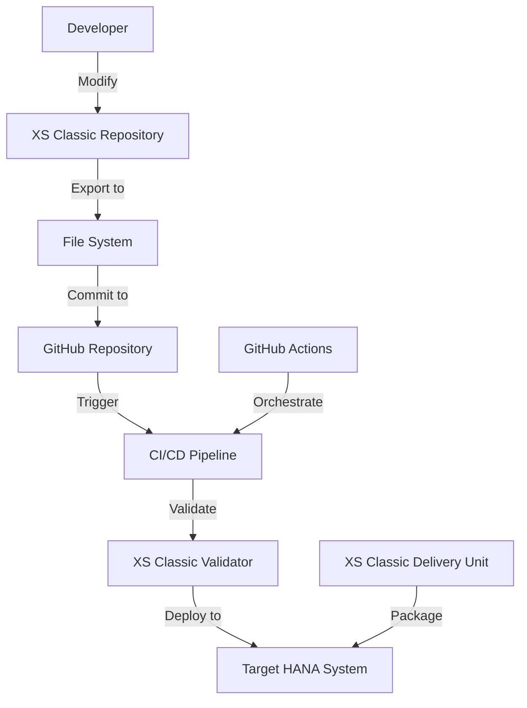
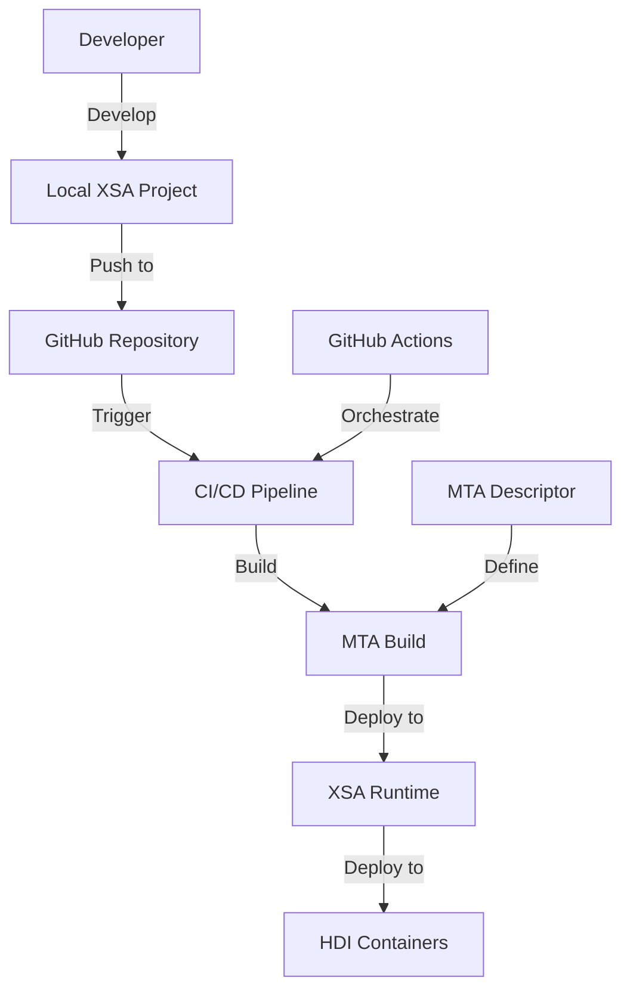
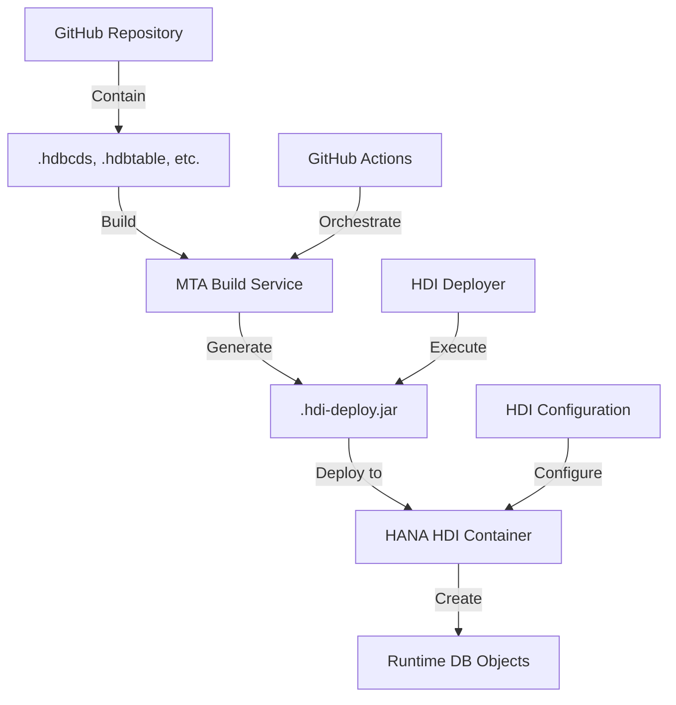

# 📄 SAP HANA Applications Architecture Integration

## 📋 Table of Contents

- [📋 Overview](#overview)
- [Architecture Components](#architecture-components)
- [HANA-Specific Integration Requirements](#hana-specific-integration-requirements)
- [Integration Architecture Reference Diagram](#integration-architecture-reference-diagram)
- [🔧 Implementation Recommendations](#implementation-recommendations)
- [Related Documentation](#related-documentation)
- [References](#references)


This document outlines the specialized architecture for integrating SAP HANA application development with GitHub Enterprise, addressing the unique requirements of developing and deploying applications that leverage the SAP HANA database platform.

## 📋 Overview

SAP HANA applications utilize the in-memory database platform's unique capabilities and often involve specialized development models including XS Classic, XS Advanced (Cloud Foundry-based), and native SQLScript development. Integrating GitHub with SAP HANA development requires specialized approaches that address these models while providing modern DevOps capabilities.

## Architecture Components

The HANA integration architecture consists of the following key components:

1. **SAP HANA Development Environment** - Development tools for HANA applications
2. **GitHub Enterprise** - Source code repository and collaboration platform
3. **CI/CD Pipeline Services** - Continuous integration and deployment services
4. **HDI Container Management** - HANA Deployment Infrastructure components
5. **Database Artifact Versioning** - Specialized versioning for database objects
6. **Testing Framework** - Database-specific testing components
7. **Performance Monitoring** - HANA-specific performance analysis tools

## HANA-Specific Integration Requirements

### XS Classic Integration Patterns

SAP HANA XS Classic is the original application server embedded within SAP HANA. Although newer development should use XS Advanced or other approaches, many organizations maintain legacy XS Classic applications that require modern DevOps practices.

#### XS Classic Architecture



#### XS Classic Development Objects

XS Classic applications typically include the following object types:

| Object Type | File Extension | Purpose | Special Handling |
|------------|---------------|---------|-----------------|
| JavaScript Files | .js, .xsjs | Server-side application logic | Static analysis, security scanning |
| OData Services | .xsodata | OData service definitions | Service validation, entity verification |
| XSJS Services | .xsjslib | Reusable JavaScript libraries | Dependency analysis |
| HANA Views | .hdbview | Database views | SQL validation, dependency analysis |
| HANA Procedures | .hdbprocedure | Database procedures | SQL validation, security analysis |
| Web Content | .html, .css | Browser UI elements | Content validation |
| Package Structure | .xsapp, .xsaccess | Application configuration | Configuration validation |

#### XS Classic Export and Import

The primary integration challenge with XS Classic is that code is stored within the HANA repository, requiring specialized export and import processes:

1. **Repository Export Process**
   - Export of XS Classic content to file system
   - Directory structure preservation
   - Metadata extraction

2. **Version Control Integration**
   - Commit of exported content to GitHub
   - Branch management for parallel development
   - Merge conflict resolution strategies

3. **Delivery Unit Management**
   - Creation of delivery units from GitHub content
   - Version management of delivery units
   - Transport across systems

4. **Import Process**
   - Import of content into target HANA systems
   - Activation of imported objects
   - Validation of successful activation

#### GitHub Actions for XS Classic

Example GitHub Actions workflow for XS Classic:

```yaml
name: XS Classic CI/CD
on:
  push:
    branches: [ main, develop ]
    paths:
      - 'xs-classic/**'
  pull_request:
    branches: [ main ]
    
jobs:
  validate:
    runs-on: ubuntu-latest
    steps:
      - name: Checkout code
        uses: actions/checkout@v3
        
      - name: Validate XS Classic structure
        uses: sap-actions/validate-xs-classic@v1
        with:
          app-path: xs-classic/myapp
          
      - name: Validate XS JavaScript
        uses: sap-actions/validate-xsjs@v1
        with:
          js-path: xs-classic/myapp/**/*.xsjs
          
      - name: Validate XS OData services
        uses: sap-actions/validate-xsodata@v1
        with:
          odata-path: xs-classic/myapp/**/*.xsodata
          
  deploy-dev:
    needs: validate
    if: github.ref == 'refs/heads/develop'
    runs-on: ubuntu-latest
    steps:
      - name: Deploy to Development
        uses: sap-actions/deploy-xs-classic@v1
        with:
          hana-host: ${{ secrets.DEV_HANA_HOST }}
          hana-port: ${{ secrets.DEV_HANA_PORT }}
          hana-user: ${{ secrets.DEV_HANA_USER }}
          hana-password: ${{ secrets.DEV_HANA_PASSWORD }}
          app-path: xs-classic/myapp
          package: 'com.example.myapp'
          
  create-delivery-unit:
    needs: deploy-dev
    if: github.ref == 'refs/heads/main'
    runs-on: ubuntu-latest
    steps:
      - name: Create delivery unit
        uses: sap-actions/create-xs-delivery-unit@v1
        with:
          hana-host: ${{ secrets.DEV_HANA_HOST }}
          hana-port: ${{ secrets.DEV_HANA_PORT }}
          hana-user: ${{ secrets.DEV_HANA_USER }}
          hana-password: ${{ secrets.DEV_HANA_PASSWORD }}
          du-name: 'MYAPP_DU'
          du-version: '1.0.${GITHUB_RUN_NUMBER}'
          vendor: 'acme.com'
          package: 'com.example.myapp'
```

### XS Advanced (Cloud Foundry) Integration

XS Advanced (XSA) is the modern application development framework for SAP HANA, based on Cloud Foundry. It allows for microservice-based applications with polyglot programming support.

#### XS Advanced Architecture



#### XS Advanced Development Components

XS Advanced applications typically include:

1. **Multi-Target Application (MTA)**
   - MTA descriptor (mta.yaml)
   - Module definitions
   - Resource definitions
   - Build and deployment parameters

2. **Database Modules (HDI)**
   - CDS design time artifacts
   - SQLScript objects
   - Table definitions
   - View definitions

3. **Application Modules**
   - Node.js modules
   - Java modules
   - Python modules
   - Other language runtimes

4. **UI Modules**
   - SAPUI5/Fiori applications
   - HTML5 applications
   - UI configuration

#### XS Advanced Development Workflow

The XS Advanced integration workflow includes:

1. **Local Development**
   - Development in local environment with XS Advanced tools
   - Local build and testing
   - Connection to HANA database for development

2. **Version Control**
   - Commit to GitHub repository
   - Branch management
   - Code review process

3. **Continuous Integration**
   - Automated build of MTA archive
   - Validation of modules
   - Unit and integration testing

4. **Continuous Deployment**
   - Deployment to XS Advanced runtime
   - HDI container creation/update
   - Service instantiation

#### GitHub Actions for XS Advanced

Example GitHub Actions workflow for XS Advanced:

```yaml
name: XS Advanced CI/CD
on:
  push:
    branches: [ main, develop ]
  pull_request:
    branches: [ main ]
    
jobs:
  build:
    runs-on: ubuntu-latest
    steps:
      - name: Checkout code
        uses: actions/checkout@v3
        
      - name: Setup Cloud MTA Build Tool
        uses: SAP/project-piper-action@master
        with:
          piper-version: latest
          
      - name: Build MTA
        run: mbt build -p=cf
        
      - name: Upload MTA artifact
        uses: actions/upload-artifact@v3
        with:
          name: mta-archive
          path: mta_archives/*.mtar
          
  test-db-module:
    needs: build
    runs-on: ubuntu-latest
    steps:
      - name: Setup HANA HDI deployer
        uses: sap-actions/setup-hdi@v1
        
      - name: Test database artifacts
        uses: sap-actions/test-hdi-module@v1
        with:
          module-path: db
          
  deploy-dev:
    needs: [build, test-db-module]
    if: github.ref == 'refs/heads/develop'
    runs-on: ubuntu-latest
    steps:
      - name: Download MTA artifact
        uses: actions/download-artifact@v3
        with:
          name: mta-archive
          
      - name: Install Cloud Foundry CLI
        uses: cloudfoundry-community/setup-cf-cli@v1
        
      - name: Login to Cloud Foundry XSA
        run: |
          cf login -a ${{ secrets.XSA_API }} \
                  -u ${{ secrets.XSA_USERNAME }} \
                  -p ${{ secrets.XSA_PASSWORD }} \
                  -o ${{ secrets.XSA_ORG }} \
                  -s ${{ secrets.XSA_SPACE }}
                  
      - name: Deploy MTA
        run: cf deploy mta_archives/myapp_1.0.0.mtar
```

### HDI Container Deployment Automation

SAP HANA Deployment Infrastructure (HDI) provides a modern approach to managing database artifacts. HDI containers require specialized deployment approaches in GitHub integration.

#### HDI Architecture



#### HDI Development Objects

HDI deployments typically include the following object types:

| Object Type | File Extension | Purpose | Special Handling |
|------------|---------------|---------|-----------------|
| CDS Models | .hdbcds | Core data services design time | Model validation, dependency analysis |
| Table Definitions | .hdbtable | Database table definitions | Schema validation, data protection |
| View Definitions | .hdbview | Database view definitions | Query validation, performance checking |
| Procedure Definitions | .hdbprocedure | Database procedures | SQL validation, security analysis |
| Function Definitions | .hdbfunction | Database functions | Input validation, output verification |
| Schema Definitions | .hdbschema | Schema definitions | Privilege checking, dependency validation |
| Synonyms | .hdbsynonym | Database synonyms | Reference validation |
| Sequence Definitions | .hdbsequence | Database sequences | Configuration validation |
| Constraints | .hdbconstraint | Database constraints | Constraint validation |
| Calculation Views | .hdbcalculationview | Analytical views | Calculation logic validation |

#### HDI Deployment Process

The HDI deployment process consists of:

1. **Design-Time Artifact Management**
   - Source control of HDI artifacts in GitHub
   - Dependency management
   - Object organization

2. **Build Process**
   - Compilation of design-time artifacts
   - Generation of deployment descriptors
   - Dependency resolution

3. **Deployment Execution**
   - HDI container creation/access
   - Deployment of artifacts
   - Activation of database objects

4. **Validation**
   - Schema validation
   - Integrity checking
   - Performance verification

#### HDI Deployment Configuration

Example HDI deployment configuration (.hdiconfig):

```json
{
  "file_suffixes" : {
    "hdbcds" : {
      "plugin_name" : "com.sap.hana.di.cds"
    },
    "hdbtable" : {
      "plugin_name" : "com.sap.hana.di.table"
    },
    "hdbview" : {
      "plugin_name" : "com.sap.hana.di.view"
    },
    "hdbprocedure" : {
      "plugin_name" : "com.sap.hana.di.procedure"
    },
    "hdbfunction" : {
      "plugin_name" : "com.sap.hana.di.function"
    },
    "hdbcalculationview" : {
      "plugin_name" : "com.sap.hana.di.calculationview"
    },
    "hdbgrants" : {
      "plugin_name" : "com.sap.hana.di.grants"
    }
  }
}
```

#### GitHub Actions for HDI Deployment

Example GitHub Actions workflow for HDI deployment:

```yaml
name: HANA HDI Deployment
on:
  push:
    branches: [ main, develop ]
    paths:
      - 'db/**'
  pull_request:
    branches: [ main ]
    paths:
      - 'db/**'
      
jobs:
  validate-hdi:
    runs-on: ubuntu-latest
    steps:
      - name: Checkout code
        uses: actions/checkout@v3
        
      - name: Validate HDI artifacts
        uses: sap-actions/validate-hdi@v1
        with:
          hdi-path: db/src
          
  build-hdi:
    needs: validate-hdi
    runs-on: ubuntu-latest
    steps:
      - name: Build HDI deployer
        run: |
          npm ci
          npm run build:hdi
          
      - name: Upload HDI artifact
        uses: actions/upload-artifact@v3
        with:
          name: hdi-deployer
          path: db/target
          
  deploy-dev:
    needs: build-hdi
    if: github.ref == 'refs/heads/develop'
    runs-on: ubuntu-latest
    steps:
      - name: Download HDI artifact
        uses: actions/download-artifact@v3
        with:
          name: hdi-deployer
          path: deployer
          
      - name: Deploy to HDI container
        uses: sap-actions/deploy-hdi@v1
        with:
          hana-host: ${{ secrets.HANA_HOST }}
          hana-port: ${{ secrets.HANA_PORT }}
          hdi-user: ${{ secrets.HDI_DEPLOY_USER }}
          hdi-password: ${{ secrets.HDI_DEPLOY_PASSWORD }}
          hdi-container: ${{ secrets.HDI_CONTAINER }}
          deployer-path: deployer
```

### Database Artifact Versioning Approaches

SAP HANA database artifacts require specialized versioning approaches to handle schema evolution and dependency management.

#### Versioning Challenges

Database artifacts present unique versioning challenges:

1. **Schema Evolution**
   - Forward compatibility requirements
   - Backward compatibility requirements
   - Data migration needs

2. **Object Dependencies**
   - Complex dependency trees
   - Order-dependent changes
   - Cross-schema dependencies

3. **Stateful Objects**
   - Tables with persistent data
   - Configuration objects
   - Schema-bound objects

4. **Performance Impacts**
   - Index changes
   - Statistics requirements
   - Query plan implications

#### Versioning Strategies

Several versioning strategies can be employed:

1. **Schema-Based Versioning**
   - Use of schema versioning for major changes
   - Parallel schema versions during migration
   - Schema synchronization tools

2. **Delta-Based Deployment**
   - Incremental change scripts
   - Automated delta generation
   - Change log tracking

3. **Object-Level Versioning**
   - Object naming with version indicators
   - View compatibility layers
   - Procedure versioning

4. **Migration Framework**
   - Automated data migration scripts
   - Data validation tools
   - Rollback capabilities

#### Versioning Configuration

Example schema versioning configuration:

```yaml
# schema-version.yaml
schemaVersions:
  current: v5
  previous:
    - v4
    - v3
    
compatibilityViews:
  - name: CUSTOMER_V3
    implementation: CUSTOMER_V5
    compatibility: v3
    
  - name: CUSTOMER_V4
    implementation: CUSTOMER_V5
    compatibility: v4
    
migrationScripts:
  - source: v3
    target: v4
    script: migrations/v3_to_v4.hdbprocedure
    
  - source: v4
    target: v5
    script: migrations/v4_to_v5.hdbprocedure
```

#### GitHub Integration for Versioning

The GitHub integration for database versioning includes:

1. **Branch Strategy**
   - Long-lived version branches for schemas
   - Feature branches for object changes
   - Versioned tags for releases

2. **Version Management Workflow**
   - Version metadata tracking
   - Automated version incrementation
   - Version compatibility validation

3. **Migration Testing**
   - Automated migration testing in pipelines
   - Data validation across versions
   - Performance comparison between versions

4. **Documentation Generation**
   - Automated schema documentation
   - Change tracking documentation
   - Dependency visualization

#### GitHub Actions for Database Versioning

Example GitHub Actions workflow for database versioning:

```yaml
name: HANA Database Versioning
on:
  push:
    branches: [ main, develop, 'version/*' ]
    paths:
      - 'db/**'
  pull_request:
    branches: [ main, develop ]
    
jobs:
  schema-analysis:
    runs-on: ubuntu-latest
    steps:
      - name: Checkout code
        uses: actions/checkout@v3
        
      - name: Analyze schema changes
        uses: sap-actions/analyze-hana-schema@v1
        with:
          schema-path: db/src
          
      - name: Generate change report
        uses: sap-actions/generate-schema-diff@v1
        with:
          current-ref: ${{ github.event.before }}
          new-ref: ${{ github.event.after }}
          output-file: schema-changes.md
          
      - name: Upload schema report
        uses: actions/upload-artifact@v3
        with:
          name: schema-report
          path: schema-changes.md
          
  version-validation:
    runs-on: ubuntu-latest
    steps:
      - name: Validate version compatibility
        uses: sap-actions/validate-hana-versions@v1
        with:
          schema-config: db/schema-version.yaml
          
  migration-test:
    needs: [schema-analysis, version-validation]
    runs-on: ubuntu-latest
    steps:
      - name: Test data migration
        uses: sap-actions/test-hana-migration@v1
        with:
          migration-scripts: db/migrations
          test-data: db/test-data
```

### Performance Considerations for HANA Workloads

SAP HANA's in-memory architecture requires specialized performance optimization consideration in the development workflow.

#### Performance Challenges

HANA applications face unique performance challenges:

1. **Memory Management**
   - Memory consumption optimization
   - Column vs. row store usage
   - Memory pressure management

2. **SQL Performance**
   - Query optimization
   - Join performance
   - Calculation engine utilization

3. **Parallel Processing**
   - Effective parallelization
   - Query partitioning
   - Workload distribution

4. **Data Modeling**
   - Model optimization
   - Appropriate view types
   - Calculation view design

#### Performance Testing Integration

The GitHub integration for HANA performance includes:

1. **Automated Performance Testing**
   - Performance test execution in pipelines
   - Comparative performance analysis
   - Performance regression detection

2. **Explain Plan Analysis**
   - Query execution plan validation
   - Plan comparison between versions
   - Optimization recommendations

3. **Workload Simulation**
   - Realistic workload testing
   - Scalability testing
   - Concurrency testing

4. **Performance Metrics**
   - Memory consumption tracking
   - Execution time analysis
   - Resource utilization monitoring

#### Performance Testing Configuration

Example performance test configuration:

```yaml
# performance-tests.yaml
testCases:
  - name: Customer360Query
    query: SELECT * FROM CUSTOMER_360 WHERE COUNTRY_CODE = ?
    parameters:
      - US
      - DE
      - FR
    expectedMaxTime: 100  # milliseconds
    expectedMaxMemory: 500  # MB
    
  - name: SalesAnalyticsCalculation
    query: SELECT * FROM SALES_ANALYTICS WHERE YEAR = ? AND QUARTER = ?
    parameters:
      - [2023, 1]
      - [2023, 2]
      - [2023, 3]
    expectedMaxTime: 500  # milliseconds
    expectedMaxMemory: 1200  # MB
    
thresholds:
  warningThreshold: 90%  # of expected max
  failureThreshold: 120%  # of expected max
  
baselineComparison:
  enabled: true
  maxRegression: 10%  # allowed regression
  baselineFile: performance/baseline.json
```

#### Performance Optimization Workflow

The performance optimization workflow includes:

1. **Performance Baseline Establishment**
   - Capture of baseline metrics
   - Definition of performance KPIs
   - Threshold establishment

2. **Continuous Performance Testing**
   - Automated performance tests in pipelines
   - Comparison against baseline
   - Regression detection

3. **Performance Analysis**
   - Root cause analysis for issues
   - Optimization opportunity identification
   - Tuning recommendation generation

4. **Optimization Implementation**
   - Implementation of optimizations
   - A/B testing of alternatives
   - Validation of improvements

#### GitHub Actions for Performance Testing

Example GitHub Actions workflow for HANA performance testing:

```yaml
name: HANA Performance Testing
on:
  push:
    branches: [ main, develop ]
    paths:
      - 'db/**/*.hdbview'
      - 'db/**/*.hdbcalculationview'
  pull_request:
    branches: [ main ]
    
jobs:
  explain-plan-analysis:
    runs-on: ubuntu-latest
    steps:
      - name: Checkout code
        uses: actions/checkout@v3
        
      - name: Analyze query plans
        uses: sap-actions/analyze-hana-plans@v1
        with:
          queries-path: db/test/queries
          hana-host: ${{ secrets.HANA_HOST }}
          hana-port: ${{ secrets.HANA_PORT }}
          hana-user: ${{ secrets.HANA_USER }}
          hana-password: ${{ secrets.HANA_PASSWORD }}
          
  performance-test:
    runs-on: ubuntu-latest
    steps:
      - name: Run performance tests
        uses: sap-actions/hana-performance-test@v1
        with:
          config-file: performance-tests.yaml
          hana-host: ${{ secrets.HANA_HOST }}
          hana-port: ${{ secrets.HANA_PORT }}
          hana-user: ${{ secrets.HANA_USER }}
          hana-password: ${{ secrets.HANA_PASSWORD }}
          
      - name: Generate performance report
        uses: sap-actions/generate-performance-report@v1
        with:
          test-results: performance-results.json
          baseline: performance/baseline.json
          output-format: markdown
          
      - name: Upload performance report
        uses: actions/upload-artifact@v3
        with:
          name: performance-report
          path: performance-report.md
```

## Integration Architecture Reference Diagram

The following diagram illustrates the high-level integration architecture for SAP HANA applications:

```
[HANA Integration Architecture Diagram to be inserted here]
```

## 🔧 Implementation Recommendations

Based on real-world implementations, the following recommendations apply to HANA-specific GitHub integration:

1. **HDI-First Development Approach**
   - Prioritize HDI container-based development
   - Migrate XS Classic to XS Advanced where possible
   - Implement automated HDI deployment pipelines

2. **Comprehensive Database Testing**
   - Implement database-specific testing frameworks
   - Include performance testing in CI/CD pipelines
   - Validate schema changes automatically

3. **Structured Versioning Strategy**
   - Implement clear database versioning approach
   - Use object-level compatibility layers
   - Automate migration script generation and testing

4. **Performance-Focused Development**
   - Integrate performance testing early in development
   - Establish clear performance baselines
   - Implement automated performance regression detection

## Related Documentation

- [SAP Components Overview](./sap-components.md)
- [Integration Architecture](./integration-architecture.md)
- [System Architecture](./system-architecture.md)

## References

1. SAP. (2025). "SAP HANA Developer Guide." SAP Help Portal.
2. SAP HANA Academy. (2025). "Best Practices for HANA Application Development."
3. SAP Blogs. (2025). "HDI Container Development Patterns."
4. SAP TechEd. (2025). "Performance Optimization for HANA Applications."
5. SAP Developer Community. (2025). "XS Advanced Development Guide."
---


