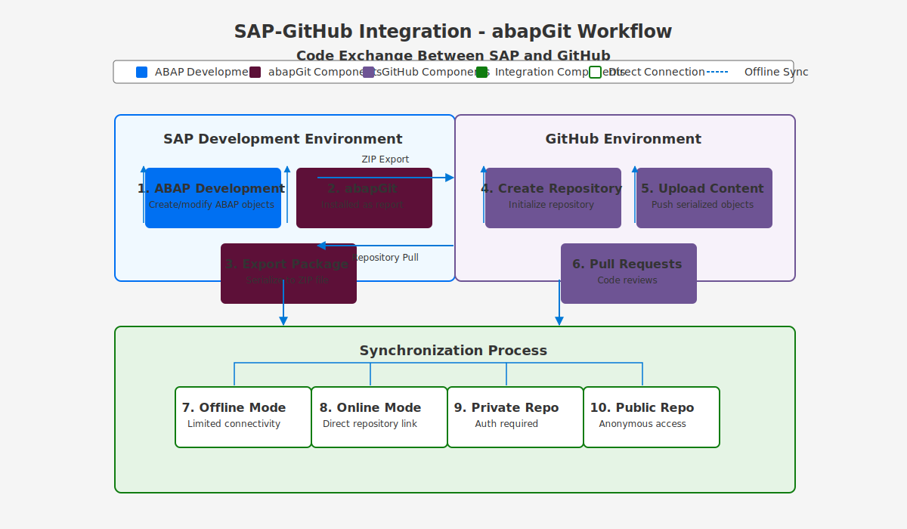

# SAP-GitHub Integration Architecture

  
  
  *Comprehensive architecture for SAP-GitHub integration*

## 📋 Table of Contents

- [Introduction](#introduction)
- [Architectural Principles](#architectural-principles)
- [High-Level Architecture](#high-level-architecture)
- [Core Components](#core-components)
- [Integration Patterns](#integration-patterns)
- [System-Specific Architectures](#system-specific-architectures)
- [Security Architecture](#security-architecture)
- [Architecture Documentation Map](#architecture-documentation-map)
- [Implementation Considerations](#implementation-considerations)
- [Next Steps](#next-steps)

## Introduction

This architecture documentation provides a comprehensive technical foundation for implementing SAP-GitHub integration. The architecture is designed to address the unique requirements of different SAP systems while leveraging GitHub's collaborative features and modern DevOps capabilities.

Our architecture enables:

- Secure, bidirectional code flow between SAP systems and GitHub
- Automated CI/CD workflows for SAP development
- Context preservation across development environments
- Comprehensive security and governance
- Scalability for enterprise-wide adoption

## Architectural Principles

The SAP-GitHub integration architecture is guided by these core principles:

### 1. Security by Design
- All integration points are secured with appropriate authentication and authorization
- Comprehensive audit logging and monitoring
- Least privilege access controls
- Secure transport and data handling

### 2. Enterprise Scalability
- Support for multiple SAP landscapes and GitHub organizations
- Performance optimization for large codebases
- Horizontal scaling for high-volume environments
- Resource efficiency for operational sustainability

### 3. Defense in Depth
- Multiple security layers throughout the architecture
- No single point of failure
- Resilient to component failures
- Comprehensive monitoring and alerting

### 4. Separation of Concerns
- Modular component design
- Clear interface definitions
- Independent scaling of components
- Isolation of critical systems

### 5. Standards Compliance
- Adherence to SAP and GitHub best practices
- Compliance with industry security standards
- Support for regulatory requirements
- Documentation of compliance controls

## High-Level Architecture

The SAP-GitHub integration consists of five primary architectural layers:

  

1. **SAP Systems Layer**: The SAP environments where application development occurs, including:
   - SAP ABAP systems (ECC, S/4HANA)
   - SAP BTP environments
   - SAP CRM and other business applications
   - SAP Fiori/UI5 applications
   - SAP HANA native applications

2. **Integration Layer**: Middleware components that facilitate secure communication:
   - API Management for controlled access
   - Event brokers for asynchronous communication
   - Context store for development context preservation
   - Transport integration for automated release management

3. **GitHub Layer**: GitHub Enterprise components including:
   - GitHub repositories for version control
   - GitHub Actions for CI/CD automation
   - GitHub Apps for extended functionality
   - GitHub Advanced Security for code scanning

4. **Security Layer**: Comprehensive security controls:
   - Authentication services (OAuth, JWT)
   - Authorization management
   - Secret management
   - Audit logging and compliance monitoring

5. **Monitoring Layer**: End-to-end visibility components:
   - Operational monitoring
   - Performance metrics
   - Security monitoring
   - Developer analytics

## Core Components

### SAP Components

| Component | Purpose | Documentation |
|-----------|---------|---------------|
| **abapGit** | Open-source tool for version-controlling ABAP objects | [SAP ABAP Architecture](./sap-abap-architecture.md) |
| **SAP Gateway** | OData services for integration | [Integration Architecture](./integration-architecture.md) |
| **Transport Management** | Change control and release management | [Transport Security](./transport-security-dashboard.md) |
| **SAP BTP Integration** | Cloud integration services | [BTP Architecture](./btp-architecture.md) |
| **SAPUI5/Fiori** | Modern SAP user interfaces | [Fiori/UI5 Architecture](./fiori-ui5-architecture.md) |

### Integration Components

| Component | Purpose | Documentation |
|-----------|---------|---------------|
| **API Gateway** | API management and security | [API Extension Framework](./api-extension-framework.md) |
| **Context Store** | Development context preservation | [Context Store](./context-store.md) |
| **Event Bus** | Asynchronous event processing | [Integration Architecture](./integration-architecture.md) |
| **Transport API** | Transport request automation | [Transport Security](./transport-security-dashboard.md) |
| **MCP Integration** | Model Context Protocol support | [MCP Integration](./mcp-integration.md) |

### GitHub Components

| Component | Purpose | Documentation |
|-----------|---------|---------------|
| **GitHub Repositories** | Version control for SAP code | [GitHub Setup](../guides/github-setup/index.md) |
| **GitHub Actions** | CI/CD pipelines for SAP | [Workflows](../guides/workflows/index.md) |
| **GitHub Advanced Security** | Security scanning and analysis | [Security Setup](../guides/security-setup/index.md) |
| **GitHub Apps** | Custom extensions for SAP | [GitHub Setup](../guides/github-setup/index.md) |
| **GitHub Copilot** | AI-assisted SAP development | [Copilot Integration](../guides/github-setup/copilot-integration.md) |

### Security Components

| Component | Purpose | Documentation |
|-----------|---------|---------------|
| **Authentication Service** | Identity verification | [Security Architecture](./security-architecture.md) |
| **Authorization Service** | Access control | [Security Architecture](./security-architecture.md) |
| **Secret Management** | Secure credential handling | [Security Setup](../guides/security-setup/secret-management.md) |
| **Security Monitoring** | Threat detection and response | [Security Monitoring](../guides/security-setup/security-monitoring.md) |
| **Compliance Engine** | Regulatory compliance verification | [Governance Model](./governance-model.md) |

## Integration Patterns

The architecture supports multiple integration patterns to address different requirements:

### Pattern 1: Direct Integration

  

  *Direct integration using abapGit*

This pattern uses abapGit to directly connect SAP ABAP systems to GitHub repositories:

- Lightweight implementation with minimal middleware
- Suitable for smaller implementations or pilot projects
- Limited automation capabilities
- Basic authentication and security

**Documentation:** [SAP ABAP Architecture](./sap-abap-architecture.md)

### Pattern 2: API-Mediated Integration

  

  *API-mediated integration using API management*

This pattern uses API Management to broker communications between SAP systems and GitHub:

- Enhanced security with API policies
- Advanced authentication options
- Comprehensive monitoring and throttling
- Support for multiple SAP systems

**Documentation:** [API Extension Framework](./api-extension-framework.md)

### Pattern 3: Event-Driven Integration

  

  *Event-driven integration patterns*

This pattern uses event hooks and messaging to create loosely coupled integrations:

- Asynchronous communication for resilience
- Event-based workflows and automation
- Scalable for high-volume environments
- Enhanced resilience and fault tolerance

**Documentation:** [Integration Architecture](./integration-architecture.md)

## System-Specific Architectures

The architecture adapts to different SAP system types:

### Traditional ABAP Systems

- **With CHARM**: Integration with SAP Change and Transport System
- **Without CHARM**: Custom transport handling approaches
- **Documentation**: [SAP ABAP Architecture](./sap-abap-architecture.md)

### SAP BTP Environment

- Cloud-native integration approach
- Service-based architecture
- Multi-tenant considerations
- **Documentation**: [BTP Architecture](./btp-architecture.md)

### Fiori/UI5 Applications

- Frontend-specific pipeline considerations
- Build automation for UI components
- Testing frameworks integration
- **Documentation**: [Fiori/UI5 Architecture](./fiori-ui5-architecture.md)

### SAP HANA Applications

- XS Classic and XS Advanced approaches
- Database artifact handling
- HANA-specific security considerations
- **Documentation**: [HANA Architecture](./hana-architecture.md)

### SAP CRM Applications

- CRM-specific object handling
- Customer data considerations
- Integration with CRM workflows
- **Documentation**: [CRM Architecture](./crm-architecture.md)

## Security Architecture

  

  *Comprehensive security architecture*

The security architecture implements defense-in-depth with multiple security layers:

### Authentication and Authorization

- OAuth 2.0/OpenID Connect for identity
- JWT for secure token handling
- Role-based access control
- Fine-grained permissions
- **Documentation**: [Security Architecture](./security-architecture.md)

### Data Protection

- Secure transport via TLS
- Sensitive data handling
- Data classification
- Encryption standards
- **Documentation**: [Security Architecture](./security-architecture.md)

### Application Security

- Code scanning and SAST
- Dependency scanning
- Secret detection
- Container scanning
- **Documentation**: [Security Architecture](./security-architecture.md)

### Operational Security

- Audit logging
- Security monitoring
- Anomaly detection
- Incident response
- **Documentation**: [Security Architecture](./security-architecture.md)

### Governance Controls

- Policy enforcement
- Compliance validation
- Separation of duties
- Approval workflows
- **Documentation**: [Governance Model](./governance-model.md)

## Architecture Documentation Map

The complete architecture documentation includes:

### Core Architecture

- [System Architecture](./system-architecture.md) - Comprehensive system details
- [Components](./components.md) - Component descriptions and interactions
- [Integration Architecture](./integration-architecture.md) - Integration patterns

### System-Specific Architectures

- [SAP ABAP Architecture](./sap-abap-architecture.md) - ABAP integration architecture
- [BTP Architecture](./btp-architecture.md) - BTP integration architecture
- [Fiori/UI5 Architecture](./fiori-ui5-architecture.md) - UI integration
- [HANA Architecture](./hana-architecture.md) - HANA integration
- [CRM Architecture](./crm-architecture.md) - CRM integration

### Integration Components

- [API Extension Framework](./api-extension-framework.md) - API integration
- [Context Store](./context-store.md) - Context preservation
- [MCP Integration](./mcp-integration.md) - Model Context Protocol

### Security and Governance

- [Security Architecture](./security-architecture.md) - Security controls
- [Governance Model](./governance-model.md) - Governance framework
- [Disaster Recovery](./disaster-recovery-architecture.md) - Business continuity

### Standards and Guidelines

- [Documentation Standards](./standards/documentation-standards.md)
- [Image Design Guidelines](./standards/image-design-guidelines.md)

## Implementation Considerations

When implementing this architecture, consider:

### Performance Optimization

- Network latency between SAP and GitHub environments
- Repository size and structure for large ABAP codebases
- CI/CD pipeline optimization for complex builds
- Testing strategy for comprehensive validation

### Deployment Options

- On-premises vs. cloud implementation
- Hybrid connectivity approaches
- Regional compliance requirements
- Network security and segmentation

### Integration Depth

- Basic version control only vs. full CI/CD automation
- Transport integration requirements
- Security scanning depth
- Monitoring and analytics requirements

### Organizational Readiness

- Team skills and training needs
- Process changes for development teams
- Governance model implementation
- Change management approach

## Next Steps

After reviewing the architecture documentation:

1. **Assessment**: Evaluate your requirements against the provided architecture
2. **Planning**: Develop an implementation plan based on the architecture
3. **Implementation**: Follow the implementation guides:
   - [SAP System Setup](../guides/sap-setup/index.md)
   - [GitHub Setup](../guides/github-setup/index.md)
   - [Integration Setup](../guides/workflows/index.md)
4. **Validation**: Test your implementation against the architecture requirements

Proceed to the [Implementation Guides](../guides/index.md) for step-by-step instructions.

---

*For architecture questions or further details, please consult the specific documentation links provided above.*

