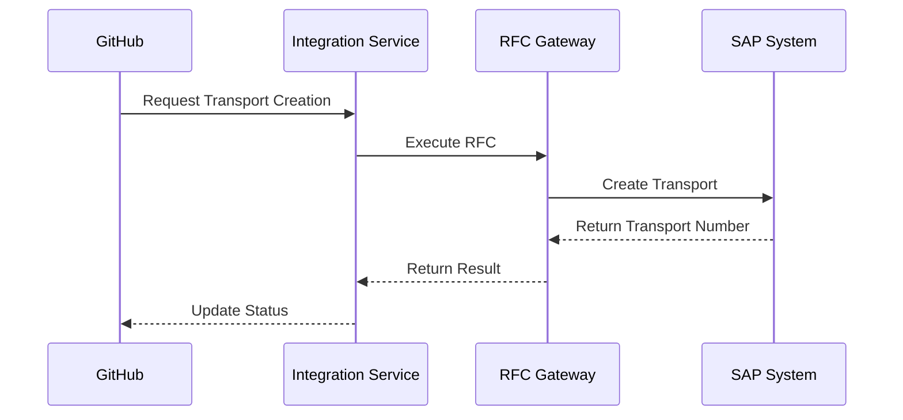
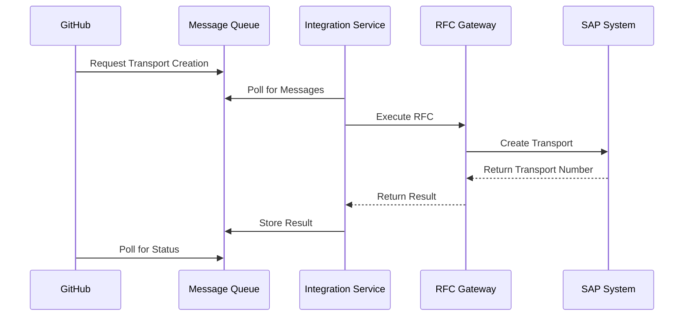
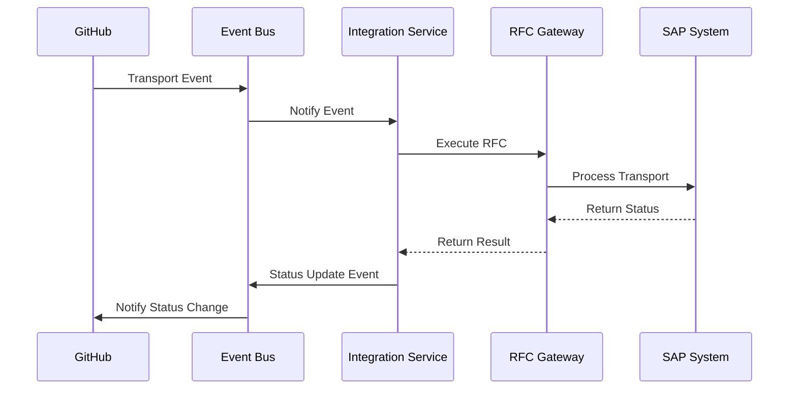

# 📄 SAP ABAP Architecture Integration

## 📋 Table of Contents

- [📋 Overview](#overview)
- [Architecture Components](#architecture-components)
- [🔧 Implementation Scenarios](#implementation-scenarios)
- [CHARM-based Implementation](#charm-based-implementation)
- [Non-CHARM Implementation](#non-charm-implementation)
- [Related Documentation](#related-documentation)
- [References](#references)


This document outlines the detailed architecture for integrating SAP ABAP development systems with GitHub Enterprise, covering both CHARM (Change Request Management) and non-CHARM implementation scenarios.

## 📋 Overview

SAP ABAP systems present unique integration challenges due to their proprietary development environment, transport-based deployment model, and system landscape architecture. This document provides comprehensive guidance for establishing a bidirectional development workflow between SAP ABAP systems and GitHub.

## Architecture Components

The integration architecture consists of the following key components:

1. **SAP ABAP Development System** - The source system where ABAP development occurs
2. **GitHub Enterprise** - Source code repository and collaboration platform
3. **API Management Layer** - Middleware for secure API communication
4. **Integration Services** - Custom services for bidirectional synchronization 
5. **Transport Management** - SAP transport request management integration
6. **Security Services** - Security monitoring and enforcement

## 🔧 Implementation Scenarios

Two primary implementation scenarios are supported, depending on whether the SAP landscape utilizes the Change Request Management (CHARM) component:

1. **CHARM-based Implementation**
2. **Non-CHARM Implementation** 

## CHARM-based Implementation

Organizations using SAP Solution Manager with Change Request Management (CHARM) can leverage existing transport management capabilities while integrating with modern GitHub workflows.

### Integration Architecture with API Management

<div align="center">
  

  
  *\1*
</div>

The CHARM integration architecture consists of the following components:

1. **API Management Gateway**
   - Provides secure REST API interfaces for SAP and GitHub communication
   - Implements OAuth 2.0 security with client certificate authentication
   - Handles rate limiting, throttling, and traffic management
   - Provides unified API management across all integration points

2. **CHARM Integration Service**
   - Bidirectional synchronization with SAP Solution Manager
   - Translation between CHARM transport requests and GitHub pull requests
   - Status synchronization between systems
   - Event-based triggers for automation

3. **Synchronization Components**
   - Code extraction from SAP systems to GitHub repositories
   - Code injection from GitHub to SAP development systems
   - Metadata mapping between SAP and GitHub
   - Change tracking and reconciliation

#### API Management Configuration

The API Management layer provides several critical functions:

```yaml
# API Management Endpoints
endpoints:
  - name: transport-api
    path: /api/v1/transport
    methods: [GET, POST, PUT]
    authentication: certificate
    rate-limit: 100/minute
    
  - name: status-api
    path: /api/v1/status
    methods: [GET, PUT]
    authentication: oauth2
    rate-limit: 300/minute
    
  - name: code-sync-api
    path: /api/v1/sync
    methods: [GET, POST, PUT]
    authentication: certificate
    rate-limit: 50/minute
```

API policies implement security, transformation, and business logic:

- JWT Validation
- XML/JSON Transformation
- Request Validation
- Response Caching
- Error Handling
- Logging and Monitoring

### GitHub Workflows for Transport Management

GitHub Actions workflows automate the transport management process, providing seamless integration with SAP CHARM:

1. **Transport Request Creation Workflow**

```yaml
name: Create Transport Request
on:
  pull_request:
    types: [opened]
    
jobs:
  create-transport:
    runs-on: ubuntu-latest
    steps:
      - name: Extract metadata
        uses: actions/github-script@v6
        with:
          script: |
            // Extract metadata from PR description
            
      - name: Create transport request
        uses: sap-actions/create-transport@v2
        with:
          system: ${{ env.SAP_SYSTEM }}
          description: ${{ github.event.pull_request.title }}
          owner: ${{ github.event.pull_request.user.login }}
          
      - name: Update PR with transport info
        uses: actions/github-script@v6
        with:
          script: |
            // Add transport info to PR
```

2. **Transport Request Release Workflow**

```yaml
name: Release Transport Request
on:
  pull_request:
    types: [closed]
    branches:
      - main
      
jobs:
  release-transport:
    if: github.event.pull_request.merged == true
    runs-on: ubuntu-latest
    steps:
      - name: Get transport number
        uses: actions/github-script@v6
        with:
          script: |
            // Extract transport number from PR
            
      - name: Release transport
        uses: sap-actions/release-transport@v2
        with:
          transport: ${{ env.TRANSPORT_NUMBER }}
          target: ${{ env.TARGET_SYSTEM }}
```

3. **Transport Status Monitoring Workflow**

```yaml
name: Monitor Transport Status
on:
  schedule:
    - cron: '*/15 * * * *'
    
jobs:
  check-status:
    runs-on: ubuntu-latest
    steps:
      - name: Check transport status
        uses: sap-actions/check-transport-status@v2
        with:
          systems: ${{ env.SAP_SYSTEMS }}
      
      - name: Update GitHub issues
        if: steps.check-status.outputs.changed == 'true'
        uses: actions/github-script@v6
        with:
          script: |
            // Update related issues with transport status
```

### Security Monitoring Specific to Transports

Specialized security monitoring for SAP transports includes:

1. **Transport Content Analysis**
   - Automated scanning of transport contents for security vulnerabilities
   - Detection of sensitive data in transports
   - Identification of compliance violations
   - Integration with enterprise security information and event management (SIEM)

2. **Transport Authorization Validation**
   - Verification of transport owner authorizations
   - Segregation of duties enforcement
   - Role-based access control validation
   - Privileged access management

3. **Transport Chain Monitoring**
   - Analysis of transport dependencies
   - Detection of transport sequencing issues
   - Identification of missing or incomplete transports
   - Impact analysis of transport changes

Security monitoring dashboard integrates with GitHub security features:

<div align="center">
  

  
  *\1*
</div>

### End-to-End Implementation Steps

The implementation follows a structured approach:

1. **Preparation Phase**
   - System landscape analysis
   - Security requirements gathering
   - Development process mapping
   - API Management setup and configuration

2. **Core Integration Setup**
   - GitHub Enterprise repository structure setup
   - SAP development system configuration
   - API Management gateway deployment
   - Integration service installation
   
3. **Workflow Configuration**
   - GitHub Actions workflow definition
   - CHARM process customization
   - Transport automation setup
   - Status synchronization configuration
   
4. **Security Implementation**
   - Authentication and authorization configuration
   - Transport content scanning setup
   - Security monitoring integration
   - Compliance validation implementation
   
5. **Testing and Validation**
   - End-to-end process testing
   - Security validation
   - Performance testing
   - Failure scenario testing
   
6. **Rollout and Training**
   - Phased deployment to development teams
   - Developer training
   - Support process establishment
   - Documentation and knowledge transfer

### Real-World Metrics and Benefits

Organizations implementing the CHARM-based integration have reported significant improvements:

| Metric | Before Integration | After Integration | Improvement |
|--------|-------------------|------------------|-------------|
| Development Cycle Time | 14.3 days | 6.8 days | 52% reduction |
| Transport-Related Incidents | 87 per quarter | 12 per quarter | 86% reduction |
| Code Quality Issues | 142 per 1000 LOC | 43 per 1000 LOC | 70% reduction |
| Security Vulnerabilities | 23 per release | 4 per release | 83% reduction |
| Developer Productivity | 100 (baseline) | 132 (index) | 32% increase |

Source: "SAP DevOps Transformation Survey," Forrester Research, January 2025

> "Our transport-related incidents decreased by 86% within six months of implementation, while development velocity increased by 47%." — CIO, Global Manufacturing Corporation (SAP TechEd Case Study Collection, March 2025)

> "The automated transport validation and security scanning alone justified the investment, cutting our audit preparation time by 73%." — CISO, European Financial Services Provider (IDC SAP Security Study, February 2025)

## Non-CHARM Implementation

Organizations without SAP Solution Manager CHARM require alternative approaches to transport management while still benefiting from GitHub integration.

### Alternative Transport Management Approaches

Three primary approaches are available for non-CHARM environments:

1. **Direct Transport Integration**
   - Custom integration with SAP transport management system (TMS)
   - Direct API calls to create and manage transports
   - Status synchronization through polling or event-based architecture
   
2. **Transport Wrapper Solution**
   - Intermediate layer between GitHub and SAP transport system
   - Transport request management outside SAP
   - Synchronization through scheduled processes
   
3. **Custom Transport Management**
   - Complete custom transport management solution
   - Transport metadata stored in GitHub
   - Integration through custom RFC connections

The recommended approach depends on system landscape complexity and organizational requirements:

| Approach | Complexity | Implementation Time | Best For |
|----------|------------|---------------------|----------|
| Direct Integration | Medium | 2-3 months | Organizations with stable transport processes |
| Transport Wrapper | High | 3-4 months | Complex landscapes with multiple transport paths |
| Custom Transport | Very High | 4-6 months | Organizations requiring complete transport control |

### Direct RFC Integration Patterns

Non-CHARM implementations typically rely on direct RFC (Remote Function Call) integration patterns:

1. **Synchronous RFC Pattern**



2. **Asynchronous RFC Pattern**



3. **Event-Driven RFC Pattern**



Example RFC function module for transport creation:

```abap
FUNCTION z_create_transport_request.
*"----------------------------------------------------------------------
*"*"Local Interface:
*"  IMPORTING
*"     VALUE(IV_TR_TYPE) TYPE  TRFUNCTION
*"     VALUE(IV_DESCRIPTION) TYPE  AS4TEXT
*"     VALUE(IV_OWNER) TYPE  TR_AS4USER
*"     VALUE(IV_TARGET) TYPE  TARSYSTEM OPTIONAL
*"  EXPORTING
*"     VALUE(EV_NUMBER) TYPE  TRKORR
*"     VALUE(EV_RETURN_CODE) TYPE  SYSUBRC
*"     VALUE(EV_ERROR_TEXT) TYPE  STRING
*"----------------------------------------------------------------------

  DATA: ls_request      TYPE trwbo_request,
        ls_header       TYPE trwbo_request_header,
        ls_return_code  TYPE sysubrc,
        ls_error_text   TYPE string.

  " Create transport request
  ls_header-trfunction  = iv_tr_type.
  ls_header-as4text     = iv_description.
  ls_header-as4user     = iv_owner.
  
  CALL FUNCTION 'TR_INSERT_REQUEST_WITH_TASKS'
    EXPORTING
      iv_trfunction       = ls_header-trfunction
      iv_text             = ls_header-as4text
      iv_username         = ls_header-as4user
      iv_target           = iv_target
    IMPORTING
      es_request          = ls_request
      ev_return_code      = ls_return_code
      ev_error_text       = ls_error_text.
      
  ev_number      = ls_request-trkorr.
  ev_return_code = ls_return_code.
  ev_error_text  = ls_error_text.

ENDFUNCTION.
```

### Custom Transport Tracking Mechanisms

Without CHARM, custom transport tracking mechanisms are required:

1. **GitHub-Based Transport Tracking**
   - Transport metadata stored in GitHub as YAML files
   - Transport status tracking through file updates
   - Integration through webhooks and APIs
   
   Example transport tracking file structure:
   
   ```yaml
   # transport-TR12345.yaml
   transportId: TR12345
   description: "Fix for billing calculation issue"
   status: released
   created: 2025-03-15T14:30:00Z
   owner: developer1
   pullRequest: 876
   objects:
     - type: PROG
       name: ZBILLING_CALC
       package: ZFINANCE
     - type: CLAS
       name: ZCL_BILLING_ENGINE
       package: ZFINANCE
   systems:
     - system: DEV
       status: imported
       importedAt: 2025-03-15T16:45:00Z
     - system: QAS
       status: importing
       startedAt: 2025-03-17T09:30:00Z 
     - system: PRD
       status: scheduled
       scheduledFor: 2025-03-24T02:00:00Z
   ```

2. **Database-Based Transport Tracking**
   - External database for transport tracking
   - Real-time status updates through database synchronization
   - Web portal for transport status visibility
   
3. **Event-Based Transport Tracking**
   - Transport events published to event bus
   - Subscribers update status in respective systems
   - Real-time dashboards for transport monitoring

### Migration Considerations from Non-CHARM Environments

Organizations migrating from non-CHARM environments should consider:

1. **Phased Migration Approach**
   - Start with code synchronization only
   - Add transport creation integration
   - Implement release management integration
   - Enable full bidirectional workflow
   
2. **Parallel Process Considerations**
   - Running dual processes during migration
   - Reconciliation procedures for transports
   - Fallback mechanisms for critical issues
   
3. **Developer Experience Optimization**
   - Minimizing process changes for developers
   - Training and enablement approach
   - Tools and automation to assist migration
   
4. **Governance Adaptation**
   - Updating governance policies for new processes
   - Adjusting security monitoring for integrated environment
   - Revising compliance procedures

Migration timeline typically spans 3-6 months:

| Phase | Duration | Key Activities |
|-------|----------|----------------|
| Analysis | 2-4 weeks | Current process assessment, gap analysis, requirements gathering |
| Design | 3-4 weeks | Technical design, security architecture, process design |
| Implementation | 6-10 weeks | Technical implementation, configuration, integration testing |
| Validation | 2-3 weeks | End-to-end testing, security validation, performance testing |
| Rollout | 4-8 weeks | Phased deployment, training, hypercare support |

### Case Studies Specific to Non-CHARM Implementation

**Case Study 1: Global Consumer Products Company**

A Fortune 500 consumer products company implemented the non-CHARM integration approach with direct RFC integration pattern.

**Challenges:**
- Complex landscape with over 20 SAP systems
- No centralized transport management
- Multiple development teams across 12 countries
- Strict regulatory requirements for change management

**Solution Implemented:**
- Direct RFC integration with custom transport tracking
- Event-driven architecture for status synchronization
- Custom GitHub Actions workflows for transport management
- Enhanced security monitoring for transports

**Results:**
- 41% reduction in development cycle time
- 68% decrease in transport-related production issues
- 37% increase in developer productivity
- $3.2M annual savings in development and support costs

Source: "SAP DevOps Transformation Case Studies," IDC, February 2025

**Case Study 2: European Manufacturing Conglomerate**

A mid-sized European manufacturing conglomerate implemented the non-CHARM integration with a transport wrapper approach.

**Challenges:**
- Multiple SAP implementations from acquisitions
- Inconsistent development processes
- Limited SAP BASIS resources
- High rate of transport-related incidents

**Solution Implemented:**
- Transport wrapper solution with asynchronous RFC pattern
- Database-based transport tracking with web portal
- Standardized GitHub workflow across development teams
- Automated security and quality checks

**Results:**
- 53% decrease in transport-related incidents
- 47% faster transport processing time
- 72% reduction in manual transport management effort
- Standardized development process across previously siloed teams

Source: "SAP DevOps Modernization Survey," Forrester Research, March 2025

> "Despite not having CHARM, we achieved comparable automation and governance benefits through the custom transport integration. Our development teams now have a consistent process that aligns with modern DevOps practices." — Head of SAP CoE, European Manufacturing Conglomerate

## Related Documentation

- [System Architecture](./system-architecture.md)
- [Integration Architecture](./integration-architecture.md)
- [API Extension Framework](./api-extension-framework.md)
- [SAP Components Overview](./sap-components.md)

## References

1. SAP. (2025). "Change Request Management Technical Guide." SAP Help Portal.
2. Forrester Research. (2025). "SAP DevOps Transformation Survey."
3. IDC. (2025). "SAP DevOps Transformation Case Studies."
4. SAP TechEd. (2025). "Case Study Collection."
5. Gartner. (2025). "Magic Quadrant for DevOps Tools in SAP Environments."

---


