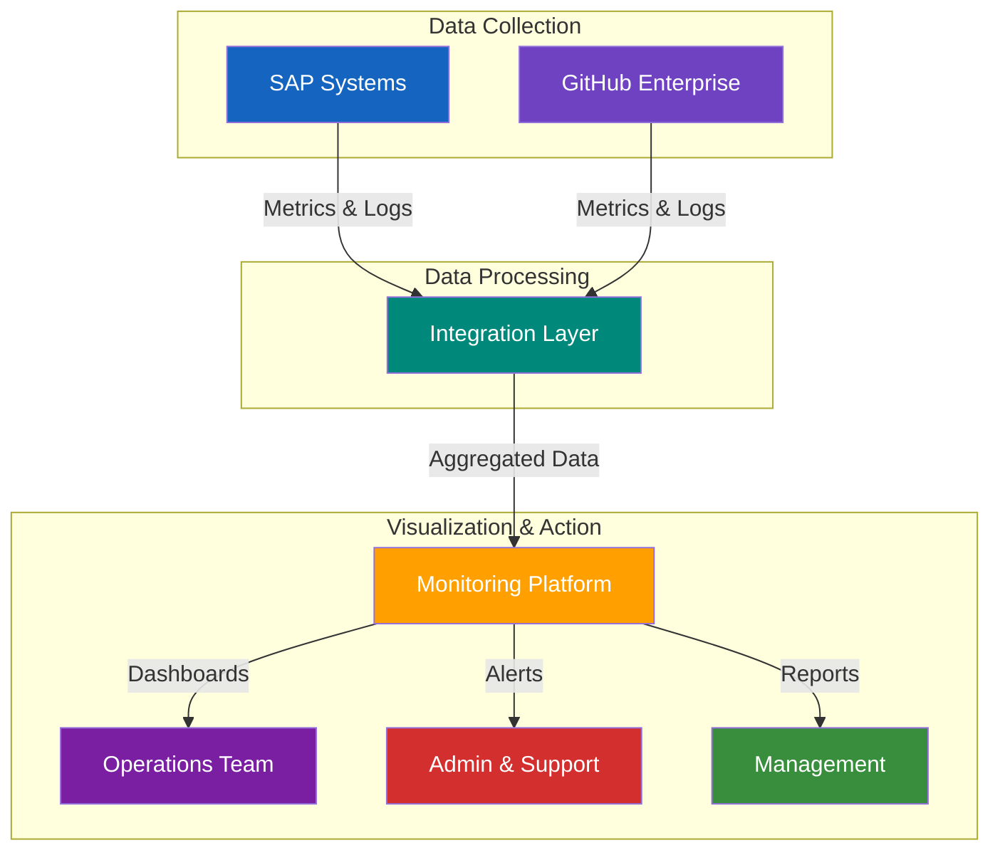

# 📄 Monitoring Overview for SAP-GitHub Integration

## 📋 Table of Contents

- [📋 Overview](#overview)
- [Monitoring Objectives](#monitoring-objectives)
- [Key Monitoring Domains](#key-monitoring-domains)
- [Monitoring Architecture](#monitoring-architecture)
- [Essential Metrics](#essential-metrics)
- [Alerting Strategy](#alerting-strategy)
- [Monitoring Tools](#monitoring-tools)
- [Dashboard Framework](#dashboard-framework)
- [Implementation Guide](#implementation-guide)
- [Best Practices](#best-practices)
- [➡️ Next Steps](#next-steps)
- [References](#references)

## 📋 Overview

This document provides a comprehensive overview of monitoring strategies for SAP-GitHub integration. Effective monitoring is critical for ensuring system health, detecting issues early, and providing insights for optimization of the integrated environment.

<div align="center">


*SAP-GitHub Integration Monitoring Dashboard*
</div>

## Monitoring Objectives

The monitoring framework is designed to achieve several key objectives:

1. **Operational Visibility**: Gain visibility into the performance and health of integrated systems
2. **Early Issue Detection**: Identify potential problems before they impact users
3. **Security Assurance**: Monitor for security events and compliance violations
4. **Performance Optimization**: Collect metrics to guide performance improvements
5. **Business Alignment**: Track metrics that demonstrate business value and ROI
6. **Change Validation**: Verify successful implementation of changes and deployments

## Key Monitoring Domains

The monitoring strategy encompasses several interconnected domains:

### System Health

- SAP system availability and performance
- GitHub Enterprise availability and API response times
- Integration service uptime and error rates
- Network connectivity between components
- Background job execution success rates

### Security and Compliance

- Authentication and authorization events
- Transport security validation results
- Security scan findings
- Compliance validation status
- Access pattern anomalies
- Secret usage and rotation metrics

### Process Efficiency

- Development velocity metrics
- Transport cycle times
- Deployment success rates
- Pull request lifecycle data
- CI/CD pipeline metrics
- Approval process timing

### User Experience

- Developer tool response times
- Transport creation and release timing
- Code synchronization latency
- Error frequencies encountered by developers
- Self-service operation success rates

## Monitoring Architecture

### Component Overview

<div align="center">



</div>

### Data Flow

1. **Collection**: Metrics and logs collected from SAP, GitHub, and integration components
2. **Processing**: Data normalized, enriched, and correlated in the integration layer
3. **Storage**: Time-series metrics stored in specialized databases
4. **Analysis**: Automatic pattern detection and anomaly identification
5. **Visualization**: Real-time dashboards and reporting interfaces
6. **Action**: Alerts triggered based on thresholds and anomalies

## Essential Metrics

### SAP System Metrics

| Metric Category | Key Metrics | Purpose |
|----------------|------------|---------|
| Availability | System uptime, Dialog response time, RFC availability | Monitor core system health |
| Performance | Background processing time, Dialog steps, Buffer quality | Identify performance bottlenecks |
| Transport | Transport success rate, Transport execution time, Object lock conflicts | Track deployment efficiency |
| Users | Active developers, Authorization errors, Lock contentions | Monitor developer experience |

### GitHub Metrics

| Metric Category | Key Metrics | Purpose |
|----------------|------------|---------|
| API | API calls per minute, API response time, API error rate | Monitor API health |
| Repositories | Repository activity, Pull request cycle time, Branch count | Track development activity |
| Actions | Workflow runs, Success rate, Duration, Resource utilization | Monitor CI/CD performance |
| Security | Failed login attempts, Code scanning alerts, Secret detection | Ensure security compliance |

### Integration Metrics

| Metric Category | Key Metrics | Purpose |
|----------------|------------|---------|
| Connectivity | Connection status, Latency, Packet loss | Monitor network health |
| Synchronization | Sync failures, Object conflicts, Sync duration | Track integration efficiency |
| Processing | Queue depth, Processing time, Error rate | Monitor processing performance |
| Correlation | Transport to PR mapping success, Reference integrity | Ensure traceability |

## Alerting Strategy

Implement a tiered alerting framework to minimize alert fatigue and ensure appropriate response:

### Severity Levels

1. **Critical (P1)**: Immediate attention required, system unavailable or severe security issue
2. **High (P2)**: Urgent attention required, significant functionality impacted
3. **Medium (P3)**: Important issue requiring attention, limited impact
4. **Low (P4)**: Minor issue, tracked for resolution during normal maintenance

### Alert Routing

Configure alerts to reach the appropriate teams based on component and severity:

<div align="center">

| Component | Critical (P1) | High (P2) | Medium (P3) | Low (P4) |
|-----------|--------------|-----------|------------|----------|
| SAP System | SAP Basis Team + Ops | SAP Basis Team | SAP Basis Team | Dashboard |
| GitHub | GitHub Admins + Ops | GitHub Admins | GitHub Admins | Dashboard |
| Integration | Integration Team + Ops | Integration Team | Integration Team | Dashboard |
| Security | Security Team + All | Security Team | Security Team | Dashboard |

</div>

### Alert Aggregation

- Group related alerts to prevent alert storms
- Implement de-duplication to avoid repeated notifications
- Provide context with alerts to speed up troubleshooting
- Include links to runbooks for standard responses

## Monitoring Tools

### SAP Monitoring Tools

- **SAP Solution Manager**: Comprehensive monitoring for SAP landscape
- **SAP FRUN**: Focused run for cloud-based SAP systems
- **CCMS**: Computing Center Management System for core metrics
- **ST03**: Workload analysis and transaction statistics
- **Custom ABAP programs**: Tailored monitoring for integration points

### GitHub Monitoring Tools

- **GitHub Enterprise Insights**: Built-in metrics for GitHub Enterprise
- **GitHub Enterprise API**: Custom metric extraction and analysis
- **GitHub Enterprise Audit Log**: Security event monitoring
- **GitHub Actions**: Monitoring workflows for repository activities
- **GitHub Advanced Security**: Security vulnerability monitoring

### Integration Monitoring Tools

- **Azure Monitor**: For Azure-hosted integration components
- **Application Insights**: For custom integration applications
- **Azure Log Analytics**: For centralized log collection and analysis
- **Azure API Management**: For API gateway monitoring
- **Prometheus/Grafana**: For open-source monitoring components

## Dashboard Framework

Create a consistent monitoring experience with standardized dashboards:

### Dashboard Hierarchy

1. **Executive Dashboard**: High-level metrics for management
2. **Operational Dashboard**: Comprehensive view for day-to-day operations
3. **Component Dashboards**: Detailed metrics for specific components
4. **Developer Dashboard**: Self-service monitoring for development teams

### Standard Dashboard Sections

Each dashboard should include these standard sections:

- **Health Status**: Current state of monitored components
- **Key Metrics**: Essential performance indicators
- **Recent Alerts**: List of recent alert activity
- **Trends**: Historical performance patterns
- **Activity**: Current and recent operational activities

### Example Dashboard Layout

<div align="center">
  
```
+----------------------------------+----------------------------------+
|                                  |                                  |
|        System Health Status      |       Integration Status         |
|                                  |                                  |
+----------------------------------+----------------------------------+
|                                  |                                  |
|        Performance Metrics       |       Security Overview          |
|                                  |                                  |
+----------------------------------+----------------------------------+
|                                  |                                  |
|        Recent Activity           |       Alerts & Incidents         |
|                                  |                                  |
+----------------------------------+----------------------------------+
|                                                                     |
|                     Trend Analysis                                  |
|                                                                     |
+---------------------------------------------------------------------+
```

</div>

## Implementation Guide

Follow these steps to implement the monitoring framework:

### Phase 1: Foundation

1. **Infrastructure Setup**:
   - Deploy monitoring components
   - Configure data collection endpoints
   - Establish baseline storage requirements

2. **Basic Monitoring**:
   - Configure essential system health checks
   - Set up basic availability monitoring
   - Implement critical alerts

### Phase 2: Enhancement

1. **Comprehensive Metrics**:
   - Add detailed performance metrics
   - Configure process efficiency monitoring
   - Implement security event collection

2. **Advanced Analytics**:
   - Deploy anomaly detection
   - Configure trend analysis
   - Implement correlation between metrics

### Phase 3: Optimization

1. **Dashboards & Visualization**:
   - Create role-specific dashboards
   - Implement executive reporting
   - Design self-service developer interfaces

2. **Automated Response**:
   - Configure self-healing capabilities
   - Implement automated troubleshooting
   - Deploy predictive alerting

## Best Practices

### Data Collection

- **Sampling Rate**: Balance frequency with resource impact
- **Retention Policy**: Define appropriate data retention periods
- **Filtering**: Collect relevant metrics, filtering out noise
- **Aggregation**: Use appropriate aggregation for long-term storage
- **Correlation**: Maintain correlation IDs across system boundaries

### Alert Configuration

- **Tuning**: Regularly review and tune alert thresholds
- **Baseline**: Establish normal operating baselines before setting thresholds
- **Context**: Include contextual information with alerts
- **Remediation**: Link alerts to remediation procedures
- **Validation**: Test alert functionality regularly

### Dashboard Design

- **Clarity**: Focus on clear, actionable information
- **Consistency**: Maintain consistent design across dashboards
- **Hierarchy**: Structure information from high-level to detailed
- **Interactivity**: Enable drill-down for investigation
- **Accessibility**: Design for different devices and contexts

## ➡️ Next Steps

After establishing the monitoring overview, proceed to:

- [Performance Monitoring](./performance.md) - Detailed performance monitoring configuration
- [Security Monitoring](../../operations/security/context-aware-security.md) - Security-focused monitoring setup
- [Metrics Dashboard](../../operations/metrics-dashboard.md) - Implementation of metrics dashboard
- [Alert Setup](../../operations/maintenance/alert-setup.md) - Detailed alert configuration

## References

1. [SAP Monitoring Best Practices](https://support.sap.com/en/alm/focused-solutions/it-operations-management.html)
2. [GitHub Enterprise Monitoring](https://docs.github.com/en/enterprise-server/admin/enterprise-management/monitoring-your-appliance)
3. [Azure Monitoring Documentation](https://docs.microsoft.com/en-us/azure/azure-monitor/)
4. [Google SRE Handbook - Monitoring](https://sre.google/sre-book/monitoring-distributed-systems/)
5. [ITIL Service Operation](https://www.axelos.com/certifications/itil-service-management)
6. [Prometheus Monitoring](https://prometheus.io/docs/introduction/overview/)

---