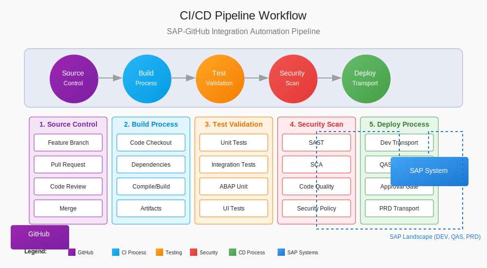

# 📄 CI/CD Pipeline Configuration for SAP-GitHub Integration

## 📋 Table of Contents

- [📋 Overview](#overview)
- [✅ Prerequisites](#prerequisites)
- [Detailed Content](#detailed-content)
- [🔧 Implementation Plan](#implementation-plan)
- [Best Practices](#best-practices)
- [Troubleshooting](#troubleshooting)
- [➡
️ ️ Next Steps](#next-steps)
- [References](#references)


## 📋 Overview

This document provides comprehensive guidance on configuring continuous integration and continuous deployment (CI/CD) pipelines for the SAP-GitHub integration. A well-designed CI/CD pipeline ensures reliable, consistent, and secure deployment of SAP code changes through automated workflows.

## ✅ Prerequisites

- GitHub Enterprise with GitHub Actions enabled
- SAP development, quality, and production systems
- Azure resources for API Management and Key Vault
- Appropriate service accounts and credentials
- Repository structure configured for SAP code
- Basic understanding of GitHub Actions workflows

## Detailed Content

### CI/CD Pipeline Architecture

<div align="center">



*SAP-GitHub Integration CI/CD Pipeline Architecture*
</div>

The SAP-GitHub integration CI/CD pipeline consists of these key components:

1. **Pipeline Components**:
   - Source control management (GitHub)
   - Build and validation (GitHub Actions)
   - Testing framework (ABAP Unit, integration tests)
   - Deployment automation (abapGit, custom RFC clients)
   - Security scanning (GitHub Advanced Security, custom scanners)
   - Approval workflows (GitHub Environments)

2. **Pipeline Stages**:
   - Code validation
   - Security scanning
   - Unit testing
   - Transport creation
   - Quality system deployment
   - Integration testing
   - Production deployment

3. **Integration Points**:
   - GitHub to SAP synchronization
   - SAP to GitHub synchronization
   - Transport management integration
   - Security monitoring integration
   - Notification systems

### Setting Up the Basic Pipeline

#### Repository Configuration

1. **Branch Protection Rules**:
   - Configure branch protection for main and development branches
   - Require pull request reviews before merging
   - Require status checks to pass
   - Example branch protection settings:
     ```
     Branch: main
     Protect from pushes and deletions: Yes
     Require pull request reviews before merging: Yes
     Required approving reviews: 2
     Dismiss stale pull request approvals when new commits are pushed: Yes
     Require status checks to pass before merging: Yes
     Required status checks:
       - ABAP Syntax Check
       - Security Scan
       - Unit Tests
     ```

2. **GitHub Environments**:
   - Create environments for each SAP system:
     - Development
     - Quality Assurance
     - Production
   - Configure environment protection rules
   - Set up environment secrets
   - Example environment configuration:
     ```
     Environment: Production
     Required reviewers: [sap-admins, security-team]
     Wait timer: 30 minutes
     Deployment branches: main
     Environment secrets:
       - SAP_PRD_HOST
       - SAP_PRD_CLIENT
       - SAP_PRD_USER
       - SAP_PRD_PASSWORD
     ```

3. **Workflow Files Structure**:
   - Organize workflow files in `.github/workflows/`
   - Create reusable workflow components
   - Implement shared action components
   - Example structure:
     ```
     .github/
     ├── workflows/
     │   ├── abap-validation.yml
     │   ├── security-scan.yml
     │   ├── dev-deployment.yml
     │   ├── qas-deployment.yml
     │   ├── prd-deployment.yml
     │   └── shared/
     │       ├── abap-test.yml
     │       └── transport-create.yml
     └── actions/
         └── sap-deploy/
             ├── action.yml
             └── index.js
     ```

#### ABAP Code Validation Workflow

1. **ABAP Syntax Check**:
   - Configure workflow to validate ABAP syntax
   - Implement SAP connectivity for validation
   - Report issues as annotations
   - Example workflow:
     ```yaml
     name: ABAP Syntax Validation
     
     on:
       pull_request:
         paths:
           - 'src/**.abap'
     
     jobs:
       validate:
         name: ABAP Syntax Check
         runs-on: ubuntu-latest
         steps:
           - uses: actions/checkout@v3
           
           - name: Set up Python
             uses: actions/setup-python@v4
             with:
               python-version: '3.10'
           
           - name: Install SAP RFC SDK
             run: |
               pip install pyrfc==2.6.0
           
           - name: Get SAP credentials
             uses: azure/get-keyvault-secrets@v1
             with:
               keyvault: "sap-integration-kv"
               secrets: "sap-dev-username, sap-dev-password"
             id: sapSecrets
           
           - name: Run ABAP syntax check
             env:
               SAP_USERNAME: ${{ steps.sapSecrets.outputs.sap-dev-username }}
               SAP_PASSWORD: ${{ steps.sapSecrets.outputs.sap-dev-password }}
               SAP_HOST: "sapdev.example.com"
               SAP_CLIENT: "100"
             run: |
               python scripts/check_abap_syntax.py
     ```

2. **ABAP Best Practices Check**:
   - Implement code quality checks
   - Verify adherence to standards
   - Check for performance issues
   - Report quality metrics

3. **Security Scanning**:
   - Set up ABAP-specific security checks
   - Integrate with GitHub Advanced Security
   - Generate security reports
   - Example security scanning configuration:
     ```yaml
     name: ABAP Security Scan
     
     on:
       pull_request:
         paths:
           - 'src/**.abap'
     
     jobs:
       security-scan:
         name: ABAP Security Scan
         runs-on: ubuntu-latest
         steps:
           - uses: actions/checkout@v3
           
           - name: Run custom ABAP security scanner
             run: |
               python scripts/abap_security_scan.py
           
           - name: Upload SARIF file
             uses: github/codeql-action/upload-sarif@v2
             with:
               sarif_file: abap-scan-results.sarif
     ```

#### Continuous Integration Pipeline

1. **Automated Testing Workflow**:
   - Set up unit test execution
   - Configure integration tests
   - Collect and publish test results
   - Example testing workflow:
     ```yaml
     name: ABAP Testing
     
     on:
       pull_request:
         branches: [ main, develop ]
       push:
         branches: [ main, develop ]
     
     jobs:
       unit-tests:
         name: ABAP Unit Tests
         runs-on: ubuntu-latest
         steps:
           - uses: actions/checkout@v3
           
           - name: Set up Python
             uses: actions/setup-python@v4
             with:
               python-version: '3.10'
           
           - name: Get SAP credentials
             uses: azure/get-keyvault-secrets@v1
             with:
               keyvault: "sap-integration-kv"
               secrets: "sap-dev-username, sap-dev-password"
             id: sapSecrets
           
           - name: Run ABAP Unit Tests
             env:
               SAP_USERNAME: ${{ steps.sapSecrets.outputs.sap-dev-username }}
               SAP_PASSWORD: ${{ steps.sapSecrets.outputs.sap-dev-password }}
               SAP_HOST: "sapdev.example.com"
               SAP_CLIENT: "100"
             run: |
               python scripts/run_abap_tests.py --output test-results.xml
           
           - name: Publish Test Results
             uses: EnricoMi/publish-unit-test-result-action@v2
             if: always()
             with:
               files: test-results.xml
     ```

2. **Code Review Automation**:
   - Set up automated code reviews
   - Implement review assignment
   - Configure review templates
   - Track review metrics

3. **Transport Creation**:
   - Automate transport request creation
   - Implement object assignment
   - Configure transport attributes
   - Example transport creation:
     ```yaml
     name: SAP Transport Creation
     
     on:
       pull_request:
         types: [closed]
         branches: [ main ]
     
     jobs:
       create-transport:
         if: github.event.pull_request.merged == true
         name: Create Transport Request
         runs-on: ubuntu-latest
         steps:
           - uses: actions/checkout@v3
           
           - name: Set up Python
             uses: actions/setup-python@v4
             with:
               python-version: '3.10'
           
           - name: Get SAP credentials
             uses: azure/get-keyvault-secrets@v1
             with:
               keyvault: "sap-integration-kv"
               secrets: "sap-dev-username, sap-dev-password"
             id: sapSecrets
           
           - name: Create transport request
             id: transport
             env:
               SAP_USERNAME: ${{ steps.sapSecrets.outputs.sap-dev-username }}
               SAP_PASSWORD: ${{ steps.sapSecrets.outputs.sap-dev-password }}
               SAP_HOST: "sapdev.example.com"
               SAP_CLIENT: "100"
             run: |
               TRANSPORT_ID=$(python scripts/create_transport.py \
                 --description "Changes from PR #${{ github.event.pull_request.number }}" \
                 --objects "src/changes.json")
               echo "transport_id=$TRANSPORT_ID" >> $GITHUB_OUTPUT
           
           - name: Add transport to PR
             uses: actions/github-script@v6
             with:
               github-token: ${{ secrets.GITHUB_TOKEN }}
               script: |
                 github.rest.issues.createComment({
                   issue_number: context.payload.pull_request.number,
                   owner: context.repo.owner,
                   repo: context.repo.repo,
                   body: `🚀 Created SAP Transport Request: ${{ steps.transport.outputs.transport_id }}`
                 })
     ```

#### Continuous Deployment Pipeline

1. **DEV System Deployment**:
   - Configure automatic deployment to DEV
   - Implement validation checks
   - Set up deployment logging
   - Example DEV deployment workflow:
     ```yaml
     name: DEV Deployment
     
     on:
       push:
         branches: [ develop ]
     
     jobs:
       deploy-dev:
         name: Deploy to DEV
         runs-on: ubuntu-latest
         environment: Development
         steps:
           - uses: actions/checkout@v3
           
           - name: Authenticate to Azure
             uses: azure/login@v1
             with:
               client-id: ${{ secrets.AZURE_CLIENT_ID }}
               tenant-id: ${{ secrets.AZURE_TENANT_ID }}
               subscription-id: ${{ secrets.AZURE_SUBSCRIPTION_ID }}
           
           - name: Get SAP credentials
             uses: azure/get-keyvault-secrets@v1
             with:
               keyvault: "sap-integration-kv"
               secrets: "sap-dev-username, sap-dev-password"
             id: sapSecrets
           
           - name: Deploy to DEV
             env:
               SAP_USERNAME: ${{ steps.sapSecrets.outputs.sap-dev-username }}
               SAP_PASSWORD: ${{ steps.sapSecrets.outputs.sap-dev-password }}
               SAP_HOST: "sapdev.example.com"
               SAP_CLIENT: "100"
             run: |
               python scripts/deploy_to_sap.py \
                 --target-system DEV \
                 --package "ZGITHUB_DEMO"
     ```

2. **QAS System Deployment**:
   - Implement approval-based deployment
   - Configure quality gate checks
   - Set up environment protection
   - Example QAS deployment workflow:
     ```yaml
     name: QAS Deployment
     
     on:
       workflow_dispatch:
         inputs:
           transport_id:
             description: 'Transport Request ID'
             required: true
     
     jobs:
       deploy-qas:
         name: Deploy to QAS
         runs-on: ubuntu-latest
         environment: Quality
         steps:
           - uses: actions/checkout@v3
           
           - name: Authenticate to Azure
             uses: azure/login@v1
             with:
               client-id: ${{ secrets.AZURE_CLIENT_ID }}
               tenant-id: ${{ secrets.AZURE_TENANT_ID }}
               subscription-id: ${{ secrets.AZURE_SUBSCRIPTION_ID }}
           
           - name: Get SAP credentials
             uses: azure/get-keyvault-secrets@v1
             with:
               keyvault: "sap-integration-kv"
               secrets: "sap-qas-username, sap-qas-password"
             id: sapSecrets
           
           - name: Deploy to QAS
             env:
               SAP_USERNAME: ${{ steps.sapSecrets.outputs.sap-qas-username }}
               SAP_PASSWORD: ${{ steps.sapSecrets.outputs.sap-qas-password }}
               SAP_HOST: "sapqas.example.com"
               SAP_CLIENT: "100"
               TRANSPORT_ID: ${{ github.event.inputs.transport_id }}
             run: |
               python scripts/deploy_to_sap.py \
                 --target-system QAS \
                 --transport-id "$TRANSPORT_ID"
     ```

3. **PRD System Deployment**:
   - Configure production deployment safeguards
   - Implement approval workflows
   - Set up rollback mechanisms
   - Example PRD deployment workflow:
     ```yaml
     name: PRD Deployment
     
     on:
       workflow_dispatch:
         inputs:
           transport_id:
             description: 'Transport Request ID'
             required: true
     
     jobs:
       deploy-prd:
         name: Deploy to PRD
         runs-on: ubuntu-latest
         environment: Production
         steps:
           - uses: actions/checkout@v3
           
           - name: Authenticate to Azure
             uses: azure/login@v1
             with:
               client-id: ${{ secrets.AZURE_CLIENT_ID }}
               tenant-id: ${{ secrets.AZURE_TENANT_ID }}
               subscription-id: ${{ secrets.AZURE_SUBSCRIPTION_ID }}
           
           - name: Get SAP credentials
             uses: azure/get-keyvault-secrets@v1
             with:
               keyvault: "sap-integration-kv"
               secrets: "sap-prd-username, sap-prd-password"
             id: sapSecrets
           
           - name: Create backup
             env:
               SAP_USERNAME: ${{ steps.sapSecrets.outputs.sap-prd-username }}
               SAP_PASSWORD: ${{ steps.sapSecrets.outputs.sap-prd-password }}
               SAP_HOST: "sapprd.example.com"
               SAP_CLIENT: "100"
             run: |
               python scripts/create_backup.py \
                 --transport-id "${{ github.event.inputs.transport_id }}" \
                 --backup-dir "backups/"
           
           - name: Deploy to PRD
             env:
               SAP_USERNAME: ${{ steps.sapSecrets.outputs.sap-prd-username }}
               SAP_PASSWORD: ${{ steps.sapSecrets.outputs.sap-prd-password }}
               SAP_HOST: "sapprd.example.com"
               SAP_CLIENT: "100"
               TRANSPORT_ID: ${{ github.event.inputs.transport_id }}
             run: |
               python scripts/deploy_to_sap.py \
                 --target-system PRD \
                 --transport-id "$TRANSPORT_ID" \
                 --with-verification
     ```

### Advanced Pipeline Features

#### Reusable Workflows

1. **Creating Reusable Components**:
   - Design modular workflow components
   - Implement parameterized workflows
   - Create standardized job patterns
   - Example reusable workflow:
     ```yaml
     # .github/workflows/shared/sap-deploy.yml
     name: Reusable SAP Deployment
     
     on:
       workflow_call:
         inputs:
           target_system:
             required: true
             type: string
           transport_id:
             required: false
             type: string
           package:
             required: false
             type: string
         secrets:
           sap_username:
             required: true
           sap_password:
             required: true
           sap_host:
             required: true
           sap_client:
             required: true
     
     jobs:
       deploy:
         name: SAP Deployment
         runs-on: ubuntu-latest
         steps:
           - uses: actions/checkout@v3
           
           - name: Set up SAP deployment
             run: |
               pip install pyrfc==2.6.0
           
           - name: Deploy to ${{ inputs.target_system }}
             env:
               SAP_USERNAME: ${{ secrets.sap_username }}
               SAP_PASSWORD: ${{ secrets.sap_password }}
               SAP_HOST: ${{ secrets.sap_host }}
               SAP_CLIENT: ${{ secrets.sap_client }}
               TARGET_SYSTEM: ${{ inputs.target_system }}
               TRANSPORT_ID: ${{ inputs.transport_id }}
               PACKAGE: ${{ inputs.package }}
             run: |
               python scripts/deploy_to_sap.py \
                 --target-system "$TARGET_SYSTEM" \
                 ${TRANSPORT_ID:+--transport-id "$TRANSPORT_ID"} \
                 ${PACKAGE:+--package "$PACKAGE"}
     ```

2. **Workflow Composition**:
   - Call reusable workflows from main workflows
   - Pass appropriate parameters and secrets
   - Create workflow pipelines
   - Example workflow composition:
     ```yaml
     name: End-to-End Deployment
     
     on:
       workflow_dispatch:
         inputs:
           transport_id:
             description: 'Transport Request ID'
             required: true
     
     jobs:
       validate:
         uses: ./.github/workflows/shared/validation.yml
         with:
           transport_id: ${{ github.event.inputs.transport_id }}
         secrets:
           sap_username: ${{ secrets.SAP_DEV_USERNAME }}
           sap_password: ${{ secrets.SAP_DEV_PASSWORD }}
           sap_host: ${{ secrets.SAP_DEV_HOST }}
           sap_client: ${{ secrets.SAP_CLIENT }}
       
       deploy-qas:
         needs: validate
         uses: ./.github/workflows/shared/sap-deploy.yml
         with:
           target_system: 'QAS'
           transport_id: ${{ github.event.inputs.transport_id }}
         secrets:
           sap_username: ${{ secrets.SAP_QAS_USERNAME }}
           sap_password: ${{ secrets.SAP_QAS_PASSWORD }}
           sap_host: ${{ secrets.SAP_QAS_HOST }}
           sap_client: ${{ secrets.SAP_CLIENT }}
     ```

#### Matrix Builds

1. **Multi-System Deployment**:
   - Configure matrix-based deployments
   - Define system-specific parameters
   - Implement parallel deployments
   - Example matrix configuration:
     ```yaml
     jobs:
       deploy:
         name: Deploy to Systems
         runs-on: ubuntu-latest
         strategy:
           matrix:
             system: [DEV1, DEV2, DEV3]
             include:
               - system: DEV1
                 host: sapdev1.example.com
               - system: DEV2
                 host: sapdev2.example.com
               - system: DEV3
                 host: sapdev3.example.com
         steps:
           - uses: actions/checkout@v3
           
           - name: Deploy to ${{ matrix.system }}
             env:
               SAP_HOST: ${{ matrix.host }}
               SAP_CLIENT: "100"
             run: |
               echo "Deploying to ${{ matrix.system }} (${{ matrix.host }})"
     ```

2. **Version Testing**:
   - Test across multiple SAP versions
   - Validate compatibility
   - Generate version-specific artifacts
   - Example version matrix:
     ```yaml
     strategy:
       matrix:
         sap_version: [750, 751, 752, 753, 754]
         include:
           - sap_version: 750
             netweaver_version: "7.50"
           - sap_version: 751
             netweaver_version: "7.51"
           - sap_version: 752
             netweaver_version: "7.52"
           - sap_version: 753
             netweaver_version: "7.53"
           - sap_version: 754
             netweaver_version: "7.54"
     ```

#### Security Integration

1. **Secret Management**:
   - Configure secure secret handling
   - Implement secret rotation
   - Use environment-scoped secrets
   - Example key vault integration:
     ```yaml
     - name: Authenticate to Azure
       uses: azure/login@v1
       with:
         client-id: ${{ secrets.AZURE_CLIENT_ID }}
         tenant-id: ${{ secrets.AZURE_TENANT_ID }}
         subscription-id: ${{ secrets.AZURE_SUBSCRIPTION_ID }}
     
     - name: Get SAP credentials
       uses: azure/get-keyvault-secrets@v1
       with:
         keyvault: "sap-integration-kv"
         secrets: "sap-username, sap-password"
       id: sapSecrets
     ```

2. **Compliance Validation**:
   - Implement compliance checks
   - Enforce security policies
   - Generate compliance reports
   - Example compliance check:
     ```yaml
     - name: Compliance Check
       run: |
         python scripts/check_compliance.py \
           --standards "SOX,GDPR" \
           --output compliance-report.json
     
     - name: Upload Compliance Report
       uses: actions/upload-artifact@v3
       with:
         name: compliance-report
         path: compliance-report.json
     ```

3. **Vulnerability Scanning**:
   - Integrate security scanning tools
   - Generate vulnerability reports
   - Implement security gates
   - Example vulnerability scanning:
     ```yaml
     - name: Run CodeQL Analysis
       uses: github/codeql-action/analyze@v2
       with:
         category: "abap"
     
     - name: Check for vulnerabilities
       run: |
         if grep -q "CRITICAL" codeql-results.sarif; then
           echo "Critical vulnerabilities found!"
           exit 1
         fi
     ```

### Monitoring and Reporting

1. **Pipeline Metrics**:
   - Track pipeline execution times
   - Monitor success/failure rates
   - Measure code quality metrics
   - Example metrics collection:
     ```yaml
     - name: Collect Pipeline Metrics
       if: always()
       run: |
         START_TIME="${{ steps.start-time.outputs.time }}"
         END_TIME=$(date +%s)
         DURATION=$((END_TIME - START_TIME))
         
         echo "Pipeline duration: $DURATION seconds"
         echo "Pipeline result: ${{ job.status }}"
         
         # Send metrics to monitoring system
         curl -X POST https://metrics.example.com/api/pipeline \
           -H "Content-Type: application/json" \
           -d "{\"pipeline\":\"${{ github.workflow }}\",\"duration\":$DURATION,\"result\":\"${{ job.status }}\"}"
     ```

2. **Deployment Dashboards**:
   - Create deployment status dashboards
   - Visualize deployment history
   - Track environment status
   - Example dashboard integration:
     ```yaml
     - name: Update Deployment Dashboard
       if: success()
       run: |
         curl -X POST https://dashboard.example.com/api/deployments \
           -H "Content-Type: application/json" \
           -d "{\"application\":\"SAP Integration\",\"environment\":\"${{ inputs.target_system }}\",\"version\":\"${{ github.sha }}\",\"timestamp\":\"$(date -u +"%Y-%m-%dT%H:%M:%SZ")\"}"
     ```

3. **Notification Integration**:
   - Configure deployment notifications
   - Set up status alerts
   - Implement targeted notifications
   - Example notification:
     ```yaml
     - name: Send Notification
       if: always()
       uses: actions/github-script@v6
       with:
         github-token: ${{ secrets.GITHUB_TOKEN }}
         script: |
           const result = "${{ job.status }}";
           const system = "${{ inputs.target_system }}";
           
           github.rest.issues.createComment({
             issue_number: context.issue.number,
             owner: context.repo.owner,
             repo: context.repo.repo,
             body: `📣 Deployment to ${system}: ${result}`
           });
     ```

## 🔧 Implementation Plan

Follow this phased approach to implement CI/CD pipelines:

1. **Phase 1: Foundation (2-3 weeks)**
   - Set up repository structure
   - Configure basic validation workflows
   - Implement branch protection
   - Create initial deployment scripts

2. **Phase 2: Basic Pipeline (3-4 weeks)**
   - Implement validation workflows
   - Set up DEV deployment
   - Configure testing automation
   - Create basic approval flows

3. **Phase 3: Advanced Pipeline (4-5 weeks)**
   - Implement QAS and PRD deployments
   - Configure environment protection
   - Set up reusable workflows
   - Implement security scanning

4. **Phase 4: Optimization (Ongoing)**
   - Implement metrics collection
   - Optimize workflow performance
   - Enhance security controls
   - Expand automation coverage

## Best Practices

1. **Pipeline Design Principles**
   - Design for reliability
   - Optimize for speed
   - Implement comprehensive validation
   - Build in security by design

2. **Code Management**
   - Follow branch naming conventions
   - Implement semantic versioning
   - Enforce pull request reviews
   - Maintain clean commit history

3. **Security Considerations**
   - Use least privilege principle
   - Implement secret rotation
   - Apply defense in depth
   - Maintain audit trails

4. **Operational Excellence**
   - Document pipeline architecture
   - Monitor pipeline health
   - Maintain deployment history
   - Practice continuous improvement

## Troubleshooting

### Common Issues and Solutions

- **Pipeline Failures**:
  - Check workflow syntax
  - Verify credential access
  - Confirm system connectivity
  - Review environment configurations

- **Deployment Problems**:
  - Validate transport status
  - Check SAP system availability
  - Verify user authorizations
  - Review deployment logs

- **Security Issues**:
  - Audit secret access
  - Review permission settings
  - Check scanning configurations
  - Verify approval workflows

## ➡️ Next Steps

After implementing CI/CD pipelines, proceed to:

- [Automated Testing](./automated-testing.md) - Enhance testing framework
- [GitHub Advanced Security](../github-setup/advanced-security.md) - Configure advanced security features
- [Monitoring Setup](../monitoring/overview.md) - Implement comprehensive monitoring

## References

- [GitHub Actions Workflow Reference](https://docs.github.com/en/actions/reference/workflow-syntax-for-github-actions)
- [SAP Transport Management](https://help.sap.com/docs/SAP_NETWEAVER_AS_ABAP_751_IP/4a368c163b08418890a406d413933ba7/48c4300fdc9f11d1914600508b5d5211.html)
- [DevOps Best Practices](https://cloud.google.com/solutions/devops/devops-tech-continuous-integration)
- [ABAP Pipeline Examples](https://blogs.sap.com/2019/10/02/continuous-integration-and-delivery-for-abap/)

---


