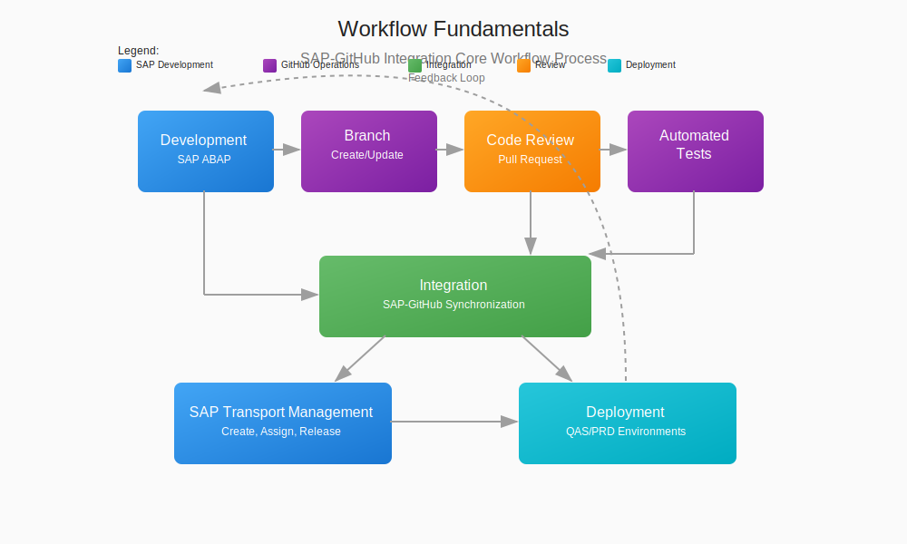

# 📄 Workflow Fundamentals

## 📋 Table of Contents

- [📋 Overview](#overview)
- [Workflow Components](#workflow-components)
- [Key Workflow Stages](#key-workflow-stages)
- [Integration Points](#integration-points)
- [Workflow Best Practices](#workflow-best-practices)
- [Common Workflow Patterns](#common-workflow-patterns)
- [➡️ Next Steps](#next-steps)
- [References](#references)

## 📋 Overview

This document outlines the fundamental workflow processes that form the foundation of the SAP-GitHub integration. Understanding these core workflows is essential for successful implementation and operation of integrated development processes between SAP systems and GitHub repositories.

*SAP-GitHub Integration Core Workflow Process*

## Workflow Components

The SAP-GitHub integration workflow consists of several key components:

1. **SAP Development Environment**:
   - ABAP Development Tools (ADT)
   - SAPGUI development interfaces
   - abapGit client for SAP systems
   - Transport Management System (TMS)

2. **GitHub Environment**:
   - Repositories and branches
   - Pull requests and code reviews
   - GitHub Actions workflows
   - Security scanning tools

3. **Integration Layer**:
   - API Management services
   - Authentication mechanisms
   - Context-aware data handling
   - Event processing components

4. **Deployment Mechanisms**:
   - Transport automation
   - Transport sequence management
   - Release management tools
   - Environment-specific configurations

## Key Workflow Stages

### 1. Development Process

Development begins in the SAP ABAP environment, where developers create or modify code using standard SAP development tools. This code is then:

- Validated against SAP syntax and best practices
- Checked for security issues within the SAP environment
- Prepared for synchronization with GitHub

### 2. Branch Management

GitHub branch management is a critical part of the workflow:

- Feature branches created for specific development tasks
- Development branches for ongoing work
- Main branch containing production-ready code
- Release branches for specific releases

### 3. Code Review Process

Code reviews ensure quality and compliance:

- Pull requests used to propose changes
- Automated validation checks for syntax and style
- Manual review by designated reviewers
- Security and compliance verification

### 4. Testing Framework

Comprehensive testing ensures reliability:

- Automated unit tests via ABAP Unit
- Integration tests validating component interactions
- Security tests identifying vulnerabilities
- Performance tests validating system behavior

### 5. Integration Synchronization

Synchronization between SAP and GitHub:

- Changes from SAP pushed to GitHub
- GitHub changes imported to SAP
- Context preservation across systems
- Conflict resolution mechanisms

### 6. Transport Management

SAP transport management ensures orderly progression:

- Transport requests created for changes
- Objects assigned to appropriate transports
- Transport sequences managed
- Transport approvals and releases

### 7. Deployment Process

The deployment process distributes changes:

- Deployment to quality assurance systems
- Validation in test environments
- Production deployment with safeguards
- Rollback mechanisms for failures

## Integration Points

The SAP-GitHub integration workflow includes several key integration points:

1. **SAP to GitHub Synchronization**:
   - abapGit-based object serialization
   - Metadata preservation
   - Versioning alignment
   - Configuration management

2. **GitHub to SAP Synchronization**:
   - Code import mechanisms
   - Validation during import
   - Conflict resolution
   - Status tracking

3. **Event-Based Integration**:
   - Webhook processing
   - Status notifications
   - Automation triggers
   - Alert mechanisms

4. **Authentication and Authorization**:
   - OAuth-based authentication
   - Role-based authorization
   - Token management
   - Security governance

## Workflow Best Practices

To ensure effective workflows:

1. **Standardization**:
   - Consistent branch naming conventions
   - Standardized commit message formats
   - Uniform workflow structures
   - Documentation templates

2. **Automation**:
   - Automated validation checks
   - Continuous integration workflows
   - Deployment automation
   - Status reporting

3. **Security Integration**:
   - Security scanning at each stage
   - Vulnerability assessment
   - Compliance verification
   - Audit trail maintenance

4. **Documentation**:
   - Workflow documentation
   - Process diagrams
   - Role definitions
   - Training materials

## Common Workflow Patterns

Several workflow patterns are commonly used:

1. **Feature Development Workflow**:
   - Feature branch creation
   - Development and testing
   - Pull request and review
   - Integration and deployment

2. **Hotfix Workflow**:
   - Hotfix branch from production
   - Quick resolution development
   - Expedited review and testing
   - Priority deployment

3. **Release Workflow**:
   - Release branch creation
   - Feature freeze and stabilization
   - Release testing
   - Coordinated deployment

4. **Multi-System Workflow**:
   - Parallel development across systems
   - Cross-system coordination
   - Consolidated integration
   - Sequenced deployment

## ➡️ Next Steps

After understanding the workflow fundamentals, proceed to:

- [CI/CD Workflow](./cicd-workflow.md) - Details on CI/CD pipeline configuration
- [Branch Workflows](./branch-workflows.md) - Specific branch-based workflow patterns
- [Transport Automation](./transport-automation.md) - Automating SAP transport processes

## References

- [GitHub Flow](https://docs.github.com/en/get-started/quickstart/github-flow)
- [SAP Transport Management](https://help.sap.com/docs/SAP_NETWEAVER_AS_ABAP_751_IP/4a368c163b08418890a406d413933ba7/48c4300fdc9f11d1914600508b5d5211.html)
- [DevOps Best Practices](https://about.gitlab.com/topics/devops/)
- [Agile Development](https://www.atlassian.com/agile)

---