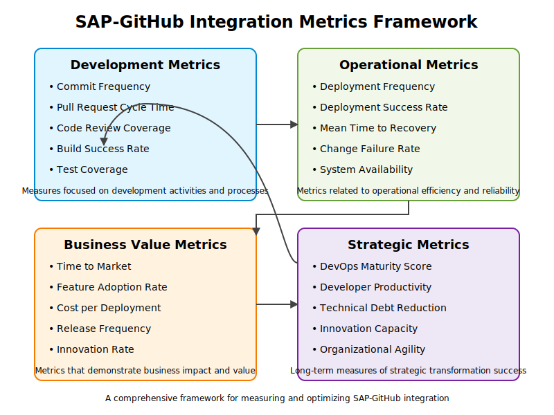

# 📄 Metrics and Measurement Guidelines

## 📋 Table of Contents

- [Measurement Framework Overview](#measurement-framework-overview)
- [Development Efficiency Metrics](#development-efficiency-metrics)
- [Code Quality Metrics](#code-quality-metrics)
- [🛡
️ ️ Security Posture Metrics](#security-posture-metrics)
- [Business Impact Metrics](#business-impact-metrics)
- [Team Effectiveness Metrics](#team-effectiveness-metrics)
- [Data Collection Methods](#data-collection-methods)
- [Establishing Effective Measurement](#establishing-effective-measurement)
- [Metrics Dashboard Example](#metrics-dashboard-example)
- [Measurement for Continuous Improvement](#measurement-for-continuous-improvement)
- [ROI Calculation Framework](#roi-calculation-framework)
- [Getting Started with Measurement](#getting-started-with-measurement)


This document provides a comprehensive framework for measuring the benefits and impact of the SAP-GitHub integration. It includes specific metrics, measurement methodologies, and guidance for establishing baselines and targets.

## Measurement Framework Overview

Effective measurement of the SAP-GitHub integration benefits requires a structured approach that captures both quantitative and qualitative improvements across multiple dimensions:

<div align="center">
  

  
  *\1*
</div>

### Metrics Categories

1. **Development Efficiency**: Measures of speed, throughput, and workflow efficiency
2. **Code Quality**: Indicators of software quality, defects, and maintainability
3. **Security Posture**: Metrics related to security vulnerabilities and compliance
4. **Business Impact**: Business-oriented measures of value and outcomes
5. **Team Effectiveness**: Metrics related to developer productivity and collaboration

### Measurement Principles

1. **Baseline First**: Establish clear baselines before implementation
2. **Business Alignment**: Connect technical metrics to business outcomes
3. **Balanced Perspective**: Include both quantitative and qualitative measures
4. **Leading Indicators**: Identify metrics that predict future success
5. **Continuous Improvement**: Use metrics to drive ongoing optimization

## Development Efficiency Metrics

### Cycle Time Metrics

| Metric | Description | Calculation Method | Typical Improvement |
|--------|-------------|-------------------|---------------------|
| **Lead Time for Changes** | Time from commit to production deployment | Average time from first commit to production release | 50-70% reduction |
| **Development Cycle Time** | Time from requirement to completed development | Average time from story creation to completed development | 30-50% reduction |
| **Deployment Frequency** | Frequency of deployments to production | Count of production deployments per time period | 100-300% increase |
| **Transport Creation Time** | Time to create and configure transport requests | Average time from request to ready transport | 70-90% reduction |
| **Change Implementation Efficiency** | Percentage of total time spent on value-adding development activities | Development time / Total time (incl. admin tasks) | 25-40% improvement |

### Workflow Efficiency Metrics

| Metric | Description | Calculation Method | Typical Improvement |
|--------|-------------|-------------------|---------------------|
| **Code Review Efficiency** | Time from PR creation to approval | Average time from PR created to merged | 40-60% reduction |
| **Build Success Rate** | Percentage of successful builds | Successful builds / Total builds × 100% | 15-30% improvement |
| **Transport Success Rate** | Percentage of transports released without issues | Successful transports / Total transports × 100% | 20-40% improvement |
| **First-time Resolution Rate** | Changes implemented correctly the first time | Changes without rework / Total changes × 100% | 30-50% improvement |
| **Automation Coverage** | Percentage of development workflow steps automated | Automated steps / Total steps × 100% | 50-100% improvement |

## Code Quality Metrics

### Defect Metrics

| Metric | Description | Calculation Method | Typical Improvement |
|--------|-------------|-------------------|---------------------|
| **Defect Density** | Number of defects per unit of code | Defects / KLOC (thousand lines of code) | 30-50% reduction |
| **Defect Escape Rate** | Percentage of defects found in production | Production defects / Total defects × 100% | 40-70% reduction |
| **Mean Time to Detect Defects** | Average time from introduction to detection | Average time between code change and defect detection | 50-80% reduction |
| **Mean Time to Fix** | Average time to fix defects | Average time from defect detection to fix deployment | 30-60% reduction |
| **Regression Defect Rate** | Percentage of defects that are regressions | Regression defects / Total defects × 100% | 40-60% reduction |

### Code Health Metrics

| Metric | Description | Calculation Method | Typical Improvement |
|--------|-------------|-------------------|---------------------|
| **Code Review Coverage** | Percentage of code changes reviewed | Code changes reviewed / Total code changes × 100% | 50-100% increase |
| **Test Coverage** | Percentage of code covered by tests | Code covered by tests / Total code × 100% | 30-70% increase |
| **Static Analysis Issues** | Count of static analysis warnings | Number of issues detected by static analysis | 40-60% reduction |
| **Technical Debt** | Estimate of effort to address quality issues | Effort estimate to fix quality issues (days) | 15-35% reduction |
| **Documentation Coverage** | Percentage of code with appropriate documentation | Documented components / Total components × 100% | 40-80% increase |

## 🛡️ Security Posture Metrics

### Vulnerability Metrics

| Metric | Description | Calculation Method | Typical Improvement |
|--------|-------------|-------------------|---------------------|
| **Vulnerability Density** | Number of security vulnerabilities per unit of code | Vulnerabilities / KLOC | 50-70% reduction |
| **Mean Time to Detect Vulnerabilities** | Average time from introduction to detection | Average time between code change and vulnerability detection | 70-90% reduction |
| **Mean Time to Remediate** | Average time to fix security vulnerabilities | Average time from detection to remediation | 40-70% reduction |
| **High-Risk Vulnerability Rate** | Percentage of vulnerabilities with high/critical severity | High/critical vulnerabilities / Total vulnerabilities × 100% | 60-80% reduction |
| **Vulnerability Age** | Average age of open vulnerabilities | Average time vulnerabilities remain open | 50-80% reduction |

### Compliance Metrics

| Metric | Description | Calculation Method | Typical Improvement |
|--------|-------------|-------------------|---------------------|
| **Compliance Violation Rate** | Percentage of changes with compliance violations | Changes with violations / Total changes × 100% | 60-90% reduction |
| **Audit Finding Rate** | Number of audit findings related to development | Count of audit findings per audit cycle | 70-100% reduction |
| **Compliance Verification Time** | Time to verify compliance of changes | Average time to complete compliance verification | 50-80% reduction |
| **Security Scanning Coverage** | Percentage of code scanned for security issues | Code scanned / Total code × 100% | 50-100% improvement |
| **Segregation of Duties Compliance** | Compliance with segregation of duties requirements | Percentage compliance with SoD requirements | 30-50% improvement |

## Business Impact Metrics

### Time-to-Market Metrics

| Metric | Description | Calculation Method | Typical Improvement |
|--------|-------------|-------------------|---------------------|
| **Feature Delivery Rate** | Number of features delivered per time period | Count of features delivered per quarter | 30-60% increase |
| **Time-to-Value** | Time from feature request to business value realization | Average time from requirement to value realization | 30-50% reduction |
| **Business Request Fulfillment Time** | Time to implement business-requested changes | Average time from request to implementation | 40-60% reduction |
| **On-Time Delivery Rate** | Percentage of features delivered on schedule | Features delivered on time / Total features × 100% | 30-50% improvement |
| **Feature Throughput** | Volume of development work completed over time | Story points or equivalent completed per period | 20-40% increase |

### Cost and Efficiency Metrics

| Metric | Description | Calculation Method | Typical Improvement |
|--------|-------------|-------------------|---------------------|
| **Development Cost per Feature** | Average cost to develop a feature | Total development costs / Number of features | 20-40% reduction |
| **Infrastructure Cost Efficiency** | Development infrastructure costs relative to output | Infrastructure costs / Development output | 15-30% improvement |
| **Maintenance Cost Ratio** | Percentage of budget spent on maintenance vs. new features | Maintenance costs / Total development costs × 100% | 20-40% reduction |
| **Resource Utilization** | Efficient use of development resources | Value-adding activities / Total capacity × 100% | 15-35% improvement |
| **Business Disruption Costs** | Cost of business disruptions due to system issues | Estimated cost of system-related disruptions | 30-60% reduction |

### Business Value Metrics

| Metric | Description | Calculation Method | Typical Improvement |
|--------|-------------|-------------------|---------------------|
| **Business SLA Achievement** | Meeting business service level agreements | SLAs met / Total SLAs × 100% | 20-40% improvement |
| **System Availability** | System uptime and stability | Uptime percentage | 5-15% improvement |
| **Business Process Efficiency** | Efficiency of business processes supported by SAP | Process completion time/cost improvements | 10-30% improvement |
| **Business Stakeholder Satisfaction** | Satisfaction with IT delivery and support | Survey results (1-10 scale) | 20-40% improvement |
| **Revenue Impact** | Revenue influenced by improved capabilities | Estimated revenue impact of faster delivery | Highly variable |

## Team Effectiveness Metrics

### Developer Productivity Metrics

| Metric | Description | Calculation Method | Typical Improvement |
|--------|-------------|-------------------|---------------------|
| **Developer Productivity** | Delivery rate per developer | Features or story points per developer per period | 20-40% improvement |
| **Context Switching** | Frequency of task switching | Average number of context switches per day | 30-50% reduction |
| **Onboarding Time** | Time for new developers to become productive | Average time to first productive contribution | 40-60% reduction |
| **Work Item Completion Rate** | Rate of completing development tasks | Completed tasks / Planned tasks × 100% | 20-30% improvement |
| **Flow Efficiency** | Percentage of time items are actively worked on | Active work time / Total elapsed time × 100% | 30-50% improvement |

### Collaboration and Knowledge Metrics

| Metric | Description | Calculation Method | Typical Improvement |
|--------|-------------|-------------------|---------------------|
| **Cross-team Collaboration** | Level of collaboration between teams | Count of cross-team contributions | 50-100% increase |
| **Knowledge Sharing** | Effectiveness of knowledge distribution | Survey results or knowledge sharing metrics | 40-80% improvement |
| **Code Ownership Distribution** | Distribution of code contributions across team | Gini coefficient of code contributions | 30-50% improvement |
| **PR Review Participation** | Average number of reviewers per PR | Average reviewer count per PR | 50-100% increase |
| **Community Engagement** | Engagement in development community | Participation in forums, discussions, etc. | 70-150% increase |

### Developer Experience Metrics

| Metric | Description | Calculation Method | Typical Improvement |
|--------|-------------|-------------------|---------------------|
| **Developer Satisfaction** | Overall satisfaction with development experience | Survey results (1-10 scale) | 30-60% improvement |
| **Tool Satisfaction** | Satisfaction with development tools | Survey results for tool satisfaction | 40-70% improvement |
| **Developer Retention** | Retention rate of development team | Developer retention percentage | 10-30% improvement |
| **Attraction of Talent** | Ability to attract skilled developers | Time to fill positions; candidate quality | Significant improvement |
| **Learning and Growth** | Developer learning and skill development | Survey results; skill advancement metrics | 30-50% improvement |

## Data Collection Methods

### Automated Collection

Leverage these data sources for automated metric collection:

1. **GitHub Metrics API**: Repository statistics, PR metrics, code scanning results
2. **GitHub Actions**: Build and deployment metrics
3. **API Management Analytics**: API performance and usage metrics
4. **Microsoft Sentinel**: Security and compliance metrics
5. **SAP Solution Manager**: Transport and system metrics
6. **Custom Instrumentation**: Integration-specific metrics

### Manual Collection

Some metrics require manual collection methods:

1. **Surveys**: Developer satisfaction, stakeholder feedback
2. **Workshops**: Qualitative feedback sessions
3. **Interviews**: In-depth experience assessments
4. **Observation**: Workflow efficiency analysis
5. **Business Impact Assessment**: Business value determination

## Establishing Effective Measurement

### Baseline Measurement

1. **Timing**: Collect baseline metrics 1-3 months before implementation
2. **Scope**: Measure across all metric categories
3. **Granularity**: Collect team-level and organization-level metrics
4. **Documentation**: Document measurement methods for consistency
5. **Validation**: Validate baseline accuracy with stakeholders

### Implementation Measurement

1. **Frequency**: Establish regular measurement intervals (weekly/monthly)
2. **Visualization**: Create dashboards for real-time metrics
3. **Comparison**: Compare against baseline and targets
4. **Communication**: Share progress with stakeholders
5. **Adjustment**: Refine measurement approach as needed

### Long-term Measurement

1. **Standardization**: Standardize on core metrics for long-term tracking
2. **Integration**: Integrate measurements into regular reporting
3. **Analysis**: Perform trend analysis and pattern recognition
4. **Benchmarking**: Compare with industry benchmarks when available
5. **Evolution**: Evolve metrics as the integration matures

## Metrics Dashboard Example

Create a comprehensive metrics dashboard with these sections:

1. **Executive Summary**: High-level KPIs and business impact
2. **Development Performance**: Development efficiency metrics
3. **Quality Dashboard**: Code quality and defect metrics
4. **Security Status**: Security posture and compliance metrics
5. **Team Effectiveness**: Developer productivity and collaboration
6. **Trend Analysis**: Long-term metric trends and patterns

## Measurement for Continuous Improvement

The measurement framework should drive continuous improvement:

1. **Identify Opportunities**: Use metrics to identify improvement areas
2. **Prioritize Actions**: Focus on metrics with greatest business impact
3. **Implement Changes**: Make targeted improvements based on data
4. **Measure Impact**: Track the effect of improvement actions
5. **Iterate**: Continuously refine based on measurement feedback

## ROI Calculation Framework

Calculate return on investment using this framework:

### Cost Factors

1. **Implementation Costs**: Software, infrastructure, consulting
2. **Training Costs**: Developer and administrator training
3. **Operational Costs**: Ongoing operation and maintenance
4. **Opportunity Costs**: Time invested by internal resources

### Benefit Factors

1. **Direct Cost Savings**: Reduced manual effort, fewer production issues
2. **Productivity Gains**: Developer productivity improvements
3. **Quality Improvements**: Reduced rework and defect remediation costs
4. **Time-to-Market Benefits**: Value of faster feature delivery
5. **Risk Reduction**: Value of reduced security and compliance risk

### ROI Calculation Method

```
ROI = (Total Benefits - Total Costs) / Total Costs × 100%
```

With benefits and costs calculated over a 3-5 year period for accuracy.

## Getting Started with Measurement

1. **Start Small**: Begin with core metrics from each category
2. **Automate Early**: Set up automated collection where possible
3. **Visualize**: Create simple dashboards for visibility
4. **Communicate**: Share metrics with all stakeholders
5. **Refine**: Continuously improve your measurement approach

For implementation assistance, refer to the [Implementation Guide](../implementation/index.md) section of this playbook.

---

*Last Updated: [YYYY-MM-DD] for [Component Versions: GitHub Enterprise X.Y.Z, SAP S/4 HANA X.Y.Z, etc.]*

---


