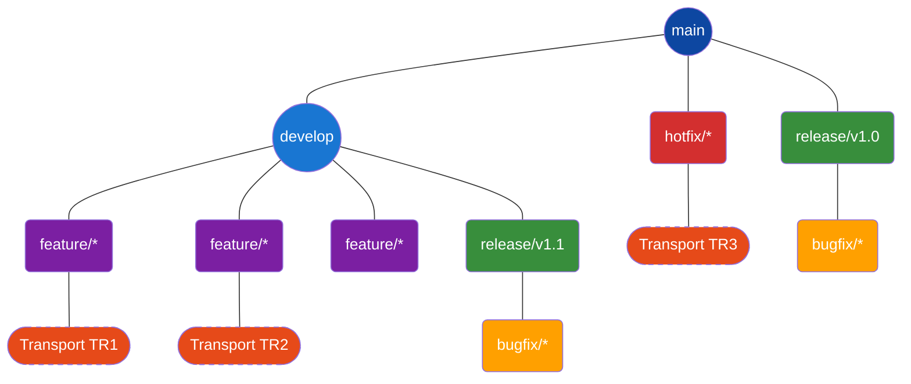

# 📄 Branching Strategy for SAP-GitHub Integration

## 📋 Table of Contents

- [📋 Overview](#overview)
- [Branching Models](#branching-models)
- [SAP-Specific Branching Challenges](#sap-specific-branching-challenges)
- [Recommended Branching Strategy](#recommended-branching-strategy)
- [Branch Naming Conventions](#branch-naming-conventions)
- [Branch Protection Rules](#branch-protection-rules)
- [Pull Request Workflow](#pull-request-workflow)
- [Transport Integration](#transport-integration)
- [Release Management](#release-management)
- [Migration Strategy](#migration-strategy)
- [References](#references)

## 📋 Overview

This document outlines best practices for implementing an effective branching strategy when integrating SAP systems with GitHub. A well-designed branching strategy is crucial for maintaining code quality, supporting parallel development, and ensuring smooth releases while addressing the unique characteristics of SAP development.

<div align="center">


*SAP-GitHub Integration Development Workflow*
</div>

## Branching Models

### Common Branching Patterns

#### GitHub Flow

A simplified, trunk-based workflow:

1. Create feature branches from main
2. Develop and commit changes
3. Open pull request for discussion
4. Merge to main when approved
5. Deploy from main

**Best for**: Small teams, continuous delivery environments, web applications

#### GitFlow

A more structured model with multiple branch types:

1. Feature branches for development
2. Develop branch for integration
3. Release branches for preparation
4. Hotfix branches for emergency fixes
5. Main branch for production code

**Best for**: Larger teams, scheduled releases, multiple version maintenance

#### Trunk-Based Development

A streamlined approach focusing on the main branch:

1. Small, frequent commits to main
2. Feature flags for incomplete features
3. Short-lived feature branches when needed
4. Automated testing for every commit
5. Continuous integration and deployment

**Best for**: DevOps-mature organizations, microservices architectures

### Comparative Analysis

<div align="center">

| Aspect | GitHub Flow | GitFlow | Trunk-Based |
|--------|------------|---------|-------------|
| Complexity | Low | High | Low |
| Release Cadence | Continuous | Scheduled | Continuous |
| Team Size | Small to Medium | Medium to Large | Any |
| Branch Lifetime | Short | Varies | Very Short |
| Merge Frequency | High | Low to Medium | Very High |
| SAP Compatibility | Medium | High | Low |

</div>

## SAP-Specific Branching Challenges

### Transport Integration

SAP development relies on transports for deployment, which creates unique challenges:

- Transports may contain multiple objects with dependencies
- Transport sequencing is critical for successful imports
- SAP objects often have interdependencies not captured in code
- Transport-based deployments don't align perfectly with Git commits

### System Landscape

SAP typically uses a multi-system landscape that influences branching:

- Development system for active development
- Quality/Testing system for validation
- Production system for live operation
- Potential additional systems for specialized testing

### Object Locking

SAP's development model traditionally involves object locking:

- Multiple developers can't modify the same object simultaneously in SAP
- Conflicts must be resolved differently than standard Git merge conflicts
- Package concepts differ from GitHub repository structures

## Recommended Branching Strategy

Based on SAP-specific considerations, we recommend a **Modified GitFlow** approach:

### Core Branches

- **main**: Production-ready code, always deployable
- **develop**: Integration branch for feature development
- **release/vX.Y.Z**: Preparation for specific releases
- **hotfix/issue-NNN**: Emergency fixes for production

### Extended Structure

<div align="center">



</div>

### Workflow Integration

1. **Development Phase**:
   - Create feature branch from develop
   - Associate with SAP transport request
   - Develop and test in DEV system
   - Create pull request to develop

2. **Quality Assurance Phase**:
   - Merge approved features to develop
   - Create release branch when ready
   - Deploy to QAS system
   - Fix issues in bugfix branches

3. **Production Phase**:
   - Merge release branch to main
   - Deploy to PRD system
   - Apply hotfixes directly to main when needed
   - Backport hotfixes to develop

## Branch Naming Conventions

Consistent branch naming enables automation and improves traceability:

### Pattern

```
<branch-type>/<description>[-<ticket-number>]
```

### Branch Types

- **feature**: New functionality
- **bugfix**: Non-emergency bug fixes
- **hotfix**: Emergency production fixes
- **release**: Release preparation
- **support**: Long-term maintenance
- **refactor**: Code improvements without functional changes

### Examples

```
feature/customer-master-enhancement-JIRA123
bugfix/billing-calculation-issue-JIRA456
hotfix/critical-auth-vulnerability-JIRA789
release/v2.3.0
refactor/improve-performance-JIRA321
```

### Automated Validation

Implement branch name validation using GitHub Actions:

```yaml
name: Branch Name Validation

on:
  create:
    branches:
      - '**'

jobs:
  validate:
    runs-on: ubuntu-latest
    steps:
      - name: Validate branch name
        run: |
          BRANCH_NAME="${GITHUB_REF#refs/heads/}"
          if ! [[ $BRANCH_NAME =~ ^(feature|bugfix|hotfix|release|support|refactor)/[a-z0-9][-a-z0-9]*(-[A-Z]+-[0-9]+)?$ ]]; then
            echo "Branch name $BRANCH_NAME does not follow the convention"
            exit 1
          fi
```

## Branch Protection Rules

Enforce development standards with branch protection:

### Main Branch Protection

- Require pull request reviews before merging
- Require status checks to pass
- Require signed commits
- Include administrators in restrictions
- Allow force pushes: No
- Allow deletions: No

### Develop Branch Protection

- Require pull request reviews before merging
- Require at least 1 approving review
- Dismiss stale pull request approvals when new commits are pushed
- Require status checks to pass
- Require branches to be up to date before merging

### Configuration Example

```yaml
# Branch protection using GitHub API
branches:
  - name: main
    protection:
      required_pull_request_reviews:
        required_approving_review_count: 2
        dismiss_stale_reviews: true
        require_code_owner_reviews: true
      required_status_checks:
        strict: true
        contexts: ["SAP Syntax Check", "Security Scan", "Unit Tests"]
      enforce_admins: true
      required_signatures: true
  
  - name: develop
    protection:
      required_pull_request_reviews:
        required_approving_review_count: 1
        dismiss_stale_reviews: true
      required_status_checks:
        strict: true
        contexts: ["SAP Syntax Check", "Unit Tests"]
```

## Pull Request Workflow

Standardize the pull request process to ensure quality and traceability:

### Pull Request Template

Create `.github/PULL_REQUEST_TEMPLATE.md` with a structured format:

```markdown
## Description
[Provide a brief description of the changes]

## Related Issue
[Link to JIRA/GitHub issue]

## SAP Transport
[Transport request number]

## Type of Change
- [ ] Feature (new functionality)
- [ ] Bugfix (non-breaking change fixing an issue)
- [ ] Hotfix (emergency production fix)
- [ ] Refactoring (no functional changes)
- [ ] Documentation update

## Testing Performed
- [ ] ABAP Unit Tests
- [ ] Integration Tests
- [ ] Manual Testing

## Impact Analysis
[Describe potential impact on other areas]

## Reviewer Notes
[Special instructions for reviewers]
```

### Automated Checks

Implement automated validations on pull requests:

1. **Pre-merge Validations**:
   - ABAP syntax check
   - Code style conformance
   - Security scanning
   - Unit test execution

2. **Integration with SAP**:
   - Verify transport exists
   - Check transport content matches PR
   - Validate object dependencies

3. **Documentation Requirements**:
   - Ensure ABAP docstrings are updated
   - Verify README updates for API changes
   - Check for complete test coverage

## Transport Integration

Align GitHub branches with SAP transports for consistent development flow:

### Transport to Branch Mapping

- Each GitHub feature branch can have one or multiple SAP transports
- Transports are created at branch creation time
- Transport numbers are included in branch descriptions and PR templates
- Commit messages reference transport numbers

### Automated Transport Creation

```yaml
name: SAP Transport Creation

on:
  pull_request:
    types: [opened]
    branches:
      - 'feature/**'

jobs:
  create-transport:
    runs-on: ubuntu-latest
    steps:
      - name: Extract branch info
        id: branch-info
        run: |
          BRANCH_NAME="${{ github.head_ref }}"
          echo "::set-output name=branch_name::$BRANCH_NAME"
          
      - name: Create transport request
        id: create-transport
        uses: ./.github/actions/create-transport
        with:
          description: "Changes for ${{ steps.branch-info.outputs.branch_name }}"
          owner: ${{ github.event.pull_request.user.login }}
          
      - name: Update PR with transport info
        uses: actions/github-script@v6
        with:
          script: |
            github.rest.issues.createComment({
              issue_number: context.issue.number,
              owner: context.repo.owner,
              repo: context.repo.repo,
              body: `SAP Transport Request created: ${process.env.TRANSPORT_ID}`
            })
        env:
          TRANSPORT_ID: ${{ steps.create-transport.outputs.transport_id }}
```

### Transport Sequencing

- Maintain a transport dependency graph in metadata files
- Validate transport sequence integrity before deployment
- Enforce dependent transports are merged in order
- Provide visualization of transport dependencies

## Release Management

Create a structured release process that aligns with SAP transport management:

### Release Branches

1. **Creation**:
   - Create from develop when features are complete
   - Naming: `release/vX.Y.Z`
   - Freeze feature development
   - Create consolidated QAS transport

2. **Stabilization**:
   - Fix bugs in bugfix branches
   - Merge bugfixes via PRs to release branch
   - Run full regression testing
   - Update documentation and release notes

3. **Finalization**:
   - Create production transport
   - Merge to main via PR
   - Tag with version number
   - Merge back to develop

### Automated Release Notes

Generate structured release notes based on commits and PRs:

```yaml
name: Generate Release Notes

on:
  push:
    branches:
      - 'release/**'

jobs:
  release-notes:
    runs-on: ubuntu-latest
    steps:
      - uses: actions/checkout@v3
        with:
          fetch-depth: 0
          
      - name: Get previous release tag
        id: previous-tag
        run: |
          TAG=$(git describe --tags --abbrev=0 2>/dev/null || echo "")
          echo "::set-output name=tag::$TAG"
          
      - name: Generate release notes
        uses: github-script@v6
        with:
          script: |
            // Generate release notes from merged PRs
```

## Migration Strategy

For teams transitioning from traditional SAP development to GitHub integration:

### Phased Approach

1. **Foundation Phase**:
   - Set up GitHub environment
   - Configure branch protection
   - Establish naming conventions
   - Train development teams

2. **Pilot Phase**:
   - Select small, low-risk package
   - Implement full workflow with small team
   - Document lessons learned
   - Refine branching strategy

3. **Rollout Phase**:
   - Extend to larger teams
   - Implement automation
   - Scale branch protection
   - Enhance monitoring

4. **Optimization Phase**:
   - Analyze metrics
   - Refine workflows
   - Increase automation
   - Adapt to feedback

### Transition Challenges

- **Team Adaptation**: Training and support for SAP developers
- **Tooling Integration**: Connecting SAP tools to GitHub
- **Process Alignment**: Adapting existing processes to new workflow
- **Legacy Systems**: Managing code in non-integrated systems

## References

1. [GitHub Flow](https://guides.github.com/introduction/flow/)
2. [GitFlow](https://nvie.com/posts/a-successful-git-branching-model/)
3. [Trunk-Based Development](https://trunkbaseddevelopment.com/)
4. [SAP Development Guidelines](https://help.sap.com/docs/SAP_NETWEAVER/0be5a911b3c541809dc47b51d7aeab12/index.html)
5. [Version Control Best Practices](https://git-scm.com/book/en/v2/Git-Branching-Branching-Workflows)
6. [GitHub Branch Protection](https://docs.github.com/en/repositories/configuring-branches-and-merges-in-your-repository/defining-the-mergeability-of-pull-requests/about-protected-branches)

---