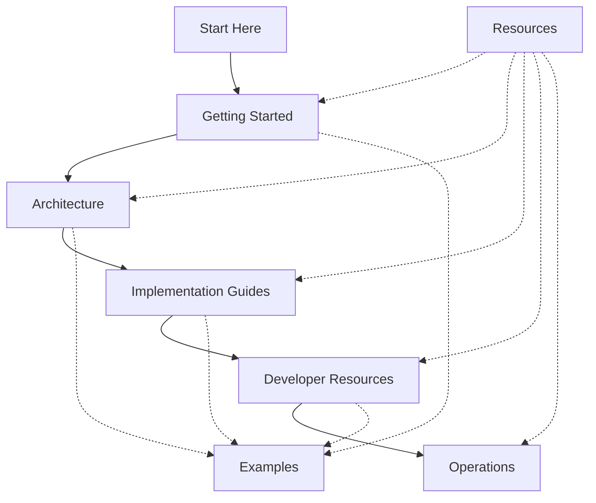

# 🛡️ SAP-GitHub Integration Playbook Documentation

<div align="center">
  
  
  *Comprehensive guide for integrating SAP systems with GitHub*
</div>

## 🔍 Overview

The SAP-GitHub Integration Playbook documentation provides comprehensive guidance for implementing and maintaining integrations between SAP systems and GitHub. This documentation is designed to support technical teams throughout the entire integration lifecycle.

## ⚡ Documentation Structure

```
docs/
├── getting-started/             # Getting started documentation
├── documentation/               # Documentation files
│   ├── architecture/            # Architecture documentation
│   ├── guides/                  # Implementation guides
│   ├── developer/               # Developer documentation
│   ├── implementation/          # Implementation guidance
│   ├── operations/              # Operations documentation
│   ├── reference/               # Reference materials
│   └── appendices/              # Additional resources
├── examples/                    # Example implementations
│   ├── dashboards/              # Example dashboards
│   ├── github-actions/          # GitHub Actions workflows
│   ├── kql-queries/             # KQL queries for Sentinel
│   └── logic-apps/              # Azure Logic Apps templates
└── resources/                   # Additional resources
    ├── markdown-style-guide.md  # Markdown formatting guide
    ├── multilingual-documentation.md # Guide for translations
    └── using-this-template.md   # Template usage guide
```

## ⚡ Documentation Sections

### 🚀 [Getting Started](./getting-started/)

The Getting Started section provides everything you need to begin with SAP-GitHub integration:

- **Quick Start Guides**: Fast implementation guidance 
- **Prerequisites**: Technical and organizational requirements
- **Initial Setup**: First-time configuration steps
- **Business Case Templates**: Materials to build business cases

### 📖 [Documentation](./documentation/)

#### 🏛️ [Architecture](./documentation/architecture/)
Comprehensive system architecture documentation including:
- Integration patterns and approaches
- Security architecture and considerations
- System interaction diagrams
- Data flow models

#### 📝 [Guides](./documentation/guides/) 
Detailed step-by-step implementation instructions:
- SAP system configuration
- GitHub repository setup
- Authentication integration
- Pipeline configuration

#### 👨‍💻 [Developer](./documentation/developer/)
Resources for developers working in the integrated environment:
- Development environment setup
- Workflow guides
- Coding standards
- GitHub Copilot integration for SAP development

#### 🛠️ [Implementation](./documentation/implementation/)
Implementation-specific guidance:
- Migration strategies
- Implementation scenarios
- Rollout planning
- Validation procedures

#### 🔧 [Operations](./documentation/operations/)
Day-to-day maintenance and support documentation:
- Monitoring procedures
- Troubleshooting guides
- Maintenance schedules
- Performance optimization

#### 📚 [Reference](./documentation/reference/)
Technical reference materials:
- API documentation
- Security guidelines
- Configuration specifications
- Integration parameters

#### 📋 [Appendices](./documentation/appendices/)
Supplementary materials:
- Templates
- Checklists
- Glossaries
- Change logs

### 🏗️ [Examples](./examples/)

Ready-to-use implementations to accelerate your integration:

- **Dashboard Configurations**: Monitoring dashboards for integration
- **GitHub Actions Workflows**: Pre-configured CI/CD workflows
- **KQL Queries**: Sentinel queries for security monitoring
- **Logic Apps Templates**: Azure integration templates
- **Transport Automation**: SAP transport automation examples

### 📚 [Resources](./resources/)

Additional resources to support your implementation:

- **Markdown Style Guide**: Documentation formatting standards
- **Multilingual Documentation**: Translation and localization guidance
- **Template Usage**: Guidelines for using provided templates

## 🚀 Using This Documentation

This documentation is designed to support different roles and implementation phases:

1. **Planning Phase**: Start with the [Getting Started](./getting-started/) section and review architecture documents
2. **Implementation Phase**: Follow detailed guides in the [Documentation](./documentation/) section
3. **Development Phase**: Use the developer resources and examples
4. **Operations Phase**: Refer to operations and maintenance documentation

## 📊 Documentation Map




