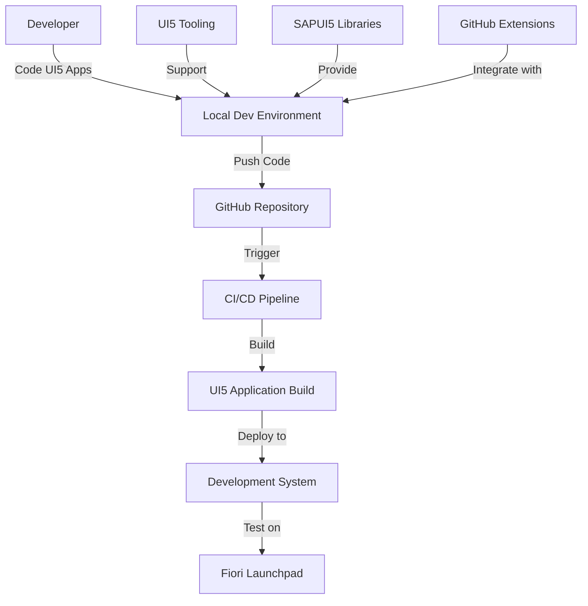
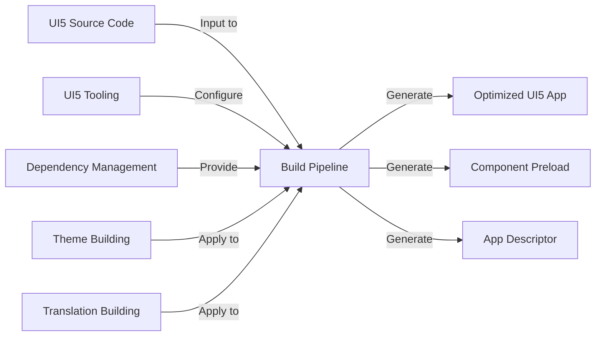
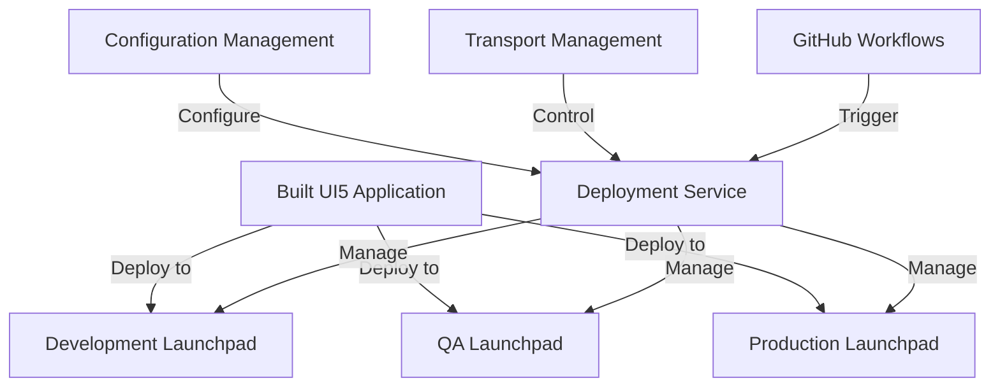
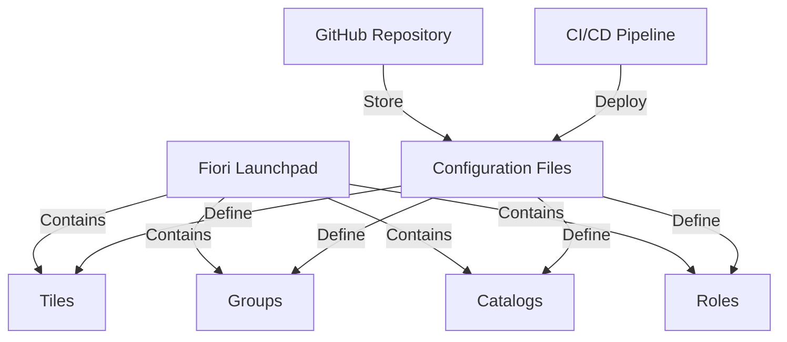
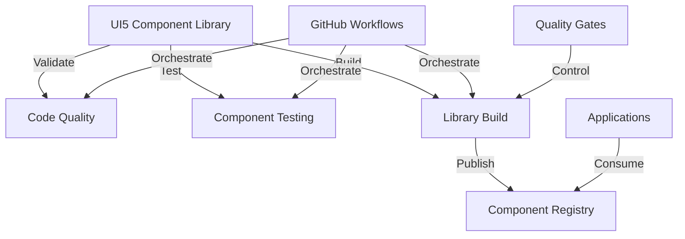

# 📄 SAP Fiori and UI5 Applications Architecture Integration

## 📋 Table of Contents

- [📋 Overview](#overview)
- [Architecture Components](#architecture-components)
- [Fiori/UI5-Specific Integration Requirements](#fiori-ui5-specific-integration-requirements)
- [Integration Architecture Reference Diagram](#integration-architecture-reference-diagram)
- [🔧 Implementation Recommendations](#implementation-recommendations)
- [Related Documentation](#related-documentation)
- [References](#references)


This document outlines the specialized architecture for integrating SAP Fiori and UI5 application development with GitHub Enterprise, addressing the unique requirements of frontend application development in the SAP ecosystem.

## 📋 Overview

SAP Fiori and UI5 applications represent the modern user experience layer for SAP systems. These frontend technologies require specialized development, testing, and deployment approaches that differ from backend SAP development. This document provides comprehensive guidance for establishing efficient development workflows between SAP Fiori/UI5 applications and GitHub.

## Architecture Components

The Fiori/UI5 integration architecture consists of the following key components:

1. **SAP UI5 Development Environment** - Tools and frameworks for UI development
2. **GitHub Enterprise** - Source code repository and collaboration platform
3. **Build Infrastructure** - Build services for UI5 applications
4. **Deployment Services** - Services for deploying to Fiori launchpad and other targets
5. **Frontend Testing Framework** - Specialized UI testing components
6. **Theming and Personalization Services** - Components for managing UI themes and personalization

## Fiori/UI5-Specific Integration Requirements

### Frontend Development Workflows

SAP Fiori/UI5 frontend development requires specialized workflows that integrate with GitHub while supporting efficient UI development.

#### Development Environment Architecture



#### UI5 Development Tools Integration

1. **IDE Integration**
   - VS Code extensions for UI5
   - WebIDE integration
   - SAP Business Application Studio integration

2. **Local Development Environment**
   - UI5 tooling configuration
   - Local proxy for OData services
   - Mock servers for backend services

3. **Code Quality Tools**
   - ESLint configuration for UI5
   - UI5 best practices validation
   - Accessibility testing

4. **Collaboration Features**
   - Pull request templates for UI components
   - UI-specific code review guidelines
   - Screenshot annotations for design feedback

#### UI Development Process

The UI development process integrates with GitHub through these key stages:

1. **Design Phase**
   - Design system implementation in code
   - UI component prototyping
   - Design token management

2. **Development Phase**
   - Component-based development
   - UI5 library creation
   - Frontend-backend contract implementation

3. **Testing Phase**
   - Unit testing with QUnit
   - Integration testing with OPA5
   - Visual regression testing

4. **Review Phase**
   - Component preview in pull requests
   - Visual difference highlighting
   - Accessibility compliance review

#### GitHub Actions for UI5 Development

Example GitHub Actions workflow for UI5 development:

```yaml
name: UI5 Application Development
on:
  push:
    branches: [ main, develop ]
    paths:
      - 'webapp/**'
  pull_request:
    branches: [ main ]
    paths:
      - 'webapp/**'
      
jobs:
  lint:
    runs-on: ubuntu-latest
    steps:
      - name: Checkout code
        uses: actions/checkout@v3
        
      - name: Setup Node.js
        uses: actions/setup-node@v3
        with:
          node-version: '18'
          
      - name: Install dependencies
        run: npm ci
        
      - name: Run ESLint
        run: npm run lint
        
  test:
    runs-on: ubuntu-latest
    needs: lint
    steps:
      - name: Checkout code
        uses: actions/checkout@v3
        
      - name: Setup Node.js
        uses: actions/setup-node@v3
        with:
          node-version: '18'
          
      - name: Install dependencies
        run: npm ci
        
      - name: Run QUnit tests
        run: npm run test
        
      - name: Run Integration tests
        uses: ui5-actions/integration-test@v1
        with:
          test-directory: webapp/test/integration
          
  preview:
    runs-on: ubuntu-latest
    needs: test
    if: github.event_name == 'pull_request'
    steps:
      - name: Generate UI5 app preview
        uses: ui5-actions/preview@v1
        with:
          app-directory: webapp
          
      - name: Post preview to PR
        uses: actions/github-script@v6
        with:
          script: |
            github.rest.issues.createComment({
              issue_number: context.issue.number,
              owner: context.repo.owner,
              repo: context.repo.repo,
              body: `[Preview UI5 Application](${process.env.PREVIEW_URL})`
            })
```

### Build Automation Approaches

Fiori/UI5 applications require specialized build processes to optimize frontend code for deployment.

#### Build Pipeline Architecture



#### Build Components

1. **UI5 Tooling**
   - Task configuration for build process
   - Custom task extensions
   - Build profiles for different environments

2. **Build Optimizations**
   - JavaScript and CSS minification
   - Component preload generation
   - Resource bundling

3. **Dependency Management**
   - NPM/Yarn package management
   - UI5 library dependencies
   - Third-party library integration

4. **Theme Building**
   - Theme compilation
   - Custom theme generation
   - Theme Designer integration

#### Build Configuration

Example UI5 tooling configuration (ui5.yaml):

```yaml
specVersion: '2.6'
metadata:
  name: my-fiori-app
type: application
framework:
  name: SAPUI5
  version: '1.96.0'
  libraries:
    - name: sap.m
    - name: sap.ui.core
    - name: sap.ui.layout
    - name: sap.ui.unified
    - name: themelib_sap_fiori_3
builder:
  customTasks:
    - name: ui5-task-zipper
      afterTask: generateVersionInfo
      configuration:
        archiveName: my-fiori-app
    - name: ui5-task-transpile
      afterTask: replaceVersion
    - name: ui5-task-minify
      afterTask: ui5-task-transpile
resources:
  configuration:
    paths:
      webapp: webapp
```

#### Build Pipeline Integration

The build pipeline integration with GitHub includes:

1. **Automated Builds**
   - Triggered by code changes
   - Build cache optimization
   - Parallel building for speed

2. **Build Configuration Management**
   - Version-controlled build configurations
   - Environment-specific build profiles
   - Build parameter management

3. **Build Artifact Management**
   - Artifact versioning
   - Artifact repository integration
   - Artifact signing for security

4. **Build Reporting**
   - Build status notifications
   - Build performance metrics
   - Build quality reporting

#### GitHub Actions for UI5 Build

Example GitHub Actions workflow for UI5 build:

```yaml
name: UI5 Application Build
on:
  push:
    branches: [ main, develop ]
    paths:
      - 'webapp/**'
      - 'ui5.yaml'
      - 'package.json'
      
jobs:
  build:
    runs-on: ubuntu-latest
    steps:
      - name: Checkout code
        uses: actions/checkout@v3
        
      - name: Setup Node.js
        uses: actions/setup-node@v3
        with:
          node-version: '18'
          cache: 'npm'
          
      - name: Install dependencies
        run: npm ci
        
      - name: Build UI5 application
        run: npm run build
        
      - name: Upload build artifact
        uses: actions/upload-artifact@v3
        with:
          name: ui5-app-build
          path: dist/
          
  analyze-build:
    needs: build
    runs-on: ubuntu-latest
    steps:
      - name: Download build artifact
        uses: actions/download-artifact@v3
        with:
          name: ui5-app-build
          path: dist/
          
      - name: Analyze bundle sizes
        uses: ui5-actions/bundle-analyzer@v1
        with:
          build-directory: dist/
          
      - name: Generate build report
        run: |
          echo "# Build Report" > build-report.md
          echo "Bundle size: $(du -sh dist/ | cut -f1)" >> build-report.md
          
      - name: Upload build report
        uses: actions/upload-artifact@v3
        with:
          name: build-report
          path: build-report.md
```

### Deployment Orchestration

Fiori/UI5 applications require specialized deployment processes to target SAP Fiori launchpad and other runtime environments.

#### Deployment Architecture



#### Deployment Targets

Fiori/UI5 applications can be deployed to various targets:

| Deployment Target | Description | Deployment Method |
|-------------------|-------------|-------------------|
| Fiori Launchpad | Standard SAP Fiori Launchpad | BSP application, SAPUI5 repository |
| SAP Cloud Platform | Cloud-based Fiori Launchpad | MTA archive, HTML5 application repository |
| Standalone Application | Self-contained UI5 application | Web server, CDN |
| Mobile Device | Mobile-optimized UI5 apps | Hybrid container, native wrapper |
| Embedded UI | UI embedded in other applications | Custom integration |

#### Deployment Strategies

1. **Blue-Green Deployment**
   - Parallel environments for zero-downtime updates
   - Live traffic switching between versions
   - Automated rollback on failure

2. **Phased Rollout**
   - Controlled deployment to user segments
   - Gradual expansion of user base
   - Monitoring and rollback capabilities

3. **Feature Toggles**
   - Conditional feature activation
   - A/B testing of UI components
   - Remote configuration of UI features

4. **Environment-Specific Deployment**
   - Configuration adjustment per environment
   - Environment-specific optimizations
   - Conditional feature activation

#### GitHub Actions for UI5 Deployment

Example GitHub Actions workflow for UI5 deployment:

```yaml
name: UI5 Application Deployment
on:
  push:
    branches: [ main ]
    paths:
      - 'webapp/**'
      - 'ui5.yaml'
      
jobs:
  build:
    runs-on: ubuntu-latest
    steps:
      - name: Build UI5 application
        # Build steps here...
        
  deploy-dev:
    needs: build
    runs-on: ubuntu-latest
    steps:
      - name: Download build artifact
        uses: actions/download-artifact@v3
        with:
          name: ui5-app-build
          path: dist/
          
      - name: Deploy to Development Launchpad
        uses: sap-actions/deploy-to-fiori-launchpad@v1
        with:
          system-url: ${{ secrets.DEV_SYSTEM_URL }}
          client: '100'
          username: ${{ secrets.DEV_USERNAME }}
          password: ${{ secrets.DEV_PASSWORD }}
          transport-request: ${{ env.TRANSPORT_REQUEST }}
          bsp-application: Z_MY_FIORI_APP
          bsp-description: 'My Fiori Application'
          
  deploy-qa:
    needs: deploy-dev
    runs-on: ubuntu-latest
    steps:
      - name: Deploy to QA Launchpad
        uses: sap-actions/release-transport@v1
        with:
          system: QA
          transport: ${{ env.TRANSPORT_REQUEST }}
          
  deploy-prod:
    needs: deploy-qa
    if: github.event.ref == 'refs/heads/main'
    runs-on: ubuntu-latest
    environment: production
    steps:
      - name: Deploy to Production Launchpad
        uses: sap-actions/release-transport@v1
        with:
          system: PRD
          transport: ${{ env.TRANSPORT_REQUEST }}
```

### Launchpad Configuration Management

SAP Fiori launchpad configuration requires specialized management approaches for integration with GitHub.

#### Launchpad Components



#### Configuration Components

1. **Launchpad Designer Export/Import**
   - Export of launchpad configurations
   - Version control of configuration files
   - Automated import to target systems

2. **Tile Configuration**
   - Tile definition management
   - Dynamic tile configuration
   - Tile visibility control

3. **Group Management**
   - User group definitions
   - Role-based group assignments
   - Default group configuration

4. **Catalog Configuration**
   - Catalog content management
   - Catalog assignment to roles
   - Technical catalog settings

#### Configuration as Code

Example launchpad configuration file:

```json
{
  "catalogs": [
    {
      "id": "Z_MY_CATALOG",
      "title": "My Applications",
      "tiles": [
        {
          "id": "Z_MY_APP_TILE",
          "title": "My Fiori App",
          "subtitle": "Application subtitle",
          "icon": "sap-icon://task",
          "targetURL": "#Z-My-App",
          "navigationMode": "embedded"
        },
        {
          "id": "Z_ANALYTICS_TILE",
          "title": "Analytics Dashboard",
          "subtitle": "Business analytics",
          "icon": "sap-icon://business-objects-experience",
          "targetURL": "#Z-Analytics"
        }
      ]
    }
  ],
  "groups": [
    {
      "id": "Z_MY_GROUP",
      "title": "Main Applications",
      "tiles": ["Z_MY_APP_TILE", "Z_ANALYTICS_TILE"]
    }
  ],
  "roles": [
    {
      "id": "Z_USER_ROLE",
      "catalogs": ["Z_MY_CATALOG"],
      "groups": ["Z_MY_GROUP"]
    }
  ]
}
```

#### Configuration Management Workflow

The launchpad configuration management workflow includes:

1. **Configuration Development**
   - Creation and editing of configuration files
   - Local validation of configurations
   - Testing in development environment

2. **Configuration Versioning**
   - Storage of configurations in GitHub
   - Change tracking and history
   - Branch-based configuration variants

3. **Configuration Deployment**
   - Automated deployment to target systems
   - Configuration validation before deployment
   - Rollback capabilities

4. **Configuration Governance**
   - Role-based access to configurations
   - Approval workflow for configuration changes
   - Audit trail of configuration changes

#### GitHub Actions for Launchpad Configuration

Example GitHub Actions workflow for launchpad configuration:

```yaml
name: Fiori Launchpad Configuration
on:
  push:
    branches: [ main ]
    paths:
      - 'launchpad/**/*.json'
      
jobs:
  validate:
    runs-on: ubuntu-latest
    steps:
      - name: Checkout code
        uses: actions/checkout@v3
        
      - name: Validate launchpad configuration
        uses: sap-actions/validate-launchpad-config@v1
        with:
          config-path: ./launchpad/config.json
          
  deploy-config:
    needs: validate
    runs-on: ubuntu-latest
    steps:
      - name: Deploy to Development Launchpad
        uses: sap-actions/deploy-launchpad-config@v1
        with:
          system-url: ${{ secrets.DEV_SYSTEM_URL }}
          client: '100'
          username: ${{ secrets.DEV_USERNAME }}
          password: ${{ secrets.DEV_PASSWORD }}
          config-path: ./launchpad/config.json
          transport-request: ${{ env.TRANSPORT_REQUEST }}
```

### CI/CD Patterns for UI Components

Fiori/UI5 applications benefit from specialized CI/CD patterns optimized for UI component development.

#### CI/CD Pipeline Architecture



#### CI/CD Components

1. **Component Library Management**
   - Versioning of UI components
   - Documentation generation
   - Component showcase

2. **Automated Testing**
   - Unit testing of components
   - Visual regression testing
   - Interaction testing

3. **Quality Gates**
   - Code quality thresholds
   - Test coverage requirements
   - Performance benchmarks

4. **Continuous Deployment**
   - Automated publishing of component libraries
   - Semantic versioning enforcement
   - Change tracking

#### Component Development Workflow

The UI component development workflow includes:

1. **Component Creation**
   - Component scaffolding
   - Development documentation
   - Local testing

2. **Component Testing**
   - Unit testing with QUnit
   - Visual testing with screenshots
   - Integration testing with OPA5

3. **Component Documentation**
   - Automated documentation generation
   - Interactive component examples
   - Usage guidelines

4. **Component Publishing**
   - Versioned component packages
   - Change logging
   - Dependency management

#### GitHub Actions for Component CI/CD

Example GitHub Actions workflow for UI5 component CI/CD:

```yaml
name: UI5 Component Library CI/CD
on:
  push:
    branches: [ main, develop ]
    paths:
      - 'src/components/**'
      
jobs:
  test:
    runs-on: ubuntu-latest
    steps:
      - name: Checkout code
        uses: actions/checkout@v3
        
      - name: Setup Node.js
        uses: actions/setup-node@v3
        with:
          node-version: '18'
          
      - name: Install dependencies
        run: npm ci
        
      - name: Run component tests
        run: npm run test:components
        
      - name: Run visual regression tests
        uses: ui5-actions/visual-regression@v1
        with:
          component-directory: src/components
          
  build-library:
    needs: test
    runs-on: ubuntu-latest
    steps:
      - name: Build component library
        run: npm run build:library
        
      - name: Generate documentation
        run: npm run generate:docs
        
      - name: Upload library artifacts
        uses: actions/upload-artifact@v3
        with:
          name: ui5-component-library
          path: dist/
          
  publish:
    needs: build-library
    if: github.ref == 'refs/heads/main'
    runs-on: ubuntu-latest
    steps:
      - name: Download library artifacts
        uses: actions/download-artifact@v3
        with:
          name: ui5-component-library
          path: dist/
          
      - name: Setup Node.js with NPM registry access
        uses: actions/setup-node@v3
        with:
          node-version: '18'
          registry-url: 'https://registry.npmjs.org'
          
      - name: Publish component library
        run: npm publish
        env:
          NODE_AUTH_TOKEN: ${{ secrets.NPM_TOKEN }}
```

## Integration Architecture Reference Diagram

The following diagram illustrates the high-level integration architecture for SAP Fiori/UI5 applications:

```
[Fiori/UI5 Integration Architecture Diagram to be inserted here]
```

## 🔧 Implementation Recommendations

Based on real-world implementations, the following recommendations apply to Fiori/UI5-specific GitHub integration:

1. **Component-Based Development**
   - Organize code into reusable components
   - Implement consistent component interfaces
   - Create a component library for reuse

2. **Automated UI Testing**
   - Implement comprehensive unit tests for UI components
   - Add visual regression testing
   - Include end-to-end testing for critical paths

3. **Optimized Build Pipeline**
   - Configure advanced UI5 build optimizations
   - Implement efficient caching strategies
   - Create environment-specific builds

4. **Central Launchpad Management**
   - Maintain launchpad configurations as code
   - Implement structured testing for launchpad changes
   - Use role-based deployment strategies

## Related Documentation

- [SAP Components Overview](./sap-components.md)
- [Integration Architecture](./integration-architecture.md)
- [System Architecture](./system-architecture.md)

## References

1. SAP. (2025). "SAPUI5 SDK - Demo Kit." SAP Help Portal.
2. Fiori Design Guidelines. (2025). "SAP Fiori Design Guidelines."
3. OpenUI5 Documentation. (2025). "UI5 Tooling."
4. SAP Blogs. (2025). "Best Practices for Fiori Application Development."
5. SAPUI5 Documentation. (2025). "Deployment Options for SAPUI5 Applications."
---


