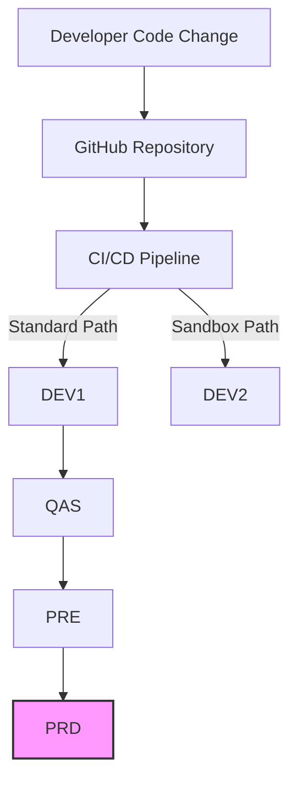

# Implementing Multi-System Deployments

## Overview

This tutorial guides you through implementing and managing deployments across multiple SAP systems using the SAP-GitHub integration. You'll learn how to configure, coordinate, and automate the deployment process for complex system landscapes with multiple development, quality assurance, and production environments.

## Prerequisites

Before starting this tutorial, ensure you have:

- Basic SAP-GitHub integration already implemented and working
- Multiple SAP systems (at least DEV, QAS, and PRD) set up
- GitHub Enterprise with proper access and permissions
- abapGit installed and configured on all systems
- API Management set up for secure communication

## Multi-System Deployment Challenges

Managing deployments across multiple SAP systems introduces several challenges:

- **Synchronization**: Ensuring consistent code across systems
- **Sequencing**: Coordinating the correct order of deployments
- **Environment Differences**: Handling system-specific configurations
- **Validation**: Verifying successful deployments at each stage
- **Rollback**: Implementing safe rollback procedures if issues arise

## Step-by-Step Implementation

### 1. Define Your System Landscape

First, document your complete system landscape:

1. Create a systems configuration file in your repository:

```yaml
# .github/sap-systems.yml
systems:
  - id: DEV1
    name: "Development System 1"
    environment: "development"
    sap_system_id: "D01"
    client: "100"
    host: "sapdev1.example.com"
    port: 443
    role: "primary-development"
    
  - id: DEV2
    name: "Development System 2"
    environment: "development"
    sap_system_id: "D02" 
    client: "100"
    host: "sapdev2.example.com"
    port: 443
    role: "sandbox"
    
  - id: QAS
    name: "Quality Assurance"
    environment: "testing"
    sap_system_id: "Q01"
    client: "100"
    host: "sapqas.example.com"
    port: 443
    role: "testing"
    requires_approval: true
    
  - id: PRE
    name: "Pre-Production"
    environment: "pre-production"
    sap_system_id: "P01"
    client: "100"
    host: "sappre.example.com"
    port: 443
    role: "staging"
    requires_approval: true
    
  - id: PRD
    name: "Production"
    environment: "production"
    sap_system_id: "P02"
    client: "100"
    host: "sapprd.example.com"
    port: 443
    role: "production"
    requires_approval: true
    requires_manager_approval: true

deployment_paths:
  - name: "Standard Path"
    sequence:
      - system_id: DEV1
        auto_deploy: true
      - system_id: QAS
        auto_deploy: true
        requires_tests: true
      - system_id: PRE
        auto_deploy: false
      - system_id: PRD
        auto_deploy: false
        
  - name: "Sandbox Path"
    sequence:
      - system_id: DEV2
        auto_deploy: true
```

2. Visualize the deployment paths to ensure clarity:



### 2. Create Environment-Specific Configurations

Set up system-specific configuration handling:

1. Create a directory structure for environment configurations:

```
/config
  /global
    default.yml
  /development
    DEV1.yml
    DEV2.yml
  /testing
    QAS.yml
  /pre-production
    PRE.yml
  /production
    PRD.yml
```

2. Define global default configuration:

```yaml
# /config/global/default.yml
# Global defaults applied to all systems
abapgit:
  transport_layer: ZGIT
  package_prefix: Z
  
api:
  timeout_seconds: 300
  retry_attempts: 3
  
logging:
  level: info
```

3. Create environment-specific configurations:

```yaml
# /config/development/DEV1.yml
# Development-specific overrides
abapgit:
  transport_layer: ZDEV
  
logging:
  level: debug
  retention_days: 7
```

```yaml
# /config/production/PRD.yml
# Production-specific overrides
abapgit:
  transport_layer: ZPRD
  transport_approval_required: true
  
api:
  timeout_seconds: 600
  retry_attempts: 5
  
logging:
  level: warning
  retention_days: 30
```

### 3. Implement Multi-System Deployment Workflow

Create a GitHub Actions workflow for multi-system deployment:

```yaml
# .github/workflows/multi-system-deploy.yml
name: Multi-System SAP Deployment

on:
  push:
    branches: [main]
  pull_request:
    types: [closed]
    branches: [main]
  workflow_dispatch:
    inputs:
      target_system:
        description: 'Target SAP System'
        required: true
        default: 'QAS'
      deployment_path:
        description: 'Deployment Path'
        required: true
        default: 'Standard Path'

env:
  CONFIG_PATH: './config'

jobs:
  prepare_deployment:
    runs-on: ubuntu-latest
    outputs:
      deployment_matrix: ${{ steps.set-matrix.outputs.deployment_matrix }}
      config: ${{ steps.load-config.outputs.config }}
    steps:
      - uses: actions/checkout@v3
      
      - name: Load System Configuration
        id: load-config
        run: |
          SYSTEMS_CONFIG=$(cat .github/sap-systems.yml | yq -o=json)
          echo "::set-output name=config::${SYSTEMS_CONFIG}"
      
      - name: Determine Deployment Targets
        id: set-matrix
        run: |
          # Determine target systems based on trigger or input
          TARGET_SYSTEM="${{ github.event.inputs.target_system }}"
          PATH_NAME="${{ github.event.inputs.deployment_path }}"
          
          if [ -z "$TARGET_SYSTEM" ]; then
            if [ "${{ github.event_name }}" == "push" ]; then
              # Default for direct push to main: Deploy to DEV1
              TARGET_SYSTEM="DEV1"
              PATH_NAME="Standard Path"
            elif [ "${{ github.event_name }}" == "pull_request" ] && [ "${{ github.event.pull_request.merged }}" == "true" ]; then
              # Default for merged PR: Deploy to QAS
              TARGET_SYSTEM="QAS"
              PATH_NAME="Standard Path"
            fi
          fi
          
          # Build deployment matrix
          python .github/scripts/build_deployment_matrix.py \
            --config .github/sap-systems.yml \
            --target "$TARGET_SYSTEM" \
            --path "$PATH_NAME" \
            --output deployment_matrix.json
            
          MATRIX=$(cat deployment_matrix.json)
          echo "::set-output name=deployment_matrix::${MATRIX}"
  
  deploy:
    needs: prepare_deployment
    runs-on: ubuntu-latest
    strategy:
      matrix: ${{ fromJson(needs.prepare_deployment.outputs.deployment_matrix) }}
      fail-fast: false
    environment: ${{ matrix.environment }}
    steps:
      - uses: actions/checkout@v3
      
      - name: Merge Configuration
        run: |
          # Merge global and environment-specific configs
          mkdir -p ./merged_config
          
          # Start with default
          cp $CONFIG_PATH/global/default.yml ./merged_config/config.yml
          
          # Apply environment overrides
          if [ -f "$CONFIG_PATH/${{ matrix.environment }}/${{ matrix.system }}.yml" ]; then
            python .github/scripts/merge_yaml.py \
              --base ./merged_config/config.yml \
              --override "$CONFIG_PATH/${{ matrix.environment }}/${{ matrix.system }}.yml" \
              --output ./merged_config/config.yml
          fi
          
          cat ./merged_config/config.yml
      
      - name: Deploy to SAP System
        uses: sap-actions/abapgit-deploy@v1
        with:
          sap-url: ${{ matrix.host }}
          sap-client: ${{ matrix.client }}
          sap-username: ${{ secrets[format('SAP_{0}_USERNAME', matrix.system)] }}
          sap-password: ${{ secrets[format('SAP_{0}_PASSWORD', matrix.system)] }}
          repository-url: ${{ github.repository }}
          github-token: ${{ secrets.GITHUB_TOKEN }}
          config-file: ./merged_config/config.yml
      
      - name: Run Tests
        if: ${{ matrix.requires_tests == true }}
        uses: sap-actions/abap-unit-tests@v1
        with:
          sap-url: ${{ matrix.host }}
          sap-client: ${{ matrix.client }}
          sap-username: ${{ secrets[format('SAP_{0}_USERNAME', matrix.system)] }}
          sap-password: ${{ secrets[format('SAP_{0}_PASSWORD', matrix.system)] }}
          test-package: ${{ env.SAP_PACKAGE }}
          
      - name: Post Deployment Validation
        run: |
          python .github/scripts/validate_deployment.py \
            --system ${{ matrix.system }} \
            --host ${{ matrix.host }} \
            --client ${{ matrix.client }} \
            --username ${{ secrets[format('SAP_{0}_USERNAME', matrix.system)] }} \
            --password ${{ secrets[format('SAP_{0}_PASSWORD', matrix.system)] }}
            
      - name: Create Deployment Record
        uses: chrnorm/deployment-action@v2
        with:
          token: ${{ secrets.GITHUB_TOKEN }}
          environment: ${{ matrix.environment }}
          description: "Deployment to ${{ matrix.system }}"
          
  notify:
    needs: [prepare_deployment, deploy]
    runs-on: ubuntu-latest
    if: always()
    steps:
      - name: Deployment Status Notification
        uses: actions/github-script@v6
        with:
          script: |
            const deployments = ${{ toJSON(needs.deploy.result) }};
            const config = ${{ needs.prepare_deployment.outputs.config }};
            
            let message = "## Deployment Status\n\n";
            message += "| System | Status | Details |\n";
            message += "|--------|--------|--------|\n";
            
            // Parse and format deployment results
            for (const system in deployments) {
              const status = deployments[system] === 'success' ? '✅ Success' : '❌ Failed';
              message += `| ${system} | ${status} | [Details](${context.serverUrl}/${context.repo.owner}/${context.repo.repo}/actions/runs/${context.runId}) |\n`;
            }
            
            // Create or update comment on PR
            if (context.eventName === 'pull_request') {
              const issue_number = context.issue.number;
              
              // Find existing comment to update
              const comments = await github.rest.issues.listComments({
                owner: context.repo.owner,
                repo: context.repo.repo,
                issue_number
              });
              
              const deploymentComment = comments.data.find(comment => 
                comment.body.includes('## Deployment Status')
              );
              
              if (deploymentComment) {
                await github.rest.issues.updateComment({
                  owner: context.repo.owner,
                  repo: context.repo.repo,
                  comment_id: deploymentComment.id,
                  body: message
                });
              } else {
                await github.rest.issues.createComment({
                  owner: context.repo.owner,
                  repo: context.repo.repo,
                  issue_number,
                  body: message
                });
              }
            }
```

### 4. Create Supporting Python Scripts

Create the necessary Python scripts for the workflow:

**build_deployment_matrix.py**:
```python
#!/usr/bin/env python3
import yaml
import json
import argparse
import sys

def build_deployment_matrix(config_file, target_system, path_name):
    # Load systems configuration
    with open(config_file, 'r') as file:
        config = yaml.safe_load(file)
    
    systems = config.get('systems', [])
    paths = config.get('deployment_paths', [])
    
    # Find the requested deployment path
    selected_path = None
    for path in paths:
        if path.get('name') == path_name:
            selected_path = path
            break
    
    if not selected_path:
        print(f"Error: Deployment path '{path_name}' not found", file=sys.stderr)
        sys.exit(1)
    
    # Build the list of systems to deploy to
    deploy_systems = []
    found_target = False
    
    for step in selected_path.get('sequence', []):
        system_id = step.get('system_id')
        
        # Find the system details
        system_details = None
        for system in systems:
            if system.get('id') == system_id:
                system_details = system
                break
        
        if not system_details:
            print(f"Error: System '{system_id}' not found", file=sys.stderr)
            continue
        
        # Include the system if it's the target or we haven't reached the target yet
        if system_id == target_system:
            found_target = True
        
        if system_id == target_system or not found_target:
            deploy_info = {
                'system': system_id,
                'environment': system_details.get('environment', 'development'),
                'host': system_details.get('host', ''),
                'client': system_details.get('client', '100'),
                'requires_tests': step.get('requires_tests', False),
                'auto_deploy': step.get('auto_deploy', False),
                'requires_approval': system_details.get('requires_approval', False)
            }
            deploy_systems.append(deploy_info)
    
    # Create matrix output
    matrix = {'include': deploy_systems}
    return matrix

if __name__ == "__main__":
    parser = argparse.ArgumentParser(description='Build deployment matrix')
    parser.add_argument('--config', required=True, help='Path to systems configuration YAML')
    parser.add_argument('--target', required=True, help='Target system ID')
    parser.add_argument('--path', required=True, help='Deployment path name')
    parser.add_argument('--output', required=True, help='Output JSON file for matrix')
    args = parser.parse_args()
    
    matrix = build_deployment_matrix(args.config, args.target, args.path)
    
    with open(args.output, 'w') as file:
        json.dump(matrix, file)
    
    print(f"Deployment matrix written to {args.output}")
```

**merge_yaml.py**:
```python
#!/usr/bin/env python3
import yaml
import argparse
import sys
from deepmerge import always_merger

def merge_yaml_files(base_file, override_file, output_file):
    # Load the YAML files
    with open(base_file, 'r') as file:
        base_config = yaml.safe_load(file)
    
    with open(override_file, 'r') as file:
        override_config = yaml.safe_load(file)
    
    # Merge the configurations
    merged_config = always_merger.merge(base_config, override_config)
    
    # Write the merged configuration
    with open(output_file, 'w') as file:
        yaml.dump(merged_config, file, default_flow_style=False)

if __name__ == "__main__":
    parser = argparse.ArgumentParser(description='Merge YAML configuration files')
    parser.add_argument('--base', required=True, help='Base configuration file')
    parser.add_argument('--override', required=True, help='Override configuration file')
    parser.add_argument('--output', required=True, help='Output merged configuration file')
    args = parser.parse_args()
    
    merge_yaml_files(args.base, args.override, args.output)
```

**validate_deployment.py**:
```python
#!/usr/bin/env python3
import argparse
import sys
import requests
import json
import base64
import time

def validate_deployment(system, host, client, username, password):
    print(f"Validating deployment to {system}...")
    
    # Create basic auth header
    auth_str = f"{username}:{password}"
    auth_bytes = auth_str.encode('ascii')
    base64_bytes = base64.b64encode(auth_bytes)
    base64_auth = base64_bytes.decode('ascii')
    
    headers = {
        'Authorization': f'Basic {base64_auth}',
        'Content-Type': 'application/json',
        'Accept': 'application/json'
    }
    
    # API endpoint for SAP
    api_url = f"https://{host}/sap/bc/http/sap/zabapgit_status"
    
    # Parameters for the API call
    params = {
        'sap-client': client
    }
    
    try:
        # Make the API call
        response = requests.get(api_url, headers=headers, params=params, timeout=30)
        
        if response.status_code != 200:
            print(f"Error: API returned status code {response.status_code}", file=sys.stderr)
            print(f"Response: {response.text}", file=sys.stderr)
            sys.exit(1)
        
        # Parse the response
        status_data = response.json()
        
        # Check the activation status
        if status_data.get('activation_errors', 0) > 0:
            print(f"Error: {status_data.get('activation_errors', 0)} activation errors found", file=sys.stderr)
            for error in status_data.get('errors', []):
                print(f"  - {error.get('message')}", file=sys.stderr)
            sys.exit(1)
        
        # Check the syntax check status
        if status_data.get('syntax_errors', 0) > 0:
            print(f"Error: {status_data.get('syntax_errors', 0)} syntax errors found", file=sys.stderr)
            for error in status_data.get('errors', []):
                print(f"  - {error.get('message')}", file=sys.stderr)
            sys.exit(1)
            
        print(f"Deployment validation successful for {system}")
        print(f"  - Objects processed: {status_data.get('objects_processed', 0)}")
        print(f"  - Objects activated: {status_data.get('objects_activated', 0)}")
        
        return True
        
    except Exception as e:
        print(f"Error validating deployment: {str(e)}", file=sys.stderr)
        sys.exit(1)

if __name__ == "__main__":
    parser = argparse.ArgumentParser(description='Validate SAP deployment')
    parser.add_argument('--system', required=True, help='SAP system ID')
    parser.add_argument('--host', required=True, help='SAP host')
    parser.add_argument('--client', required=True, help='SAP client')
    parser.add_argument('--username', required=True, help='SAP username')
    parser.add_argument('--password', required=True, help='SAP password')
    args = parser.parse_args()
    
    validate_deployment(args.system, args.host, args.client, args.username, args.password)
```

### 5. Set Up Deployment Approvals

Configure approval workflows for sensitive environments:

1. Configure environment protection rules in GitHub:
   - Go to your repository on GitHub
   - Navigate to Settings > Environments
   - Create environments for each system (development, testing, pre-production, production)
   - For QAS, PRE, and PRD environments, enable:
     - Required reviewers (add appropriate team members)
     - Wait timer (e.g., 10 minutes)
     - Deployment branches (restrict to main branch)

2. Create a deployment approval notification workflow:

```yaml
# .github/workflows/deployment-approval.yml
name: Deployment Approval Notification

on:
  workflow_run:
    workflows: ["Multi-System SAP Deployment"]
    types: [requested]

jobs:
  notify:
    runs-on: ubuntu-latest
    steps:
      - name: Check for pending approvals
        uses: actions/github-script@v6
        with:
          script: |
            // Get the source workflow run
            const run = await github.rest.actions.getWorkflowRun({
              owner: context.repo.owner,
              repo: context.repo.repo,
              run_id: context.payload.workflow_run.id
            });
            
            // Get pending deployment reviews
            const deployments = await github.rest.repos.listDeployments({
              owner: context.repo.owner,
              repo: context.repo.repo,
              sha: run.data.head_sha
            });
            
            // Check for pending reviews
            for (const deployment of deployments.data) {
              if (deployment.environment === 'pre-production' || deployment.environment === 'production') {
                // Send notification (examples: Slack, Teams, Email)
                console.log(`Deployment to ${deployment.environment} requires approval`);
                
                // Example: Send a Slack notification
                const slackMsg = {
                  text: `🚨 *Deployment Approval Required*\n
                  Environment: *${deployment.environment}*\n
                  Repository: ${context.repo.owner}/${context.repo.repo}\n
                  Branch: ${run.data.head_branch}\n
                  Commit: ${run.data.head_commit.message}\n
                  Author: ${run.data.head_commit.author.name}\n
                  <${context.serverUrl}/${context.repo.owner}/${context.repo.repo}/actions/runs/${context.payload.workflow_run.id}|View Workflow Run>`
                };
                
                // Note: You would need to set up a Slack webhook secret
                // and uncomment the below code to actually send the notification
                /*
                await fetch(process.env.SLACK_WEBHOOK_URL, {
                  method: 'POST',
                  headers: { 'Content-Type': 'application/json' },
                  body: JSON.stringify(slackMsg)
                });
                */
              }
            }
```

### 6. Implement System-Specific Transformations

For system-specific code modifications:

1. Create a configuration for system-specific code adjustments:

```yaml
# /config/transformations.yml
transformations:
  # Development-specific adjustments
  development:
    global:
      - type: replace
        file_pattern: "*.abap"
        search: "CALL FUNCTION 'Z_LOGGER'"
        replace: "CALL FUNCTION 'Z_LOGGER_DEV'"
    
    DEV2:
      - type: replace
        file_pattern: "z*.prog.abap"
        search: "p_client = '100'"
        replace: "p_client = '200'"
  
  # Test-specific adjustments
  testing:
    global:
      - type: replace
        file_pattern: "zconf*.tabl.abap"
        search: "VALUE='DEVELOPMENT'"
        replace: "VALUE='TESTING'"
  
  # Production-specific adjustments
  production:
    global:
      - type: replace
        file_pattern: "*.abap"
        search: "gv_debug_mode = abap_true"
        replace: "gv_debug_mode = abap_false"
      - type: replace
        file_pattern: "zlog*.clas.abap"
        search: "SEVERITY = 'DEBUG'"
        replace: "SEVERITY = 'INFO'"
```

2. Create a script to apply the transformations:

```python
#!/usr/bin/env python3
# .github/scripts/apply_transformations.py
import yaml
import os
import re
import glob
import argparse

def apply_transformations(transformations_file, environment, system, source_dir):
    # Load transformations
    with open(transformations_file, 'r') as file:
        config = yaml.safe_load(file)
    
    transformations = config.get('transformations', {})
    
    # Get environment-specific transformations
    env_transforms = transformations.get(environment, {})
    
    # Apply global transformations for this environment
    global_transforms = env_transforms.get('global', [])
    apply_transform_set(global_transforms, source_dir)
    
    # Apply system-specific transformations
    system_transforms = env_transforms.get(system, [])
    apply_transform_set(system_transforms, source_dir)
    
    print(f"Applied transformations for {environment}/{system}")

def apply_transform_set(transforms, source_dir):
    for transform in transforms:
        transform_type = transform.get('type')
        
        if transform_type == 'replace':
            file_pattern = transform.get('file_pattern')
            search = transform.get('search')
            replace = transform.get('replace')
            
            # Find files matching the pattern
            files = glob.glob(os.path.join(source_dir, '**', file_pattern), recursive=True)
            
            for file_path in files:
                with open(file_path, 'r') as file:
                    content = file.read()
                
                # Apply the replacement
                modified_content = content.replace(search, replace)
                
                # Write the file back if changed
                if content != modified_content:
                    with open(file_path, 'w') as file:
                        file.write(modified_content)
                    print(f"Applied transformation to {file_path}")

if __name__ == "__main__":
    parser = argparse.ArgumentParser(description='Apply system-specific transformations')
    parser.add_argument('--config', required=True, help='Transformations configuration file')
    parser.add_argument('--environment', required=True, help='Target environment')
    parser.add_argument('--system', required=True, help='Target system')
    parser.add_argument('--source', required=True, help='Source directory')
    args = parser.parse_args()
    
    apply_transformations(args.config, args.environment, args.system, args.source)
```

3. Update your deployment workflow to include transformations:

```yaml
# Add this step before the deploy step in your workflow
- name: Apply System-Specific Transformations
  run: |
    python .github/scripts/apply_transformations.py \
      --config ./config/transformations.yml \
      --environment ${{ matrix.environment }} \
      --system ${{ matrix.system }} \
      --source ./src
```

### 7. Implement Rollback Capability

Add rollback functionality to your workflow:

1. Create a rollback workflow file:

```yaml
# .github/workflows/rollback.yml
name: Rollback Deployment

on:
  workflow_dispatch:
    inputs:
      system:
        description: 'SAP System to rollback'
        required: true
      version:
        description: 'Version to rollback to (commit SHA)'
        required: true

jobs:
  rollback:
    runs-on: ubuntu-latest
    steps:
      - uses: actions/checkout@v3
        with:
          ref: ${{ github.event.inputs.version }}
      
      - name: Load System Configuration
        id: load-config
        run: |
          # Load system info from config
          SYSTEM="${{ github.event.inputs.system }}"
          SYSTEMS_CONFIG=$(cat .github/sap-systems.yml | yq -o=json)
          
          # Extract system details
          python -c "
import json, sys
config = json.loads('$SYSTEMS_CONFIG')
system = next((s for s in config.get('systems', []) if s.get('id') == '$SYSTEM'), None)
if system:
    print(f\"::set-output name=host::{system.get('host', '')}\")
    print(f\"::set-output name=client::{system.get('client', '')}\")
    print(f\"::set-output name=environment::{system.get('environment', '')}\")
else:
    print(f\"Error: System '$SYSTEM' not found\", file=sys.stderr)
    sys.exit(1)
          "
      
      - name: Execute Rollback
        uses: sap-actions/abapgit-deploy@v1
        with:
          sap-url: ${{ steps.load-config.outputs.host }}
          sap-client: ${{ steps.load-config.outputs.client }}
          sap-username: ${{ secrets[format('SAP_{0}_USERNAME', github.event.inputs.system)] }}
          sap-password: ${{ secrets[format('SAP_{0}_PASSWORD', github.event.inputs.system)] }}
          repository-url: ${{ github.repository }}
          github-token: ${{ secrets.GITHUB_TOKEN }}
          commit-id: ${{ github.event.inputs.version }}
          rollback: true
      
      - name: Validate Rollback
        run: |
          python .github/scripts/validate_deployment.py \
            --system ${{ github.event.inputs.system }} \
            --host ${{ steps.load-config.outputs.host }} \
            --client ${{ steps.load-config.outputs.client }} \
            --username ${{ secrets[format('SAP_{0}_USERNAME', github.event.inputs.system)] }} \
            --password ${{ secrets[format('SAP_{0}_PASSWORD', github.event.inputs.system)] }}
      
      - name: Create Rollback Record
        uses: chrnorm/deployment-action@v2
        with:
          token: ${{ secrets.GITHUB_TOKEN }}
          environment: ${{ steps.load-config.outputs.environment }}
          description: "Rollback of ${{ github.event.inputs.system }} to ${{ github.event.inputs.version }}"
```

2. Create a deployment history tracking workflow:

```yaml
# .github/workflows/deployment-history.yml
name: Track Deployment History

on:
  workflow_run:
    workflows: ["Multi-System SAP Deployment"]
    types: [completed]

jobs:
  track-history:
    runs-on: ubuntu-latest
    steps:
      - uses: actions/checkout@v3
      
      - name: Update Deployment History
        uses: actions/github-script@v6
        with:
          script: |
            // Get the source workflow run
            const run = await github.rest.actions.getWorkflowRun({
              owner: context.repo.owner,
              repo: context.repo.repo,
              run_id: context.payload.workflow_run.id
            });
            
            // Create or update deployment history
            const historyFile = '.github/deployment_history.json';
            let history = {};
            
            try {
              // Try to get existing file
              const content = await github.rest.repos.getContent({
                owner: context.repo.owner,
                repo: context.repo.repo,
                path: historyFile,
                ref: context.ref
              });
              
              // Decode content
              const fileContent = Buffer.from(content.data.content, 'base64').toString();
              history = JSON.parse(fileContent);
            } catch (e) {
              console.log('No existing history file found, creating new one');
            }
            
            // Get deployments from this run
            const deployments = await github.rest.repos.listDeployments({
              owner: context.repo.owner,
              repo: context.repo.repo,
              sha: run.data.head_sha
            });
            
            // Add new deployment records
            for (const deployment of deployments.data) {
              // Create record for this environment if it doesn't exist
              if (!history[deployment.environment]) {
                history[deployment.environment] = [];
              }
              
              // Add new deployment record
              history[deployment.environment].unshift({
                id: deployment.id,
                sha: run.data.head_sha,
                ref: run.data.head_branch,
                author: run.data.head_commit.author.name,
                message: run.data.head_commit.message,
                date: new Date().toISOString(),
                status: deployment.state || 'success',
                url: run.data.html_url
              });
              
              // Keep only the last 10 deployments
              if (history[deployment.environment].length > 10) {
                history[deployment.environment] = history[deployment.environment].slice(0, 10);
              }
            }
            
            // Convert to JSON
            const newContent = JSON.stringify(history, null, 2);
            
            // Update or create the file
            try {
              // Get the current file to update it
              const content = await github.rest.repos.getContent({
                owner: context.repo.owner,
                repo: context.repo.repo,
                path: historyFile
              });
              
              await github.rest.repos.createOrUpdateFileContents({
                owner: context.repo.owner,
                repo: context.repo.repo,
                path: historyFile,
                message: 'Update deployment history [skip ci]',
                content: Buffer.from(newContent).toString('base64'),
                sha: content.data.sha,
                branch: 'main'
              });
            } catch (e) {
              // File doesn't exist, create it
              await github.rest.repos.createOrUpdateFileContents({
                owner: context.repo.owner,
                repo: context.repo.repo,
                path: historyFile,
                message: 'Create deployment history [skip ci]',
                content: Buffer.from(newContent).toString('base64'),
                branch: 'main'
              });
            }
```

### 8. Test Your Multi-System Deployment

Follow these steps to test your configuration:

1. Create a simple ABAP program in your repository
2. Push the change to a feature branch
3. Create a pull request to merge into main
4. Verify that the deployment to DEV1 happens automatically upon merge
5. Manually trigger a deployment to QAS using the workflow_dispatch event
6. Verify that approvals are required for PRE and PRD environments
7. Check the deployment history is updated correctly

## Multi-System Deployment Strategies

### Recommended Deployment Patterns

Depending on your organization's needs, consider these deployment patterns:

1. **Sequential Promotion**: 
   - DEV → QAS → PRE → PRD
   - Good for traditional development with high release stability

2. **Parallel Development**:
   - DEV1, DEV2 (parallel) → QAS → PRD
   - Suitable for multiple teams working on different features

3. **Environment Branching**:
   - Branches mapped to environments (e.g., dev branch → DEV, main branch → QAS)
   - Good for clearer tracking of changes per environment

### Quality Gates

Implement these quality gates between environments:

1. **Development to QAS**:
   - All ABAP syntax checks must pass
   - Unit tests must pass
   - Code coverage minimum threshold (e.g., 70%)
   - Code review approval required

2. **QAS to PRE**:
   - Integration tests must pass
   - Performance benchmarks must be met
   - Security scan must pass
   - QA signoff required

3. **PRE to PRD**:
   - UAT completed and approved
   - Release documentation completed
   - Production change board approval
   - Scheduled maintenance window

## Troubleshooting

| Issue | Solution |
|-------|----------|
| Deployment fails in one system but succeeds in others | Check system-specific configurations and logs. Look for environment differences that might be causing the issue. |
| Environment-specific transformations not being applied | Verify the transformation script execution and debugging output. Check file patterns for errors. |
| Approval workflow not triggering | Ensure environment protection rules are correctly configured in GitHub repository settings. |
| Failed rollback | Check if the version being rolled back to is compatible with the current system. Try an incremental rollback to a more recent version. |
| Configuration not being correctly applied | Validate the YAML merge process and check for syntax errors in configuration files. |

## Next Steps

After implementing multi-system deployment, consider these advanced configurations:

- [GitHub Copilot Configuration](./copilot-setup.md) to enhance developer productivity
- [Custom Action Development](./custom-actions.md) for SAP-specific deployment needs
- Implementing release notes generation for each promotion
- Creating a deployment dashboard for better visibility
- Setting up integration with your IT Service Management system for change tracking

---

**Document Metadata:**
- Last Updated: 2023-09-01
- Contributors: DevOps Team
- Version: 1.0.0
- Status: Published