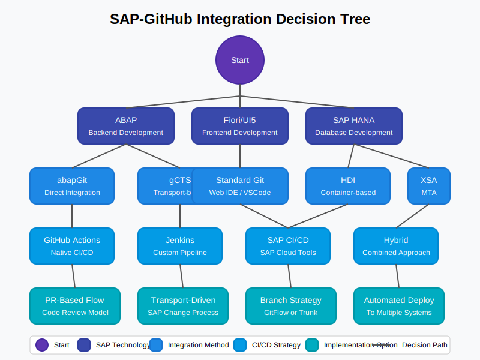

# 💻 SAP-GitHub Integration Examples

  
  
  
  *Example implementations and templates for SAP-GitHub integration*

This directory contains a comprehensive collection of example implementations, configuration templates, and code samples to help you implement SAP-GitHub integration in your organization.

## 📋 Table of Contents

- [📋 Directory Structure](#directory-structure)
- [🚀 How to Use These Examples](#how-to-use-these-examples)
- [🤝 Contributing](#contributing)
- [🔗 Related Documentation](#related-documentation)

## 📋 Directory Structure

The examples are organized into the following categories:

### Core Integration Examples

- [**ABAP Integration**](abap-integration/) - Examples for integrating ABAP systems with GitHub
  - [abapGit Integration](abap-integration/abapgit-integration.md) - Complete implementation guide for abapGit
  
- [**GitHub Actions**](github-actions/) - Workflow examples for SAP-GitHub automation
  - [UI5/Fiori Build Pipeline](github-actions/ui5-build-pipeline.md) - Complete CI/CD workflow for UI5/Fiori
  - [SAP Integration Workflow](github-actions/sap-integration-workflow.yml) - GitHub Actions workflow for SAP integration

- [**API Management**](api-management/) - Examples for API management between SAP and GitHub
  - [SAP to GitHub Integration](api-management/sap-to-github.md) - API management policies for SAP-GitHub connectivity

- [**XML Configuration**](xml-config/) - XML-based configuration templates
  - [System Connectivity](xml-config/system-connectivity.md) - XML configurations for system connectivity

### Security & Authentication

- [**Security Configuration**](security-config/) - Security templates and configurations
  - [OAuth Configuration](security-config/oauth-configuration.md) - OAuth 2.0 implementation between SAP and GitHub
  
- [**Security Examples**](security/) - Additional security implementation examples
  - [Defender](security/defender/) - Microsoft Defender integration examples
  - [Sentinel](security/sentinel/) - Microsoft Sentinel integration examples

### Additional Resources

- [**abapGit Configuration**](abapgit-config/) - Configuration templates for abapGit
- [**API Implementations**](api-implementations/) - API implementation examples
- [**APIM Configs**](apim-configs/) - API Management configuration examples
- [**Copilot Prompts**](copilot-prompts/) - GitHub Copilot prompt examples for SAP development
- [**End-to-End Scenarios**](end-to-end/) - Complete end-to-end implementation scenarios

## How to Use These Examples

Each example is designed to be a ready-to-use template that you can adapt to your specific requirements:

1. **Reference Implementations** - Use these examples as reference implementations for your projects
2. **Templates** - Modify the templates to fit your specific SAP and GitHub environment
3. **Learning Resources** - Study the examples to understand integration best practices
4. **Starting Points** - Use these examples as starting points for your own implementations

## Contributing

We welcome contributions to expand our examples collection. If you have implemented a successful SAP-GitHub integration pattern that you would like to share, please follow our [contribution guidelines](../CONTRIBUTING.md).

## Related Documentation

- [Implementation Checklists](../docs/6-appendices/implementation-checklist.md)
- [Case Studies](../docs/6-appendices/case-studies/index.md)
- [ROI Templates](../docs/6-appendices/roi-templates.md)
- [Reference Documentation](../docs/5-reference/index.md)

---

**Document Metadata:**
- Last Updated: 2023-11-15
- Version: 1.0.0
- Status: Published 