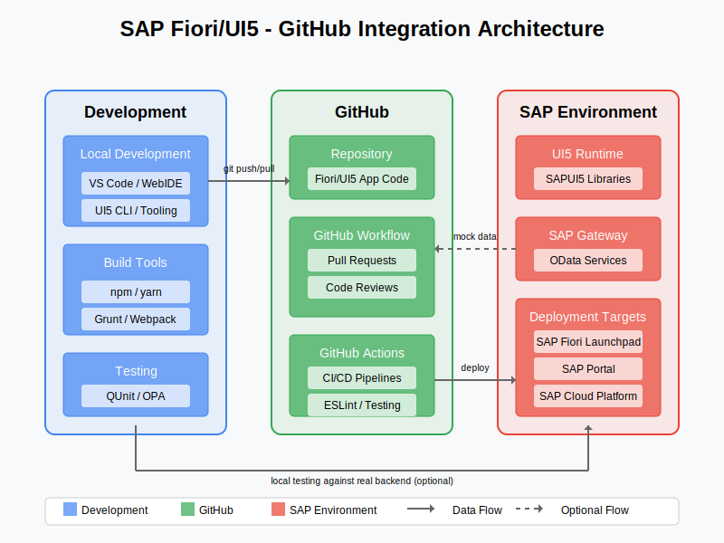

# 🔄 UI5/Fiori Build Pipeline

<div align="center">
  
  
  *CI/CD pipeline for SAP UI5/Fiori development*
</div>

# UI5/Fiori Build Pipeline with GitHub Actions

This example provides a complete GitHub Actions workflow for building, testing, and deploying SAP UI5/Fiori applications to different environments.

## Overview

The UI5/Fiori build pipeline automates the process of building, testing, and deploying UI5 and Fiori applications using GitHub Actions. It includes stages for code quality checks, unit testing, integration testing, and deployment to multiple environments (development, QA, production).

## Prerequisites

- GitHub repository with your UI5/Fiori application code
- SAP BTP account with necessary entitlements
- Cloud Foundry access or SAP BTP, ABAP Environment
- Node.js-based UI5 build tools setup in your project
- Proper credentials stored as GitHub Secrets

## Workflow File

Below is a complete GitHub Actions workflow file for UI5/Fiori applications. Save this as `.github/workflows/ui5-build-deploy.yml` in your repository:

```yaml
name: UI5/Fiori Build and Deploy

on:
  push:
    branches: [ main, develop ]
    paths:
      - 'webapp/**'
      - 'ui5.yaml'
      - 'package.json'
  pull_request:
    branches: [ main, develop ]
    paths:
      - 'webapp/**'
      - 'ui5.yaml'
      - 'package.json'
  workflow_dispatch:
    inputs:
      environment:
        description: 'Environment to deploy to'
        required: true
        default: 'dev'
        type: choice
        options:
          - dev
          - qa
          - prod

env:
  UI5_VERSION: 1.96.6
  MTA_VERSION: 1.3.0
  NODE_VERSION: 16

jobs:
  lint:
    name: Code Quality Checks
    runs-on: ubuntu-latest
    steps:
      - uses: actions/checkout@v3
      
      - name: Set up Node.js
        uses: actions/setup-node@v3
        with:
          node-version: ${{ env.NODE_VERSION }}
          cache: 'npm'
      
      - name: Install dependencies
        run: npm ci
      
      - name: ESLint
        run: npm run lint
        
      - name: Check UI5 best practices
        run: npx ui5-linter
      
      - name: Run Prettier check
        run: npx prettier --check "webapp/**/*.{js,xml,json,yaml,html}"

  test:
    name: Unit and Integration Tests
    needs: lint
    runs-on: ubuntu-latest
    steps:
      - uses: actions/checkout@v3
      
      - name: Set up Node.js
        uses: actions/setup-node@v3
        with:
          node-version: ${{ env.NODE_VERSION }}
          cache: 'npm'
      
      - name: Install dependencies
        run: npm ci
      
      - name: Install UI5 CLI
        run: npm install --global @ui5/cli
      
      - name: Run Unit Tests
        run: npm run test
      
      - name: Run Integration Tests
        run: npm run integration-test
      
      - name: Upload test results
        uses: actions/upload-artifact@v3
        with:
          name: test-results
          path: coverage/
          retention-days: 14

  build:
    name: Build UI5 Application
    needs: test
    runs-on: ubuntu-latest
    steps:
      - uses: actions/checkout@v3
      
      - name: Set up Node.js
        uses: actions/setup-node@v3
        with:
          node-version: ${{ env.NODE_VERSION }}
          cache: 'npm'
      
      - name: Install dependencies
        run: npm ci
      
      - name: Install UI5 CLI
        run: npm install --global @ui5/cli
      
      - name: Build UI5 application
        run: ui5 build --clean-dest --dest dist
      
      - name: Create MTA package
        if: github.event_name != 'pull_request'
        run: |
          curl -L -o mta.jar "https://repo1.maven.org/maven2/com/sap/cloud/mta-build-tool/${{ env.MTA_VERSION }}/mta-build-tool-${{ env.MTA_VERSION }}.jar"
          java -jar mta.jar --build-target=CF build
      
      - name: Upload build artifacts
        uses: actions/upload-artifact@v3
        with:
          name: ui5-app-build
          path: |
            dist/
            mta_archives/
          retention-days: 14

  deploy-dev:
    name: Deploy to Development
    if: (github.event_name == 'push' && github.ref == 'refs/heads/develop') || (github.event_name == 'workflow_dispatch' && github.event.inputs.environment == 'dev')
    needs: build
    runs-on: ubuntu-latest
    environment: development
    steps:
      - uses: actions/checkout@v3
      
      - name: Download build artifacts
        uses: actions/download-artifact@v3
        with:
          name: ui5-app-build
      
      - name: Install CF CLI
        run: |
          curl -L "https://packages.cloudfoundry.org/stable?release=linux64-binary&version=v8&source=github" | tar -zx
          sudo mv cf /usr/local/bin/
      
      - name: Login to Cloud Foundry
        run: |
          cf login -a ${{ secrets.CF_API }} -u ${{ secrets.CF_USERNAME }} -p ${{ secrets.CF_PASSWORD }} -o ${{ secrets.CF_ORG }} -s ${{ secrets.CF_SPACE_DEV }}
      
      - name: Deploy to CF Dev Space
        run: |
          cf deploy mta_archives/my_ui5_app_1.0.0.mtar
      
      - name: Run smoke tests
        run: |
          echo "Running smoke tests on development environment"
          npm ci
          npm run smoke-test -- --baseUrl https://myapp-dev.cfapps.eu10.hana.ondemand.com

  deploy-qa:
    name: Deploy to QA
    if: (github.event_name == 'push' && github.ref == 'refs/heads/main') || (github.event_name == 'workflow_dispatch' && github.event.inputs.environment == 'qa')
    needs: build
    runs-on: ubuntu-latest
    environment: qa
    steps:
      - uses: actions/checkout@v3
      
      - name: Download build artifacts
        uses: actions/download-artifact@v3
        with:
          name: ui5-app-build
      
      - name: Install CF CLI
        run: |
          curl -L "https://packages.cloudfoundry.org/stable?release=linux64-binary&version=v8&source=github" | tar -zx
          sudo mv cf /usr/local/bin/
      
      - name: Login to Cloud Foundry
        run: |
          cf login -a ${{ secrets.CF_API }} -u ${{ secrets.CF_USERNAME }} -p ${{ secrets.CF_PASSWORD }} -o ${{ secrets.CF_ORG }} -s ${{ secrets.CF_SPACE_QA }}
      
      - name: Deploy to CF QA Space
        run: |
          cf deploy mta_archives/my_ui5_app_1.0.0.mtar
      
      - name: Run acceptance tests
        run: |
          echo "Running acceptance tests on QA environment"
          npm ci
          npm run acceptance-test -- --baseUrl https://myapp-qa.cfapps.eu10.hana.ondemand.com

  deploy-prod:
    name: Deploy to Production
    if: github.event_name == 'workflow_dispatch' && github.event.inputs.environment == 'prod'
    needs: deploy-qa
    runs-on: ubuntu-latest
    environment: production
    steps:
      - uses: actions/checkout@v3
      
      - name: Download build artifacts
        uses: actions/download-artifact@v3
        with:
          name: ui5-app-build
      
      - name: Install CF CLI
        run: |
          curl -L "https://packages.cloudfoundry.org/stable?release=linux64-binary&version=v8&source=github" | tar -zx
          sudo mv cf /usr/local/bin/
      
      - name: Login to Cloud Foundry
        run: |
          cf login -a ${{ secrets.CF_API }} -u ${{ secrets.CF_USERNAME }} -p ${{ secrets.CF_PASSWORD }} -o ${{ secrets.CF_ORG }} -s ${{ secrets.CF_SPACE_PROD }}
      
      - name: Deploy to CF Production Space
        run: |
          cf deploy mta_archives/my_ui5_app_1.0.0.mtar
      
      - name: Notify deployment
        uses: slackapi/slack-github-action@v1.24.0
        with:
          channel-id: 'C123456789'
          slack-message: "UI5 application successfully deployed to production! :rocket:"
        env:
          SLACK_BOT_TOKEN: ${{ secrets.SLACK_BOT_TOKEN }}
```

## Essential Project Files

### package.json

```json
{
  "name": "my-ui5-app",
  "version": "1.0.0",
  "description": "UI5 Fiori Application",
  "private": true,
  "scripts": {
    "start": "ui5 serve",
    "build": "ui5 build --clean-dest --dest dist",
    "lint": "eslint webapp",
    "test": "karma start karma.conf.js",
    "integration-test": "wdi5 run wdio.conf.js",
    "smoke-test": "wdi5 run wdio.smoke.conf.js",
    "acceptance-test": "wdi5 run wdio.acceptance.conf.js",
    "deploy": "npm run build && cf deploy"
  },
  "devDependencies": {
    "@ui5/cli": "^2.14.1",
    "@wdio/cli": "^7.16.12",
    "@wdio/local-runner": "^7.16.12",
    "@wdio/mocha-framework": "^7.16.12",
    "karma": "^6.3.16",
    "karma-chrome-launcher": "^3.1.0",
    "karma-coverage": "^2.1.0",
    "karma-ui5": "^2.4.0",
    "eslint": "^8.10.0",
    "prettier": "^2.5.1",
    "ui5-middleware-livereload": "^0.5.8",
    "wdi5": "^1.4.0"
  },
  "ui5": {
    "dependencies": [
      "ui5-middleware-livereload"
    ]
  }
}
```

### ui5.yaml

```yaml
specVersion: '2.5'
metadata:
  name: my-ui5-app
type: application
framework:
  name: SAPUI5
  version: 1.96.6
  libraries:
    - name: sap.m
    - name: sap.ui.core
    - name: sap.ui.layout
    - name: themelib_sap_fiori_3
server:
  customMiddleware:
    - name: ui5-middleware-livereload
      afterMiddleware: compression
      configuration:
        port: 35729
        path: webapp
```

### mta.yaml

```yaml
ID: my_ui5_app
_schema-version: '3.2'
version: 1.0.0
modules:
  - name: my-ui5-app
    type: html5
    path: dist
    parameters:
      disk-quota: 256M
      memory: 256M
    build-parameters:
      builder: custom
      commands:
        - npm run build
    requires:
      - name: my-destination-service
      - name: my-uaa-service

resources:
  - name: my-destination-service
    type: org.cloudfoundry.managed-service
    parameters:
      service: destination
      service-plan: lite
  - name: my-uaa-service
    type: org.cloudfoundry.managed-service
    parameters:
      service: xsuaa
      service-plan: application
      path: ./xs-security.json
```

### xs-security.json

```json
{
  "xsappname": "my-ui5-app",
  "tenant-mode": "dedicated",
  "description": "Security profile for UI5 app",
  "scopes": [
    {
      "name": "$XSAPPNAME.Display",
      "description": "Display content"
    },
    {
      "name": "$XSAPPNAME.Edit",
      "description": "Edit content"
    }
  ],
  "role-templates": [
    {
      "name": "Viewer",
      "description": "View content",
      "scope-references": [
        "$XSAPPNAME.Display"
      ]
    },
    {
      "name": "Editor",
      "description": "Edit content",
      "scope-references": [
        "$XSAPPNAME.Display",
        "$XSAPPNAME.Edit"
      ]
    }
  ]
}
```

## Required GitHub Secrets

Configure the following secrets in your GitHub repository settings:

| Secret Name | Description |
|-------------|-------------|
| `CF_API` | Cloud Foundry API endpoint (e.g., https://api.cf.eu10.hana.ondemand.com) |
| `CF_USERNAME` | Cloud Foundry username |
| `CF_PASSWORD` | Cloud Foundry password |
| `CF_ORG` | Cloud Foundry organization name |
| `CF_SPACE_DEV` | Cloud Foundry development space name |
| `CF_SPACE_QA` | Cloud Foundry QA space name |
| `CF_SPACE_PROD` | Cloud Foundry production space name |
| `SLACK_BOT_TOKEN` | Slack bot token for notifications (production deployments) |

## Workflow Explanation

### 1. Trigger Configuration

The workflow triggers on:
- Push events to `main` or `develop` branches that modify UI5-related files
- Pull requests to these branches
- Manual workflow dispatch with environment selection

### 2. Lint Job

- Runs code quality checks using ESLint
- Verifies UI5 best practices with ui5-linter
- Ensures consistent code formatting with Prettier

### 3. Test Job

- Executes unit tests using Karma/QUnit
- Runs integration tests using wdi5 (WebDriver IO UI5)
- Uploads test coverage reports as artifacts

### 4. Build Job

- Builds the UI5 application using UI5 CLI
- Creates MTA package for deployment
- Uploads build artifacts for deployment jobs

### 5. Deployment Jobs

- **Development**: Deploys to dev environment on push to develop branch
- **QA**: Deploys to QA environment on push to main branch
- **Production**: Deploys to production only on manual workflow dispatch
- Each environment has approval gates through GitHub environments
- Runs appropriate tests after deployment

## Best Practices

### Security

1. **Secret Management**
   - Store all credentials as GitHub Secrets
   - Use GitHub environments for different deployment targets
   - Implement approval gates for production deployments

2. **Authentication**
   - Use service keys rather than personal credentials when possible
   - Rotate credentials regularly
   - Implement least privilege access for deployment accounts

### Workflow Optimization

1. **Caching**
   - Cache npm dependencies to speed up jobs
   - Use actions/cache for other dependencies
   - Optimize build artifacts size

2. **Build Artifacts**
   - Only upload required files as artifacts
   - Set appropriate retention periods
   - Use compression for large artifacts

### Testing Strategy

1. **Test Pyramid**
   - Unit tests for individual controls and logic
   - Integration tests for component interaction
   - End-to-end tests for critical user journeys
   - Post-deployment smoke tests

2. **Test Automation**
   - Run tests in parallel where possible
   - Fail fast on critical test failures
   - Generate and publish test reports

## Troubleshooting

### Common Issues and Solutions

1. **Build Failures**
   - **Problem**: UI5 build fails with dependency errors
   - **Solution**: Ensure ui5.yaml specifies correct framework version and libraries

2. **Deployment Issues**
   - **Problem**: Cloud Foundry deployment fails
   - **Solution**: Verify CF credentials, check service availability, and validate MTA structure

3. **Test Failures**
   - **Problem**: Flaky tests causing false negatives
   - **Solution**: Implement retry mechanisms, improve test stability, or mark tests as pending until fixed

## Extensions and Customizations

### Adding Additional Test Types

```yaml
# Add this job after the 'test' job in the workflow
accessibility-test:
  name: Accessibility Testing
  needs: build
  runs-on: ubuntu-latest
  steps:
    - uses: actions/checkout@v3
    
    - name: Download build artifacts
      uses: actions/download-artifact@v3
      with:
        name: ui5-app-build
        path: dist
    
    - name: Set up Node.js
      uses: actions/setup-node@v3
      with:
        node-version: ${{ env.NODE_VERSION }}
    
    - name: Install dependencies
      run: npm ci
    
    - name: Start UI5 server
      run: npx ui5 serve -o dist &
      
    - name: Run Axe accessibility tests
      run: npm run axe-test
```

### Multi-Tenant Deployment

```yaml
# Add this job for multi-tenant scenarios
deploy-tenant:
  name: Deploy to Tenant
  needs: deploy-prod
  runs-on: ubuntu-latest
  strategy:
    matrix:
      tenant: [tenant1, tenant2, tenant3]
  steps:
    - uses: actions/checkout@v3
    
    - name: Download build artifacts
      uses: actions/download-artifact@v3
      with:
        name: ui5-app-build
    
    - name: Install CF CLI
      run: |
        curl -L "https://packages.cloudfoundry.org/stable?release=linux64-binary&version=v8&source=github" | tar -zx
        sudo mv cf /usr/local/bin/
    
    - name: Login to Cloud Foundry
      run: |
        cf login -a ${{ secrets.CF_API }} -u ${{ secrets.CF_USERNAME }} -p ${{ secrets.CF_PASSWORD }} -o ${{ secrets.CF_ORG }} -s ${{ secrets.CF_SPACE_PROD }}
    
    - name: Update tenant configuration
      run: |
        # Update tenant-specific configuration
        jq '.tenant = "${{ matrix.tenant }}"' manifest.json > dist/manifest.json
    
    - name: Deploy to tenant
      run: |
        cf push my-ui5-app-${{ matrix.tenant }} -f tenant-manifest.yml
```

## Next Steps

- Set up [API Management Policies](../api-management/sap-to-github.md) for managing API integrations
- Configure [Security Settings](../security/config/oauth-configuration.md) for secure connectivity
- Set up system connectivity configurations for robust integration
- Implement the [ABAP Pipeline](./abap-pipeline.md) for comprehensive ABAP development
